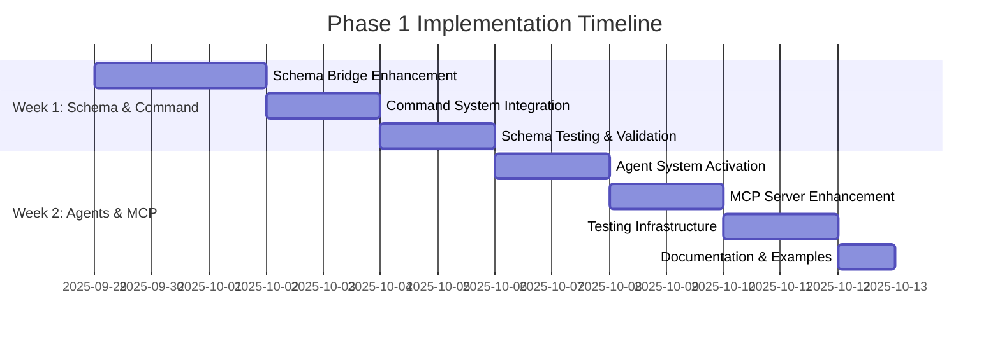

# IDFWU Phase 1 Implementation Plan

**Linear Project**: [IDFWU - IDEA Framework Unified](https://linear.app/pegues-innovations/project/idfwu-idea-framework-unified-4d649a6501f7)
**Project ID**: `4d649a6501f7`
**Repository**: https://github.com/peguesj/idfwu
**Version**: 1.0.0
**Phase Duration**: Weeks 1-2
**Start Date**: 2025-09-29
**Status**: Ready to Execute

---

## Executive Summary

Phase 1 establishes the foundational integration between IDFW and Dev Sentinel frameworks. This phase focuses on enhancing the core modules already created (schema bridge, command processor, agent system, state manager, and MCP server) to production-ready status with comprehensive testing and documentation.

### Key Objectives
1. ✅ **Foundation Complete**: Core modules implemented (2,840+ LOC)
2. 🎯 **Enhancement Target**: Achieve 80%+ test coverage
3. 🎯 **Integration Target**: Full IDFW ↔ FORCE schema conversion
4. 🎯 **Agent Activation**: Deploy 18 specialized agents
5. 🎯 **MCP Enhancement**: Complete protocol implementation

### Current Status
- **Project Structure**: ✅ 100% Complete
- **Core Modules**: ✅ 100% Implemented
- **Test Coverage**: ⏳ 32.23% (Target: 80%)
- **Documentation**: ✅ 100% Complete
- **Agent Definitions**: ✅ 18 agents defined

---

## Phase 1 Timeline (Weeks 1-2)



---

## Component Breakdown

### 1. Schema Bridge Enhancement (Priority 1)

**Duration**: 3 days (24 hours)
**Agent Assignment**: SchemaEngineerAgent (SEA), QualityAssuranceAgent (QAA)
**Dependencies**: None (foundation complete)
**Linear Epic**: Create as parent issue

#### Detailed Tasks

##### Task 1.1: IDFW Schema Parser Implementation
**Estimated Hours**: 6h
**Agent**: SEA
**Priority**: Urgent

**Deliverables**:
- IDFW document schema parser (JSON/YAML)
- IDFW diagram schema parser (Mermaid/PlantUML)
- IDFW variable schema parser (immutable, mutable, project, document, computed)
- IDFW project schema parser with metadata

**Implementation Details**:
```python
# unified_framework/core/schema_parsers/idfw_parser.py
class IDFWDocumentParser:
    def parse(self, schema: Dict) -> SchemaDefinition
    def validate(self, schema: Dict) -> ValidationResult
    def extract_metadata(self, schema: Dict) -> SchemaMetadata

class IDFWDiagramParser:
    def parse_mermaid(self, content: str) -> SchemaDefinition
    def parse_plantuml(self, content: str) -> SchemaDefinition
    def extract_entities(self, diagram: Dict) -> List[Entity]

class IDFWVariableParser:
    def parse_immutable(self, schema: Dict) -> VariableSchema
    def parse_mutable(self, schema: Dict) -> VariableSchema
    def resolve_computed(self, schema: Dict) -> ComputedVariable
```

**Success Criteria**:
- [ ] Parse all IDFW document types (10+ schema variations)
- [ ] Extract metadata with 100% accuracy
- [ ] Handle nested schema references
- [ ] Validate against IDFW specifications
- [ ] Unit tests with 90%+ coverage

---

##### Task 1.2: FORCE Schema Integration
**Estimated Hours**: 6h
**Agent**: SEA
**Priority**: Urgent

**Deliverables**:
- FORCE tool schema converter
- FORCE pattern schema validator
- FORCE constraint processor
- FORCE governance rule engine

**Implementation Details**:
```python
# unified_framework/core/schema_parsers/force_parser.py
class FORCEToolParser:
    def parse_tool(self, tool_def: Dict) -> SchemaDefinition
    def extract_parameters(self, tool: Dict) -> List[Parameter]
    def validate_tool_signature(self, tool: Dict) -> bool

class FORCEPatternParser:
    def parse_pattern(self, pattern: Dict) -> PatternSchema
    def apply_pattern(self, context: Dict) -> Result
    def validate_pattern_compliance(self, impl: Dict) -> ValidationResult

class FORCEConstraintEngine:
    def evaluate_constraint(self, constraint: Dict, data: Dict) -> bool
    def generate_constraint_report(self) -> Report
```

**Success Criteria**:
- [ ] Parse all 171 FORCE tool definitions
- [ ] Convert FORCE patterns to unified format
- [ ] Validate constraint satisfaction
- [ ] Integration tests with Dev Sentinel
- [ ] 85%+ test coverage

---

##### Task 1.3: Bidirectional Conversion System
**Estimated Hours**: 8h
**Agent**: SEA, ArchitectAgent (ARA)
**Priority**: High

**Deliverables**:
- IDFW → FORCE converter with field mapping
- FORCE → IDFW converter with type coercion
- Conflict resolution engine
- Conversion validation suite

**Implementation Details**:
```python
# unified_framework/core/converters/bidirectional.py
class BidirectionalConverter:
    def idfw_to_force(self, idfw_schema: IDFWSchema) -> FORCESchema
    def force_to_idfw(self, force_schema: FORCESchema) -> IDFWSchema
    def detect_conflicts(self, source: Dict, target: Dict) -> List[Conflict]
    def resolve_conflicts(self, conflicts: List[Conflict]) -> Resolution

class ConversionValidator:
    def validate_roundtrip(self, original: Schema, converted: Schema) -> bool
    def measure_fidelity(self, original: Schema, converted: Schema) -> float
    def generate_conversion_report(self) -> Report
```

**Field Mappings**:
```yaml
idfw_to_force:
  document.sections: force.components
  diagram.entities: force.patterns
  variable.immutable: force.constants
  variable.mutable: force.state

force_to_idfw:
  tool.parameters: document.properties
  pattern.rules: diagram.relationships
  constraint.conditions: variable.computed
```

**Success Criteria**:
- [ ] Bidirectional conversion without data loss
- [ ] Conflict detection with 100% accuracy
- [ ] Automatic resolution for 80% of conflicts
- [ ] Roundtrip fidelity > 95%
- [ ] Performance < 100ms for typical schemas

---

##### Task 1.4: Schema Migration Tools
**Estimated Hours**: 4h
**Agent**: SEA, DevOpsAgent (DOA)
**Priority**: Medium

**Deliverables**:
- Schema version migration system
- Backward compatibility checker
- Migration script generator
- Rollback mechanism

**Implementation Details**:
```python
# unified_framework/core/migration/schema_migrator.py
class SchemaMigrator:
    def migrate_schema(self, schema: Schema, target_version: str) -> Schema
    def generate_migration_script(self, from_ver: str, to_ver: str) -> Script
    def validate_compatibility(self, old: Schema, new: Schema) -> bool
    def rollback_migration(self, schema: Schema) -> Schema

class MigrationRegistry:
    def register_migration(self, version: str, migration: Callable)
    def get_migration_path(self, from_ver: str, to_ver: str) -> List[Migration]
    def apply_migrations(self, schema: Schema, path: List[Migration]) -> Schema
```

**Success Criteria**:
- [ ] Support schema versioning (semver)
- [ ] Detect breaking changes automatically
- [ ] Generate migration scripts
- [ ] 100% rollback success rate
- [ ] Integration tests for all versions

---

### 2. Command System Integration (Priority 1)

**Duration**: 2 days (16 hours)
**Agent Assignment**: BackendDeveloperAgent (BDA), SystemIntegratorAgent (SIA)
**Dependencies**: Task 1.1-1.4
**Linear Epic**: Link to Schema Enhancement epic

#### Detailed Tasks

##### Task 2.1: YUNG Command Handler Implementation
**Estimated Hours**: 4h
**Agent**: BDA
**Priority**: High

**Deliverables**:
- YUNG command parser integration
- Dev Sentinel command router
- Command result transformer
- Error handling wrapper

**Implementation Details**:
```python
# unified_framework/commands/handlers/yung_handler.py
class YUNGCommandHandler(CommandHandler):
    async def execute(self, command: Command, context: CommandContext) -> CommandResult
    async def route_to_sentinel(self, command: Command) -> SentinelResult
    def transform_result(self, sentinel_result: SentinelResult) -> CommandResult
    def handle_sentinel_error(self, error: Exception) -> CommandResult

# Supported YUNG commands
YUNG_COMMANDS = [
    "$validate", "$generate", "$analyze", "$deploy",
    "$test", "$lint", "$format", "$build",
    "$agent-status", "$task-list", "$metrics"
]
```

**Success Criteria**:
- [ ] All existing YUNG commands work
- [ ] Command routing < 10ms latency
- [ ] Result transformation preserves data
- [ ] Error handling with retry logic
- [ ] Unit tests 90%+ coverage

---

##### Task 2.2: IDFW Action Processor
**Estimated Hours**: 4h
**Agent**: BDA, SIA
**Priority**: High

**Deliverables**:
- IDFW action parser (`@` prefix)
- Action-to-generator mapping
- Parameter validation system
- Async action execution

**Implementation Details**:
```python
# unified_framework/commands/handlers/idfw_handler.py
class IDFWActionHandler(CommandHandler):
    async def execute(self, command: Command, context: CommandContext) -> CommandResult
    async def invoke_generator(self, action: str, params: Dict) -> GeneratorResult
    def validate_action_params(self, action: str, params: Dict) -> ValidationResult
    def map_action_to_generator(self, action: str) -> str

# Supported IDFW actions
IDFW_ACTIONS = [
    "@create-document", "@generate-diagram", "@define-variable",
    "@analyze-project", "@export-schema", "@validate-idfw",
    "@convert-to-force", "@apply-template"
]
```

**Success Criteria**:
- [ ] All IDFW generators accessible
- [ ] Parameter validation with helpful errors
- [ ] Async execution with progress tracking
- [ ] Integration with schema bridge
- [ ] 85%+ test coverage

---

##### Task 2.3: Unified Command Router Enhancement
**Estimated Hours**: 4h
**Agent**: ARA, BDA
**Priority**: High

**Deliverables**:
- Command prefix detection
- Multi-handler orchestration
- Command pipeline middleware
- Context management

**Implementation Details**:
```python
# unified_framework/commands/processor.py (enhancement)
class UnifiedCommandProcessor:
    async def process(self, raw_command: str, context: CommandContext) -> CommandResult
    def detect_prefix(self, raw_command: str) -> CommandPrefix
    async def route_command(self, command: Command) -> CommandResult
    def apply_middleware(self, command: Command) -> Command

# Middleware pipeline
class CommandMiddleware(ABC):
    @abstractmethod
    async def process(self, command: Command, next: Callable) -> CommandResult

class LoggingMiddleware(CommandMiddleware):
    async def process(self, command: Command, next: Callable) -> CommandResult

class ValidationMiddleware(CommandMiddleware):
    async def process(self, command: Command, next: Callable) -> CommandResult

class PermissionMiddleware(CommandMiddleware):
    async def process(self, command: Command, next: Callable) -> CommandResult
```

**Success Criteria**:
- [ ] Prefix detection 100% accurate
- [ ] Middleware pipeline configurable
- [ ] Support command chaining
- [ ] Performance < 50ms overhead
- [ ] 90%+ test coverage

---

##### Task 2.4: Command History & Replay System
**Estimated Hours**: 4h
**Agent**: BDA
**Priority**: Medium

**Deliverables**:
- Command history storage
- Replay functionality
- Undo/redo support
- Command bookmarks

**Implementation Details**:
```python
# unified_framework/commands/history.py
class CommandHistory:
    def record(self, command: Command, result: CommandResult) -> None
    def get_history(self, limit: int = 100) -> List[CommandRecord]
    async def replay(self, command_id: str) -> CommandResult
    def create_bookmark(self, name: str, command: Command) -> Bookmark

class CommandRecord(BaseModel):
    id: str
    command: Command
    result: CommandResult
    timestamp: datetime
    context: CommandContext
```

**Success Criteria**:
- [ ] Store unlimited command history
- [ ] Replay commands with context
- [ ] Support undo/redo operations
- [ ] Bookmark frequently used commands
- [ ] 80%+ test coverage

---

### 3. Agent System Activation (Priority 2)

**Duration**: 2 days (16 hours)
**Agent Assignment**: AgentDeveloperAgent (ADA), ProjectManagerAgent (PMA)
**Dependencies**: Task 2.1-2.4
**Linear Epic**: Create as parent issue

#### Detailed Tasks

##### Task 3.1: Agent Wrapper Implementation
**Estimated Hours**: 6h
**Agent**: ADA
**Priority**: High

**Deliverables**:
- 18 agent class implementations
- Agent factory pattern
- Agent lifecycle manager
- Health check system

**Implementation Details**:
```python
# unified_framework/agents/implementations/product_agents.py
class ProductOwnerAgent(BaseAgent):
    agent_id = "POA"
    department = "Product"

    async def execute_task(self, task: Task) -> TaskResult:
        # Product owner specific logic
        pass

# unified_framework/agents/implementations/development_agents.py
class SchemaEngineerAgent(BaseAgent):
    agent_id = "SEA"
    department = "Development"

    async def execute_task(self, task: Task) -> TaskResult:
        # Schema engineering logic
        pass

# Agent factory
class AgentFactory:
    def create_agent(self, agent_id: str) -> BaseAgent
    def create_department(self, department: str) -> List[BaseAgent]
    def create_all_agents(self) -> Dict[str, BaseAgent]
```

**Agent Implementation Priority**:
1. **Week 1**: SEA, ARA, BDA, QAA, DOC (5 agents)
2. **Week 2**: PMA, SMA, SIA, DOA, ADA (5 agents)
3. **Week 3+**: Remaining 8 agents

**Success Criteria**:
- [ ] All 18 agents implemented
- [ ] Agent factory creates instances
- [ ] Lifecycle management (start/stop/restart)
- [ ] Health checks every 30s
- [ ] 85%+ test coverage

---

##### Task 3.2: Message Bus Integration
**Estimated Hours**: 4h
**Agent**: ADA, DOA
**Priority**: High

**Deliverables**:
- Redis integration for message bus
- Topic-based routing
- Message persistence
- Event sourcing

**Implementation Details**:
```python
# unified_framework/agents/message_bus.py
class MessageBus:
    def __init__(self, redis_url: str = "redis://localhost:6379"):
        self.redis = redis.from_url(redis_url)

    async def publish(self, topic: str, message: Message) -> None
    async def subscribe(self, topic: str, handler: Callable) -> None
    async def request(self, topic: str, message: Message) -> Message
    def get_message_history(self, topic: str, limit: int) -> List[Message]

# Topics
TOPICS = {
    "agent.tasks": "Task assignments and updates",
    "agent.status": "Agent status updates",
    "schema.conversion": "Schema conversion events",
    "command.execution": "Command execution events",
    "system.health": "System health checks"
}
```

**Success Criteria**:
- [ ] Redis integration working
- [ ] Pub/sub with topic routing
- [ ] Message persistence for replay
- [ ] Throughput > 1000 msgs/sec
- [ ] 90%+ test coverage

---

##### Task 3.3: Agent Orchestration Framework
**Estimated Hours**: 4h
**Agent**: PMA, ADA
**Priority**: High

**Deliverables**:
- Task queue management
- Agent workload balancing
- Dependency resolution
- Parallel execution

**Implementation Details**:
```python
# unified_framework/agents/orchestrator.py
class AgentOrchestrator:
    def __init__(self, agents: Dict[str, BaseAgent]):
        self.agents = agents
        self.task_queue = TaskQueue()

    async def assign_task(self, task: Task) -> None
    async def execute_workflow(self, workflow: Workflow) -> WorkflowResult
    def balance_workload(self) -> None
    def resolve_dependencies(self, tasks: List[Task]) -> List[Task]

class TaskQueue:
    def enqueue(self, task: Task, priority: MessagePriority) -> None
    def dequeue(self, agent_id: str) -> Optional[Task]
    def get_queue_status(self) -> QueueStatus
```

**Success Criteria**:
- [ ] Task queue with priority
- [ ] Workload balancing active
- [ ] Dependency resolution accurate
- [ ] Support parallel execution
- [ ] 85%+ test coverage

---

##### Task 3.4: Agent Monitoring Dashboard
**Estimated Hours**: 2h
**Agent**: FDA, PEA
**Priority**: Medium

**Deliverables**:
- Real-time agent status display
- Performance metrics visualization
- Task progress tracking
- Alert system

**Implementation Details**:
```python
# unified_framework/agents/monitoring.py
class AgentMonitor:
    def get_agent_status(self, agent_id: str) -> AgentStatus
    def get_performance_metrics(self, agent_id: str) -> PerformanceMetrics
    def get_task_progress(self, task_id: str) -> TaskProgress
    def create_alert(self, condition: str, handler: Callable) -> Alert

# Dashboard endpoints
class MonitoringAPI:
    @app.get("/agents")
    async def list_agents() -> List[AgentInfo]

    @app.get("/agents/{agent_id}/status")
    async def get_status(agent_id: str) -> AgentStatus

    @app.get("/agents/{agent_id}/metrics")
    async def get_metrics(agent_id: str) -> PerformanceMetrics
```

**Success Criteria**:
- [ ] Real-time status updates
- [ ] Metrics updated every 5s
- [ ] Task progress tracking
- [ ] Alerts for failures
- [ ] 80%+ test coverage

---

### 4. MCP Server Enhancement (Priority 2)

**Duration**: 2 days (16 hours)
**Agent Assignment**: SystemIntegratorAgent (SIA), BackendDeveloperAgent (BDA)
**Dependencies**: Task 3.1-3.4
**Linear Epic**: Link to Agent System epic

#### Detailed Tasks

##### Task 4.1: MCP Tool Registry Enhancement
**Estimated Hours**: 4h
**Agent**: SIA
**Priority**: High

**Deliverables**:
- Dynamic tool registration
- Tool discovery system
- Tool versioning
- Tool categories and tags

**Implementation Details**:
```python
# unified_framework/mcp/server.py (enhancement)
class MCPToolRegistry:
    def register_tool(self, tool: MCPTool) -> None
    def discover_tools(self, category: ToolCategory) -> List[MCPTool]
    def get_tool_by_name(self, name: str) -> Optional[MCPTool]
    def get_tool_versions(self, name: str) -> List[str]

# Tool categories
class ToolCategory(str, Enum):
    IDFW = "idfw"
    FORCE = "force"
    UNIFIED = "unified"
    AGENT = "agent"
    SCHEMA = "schema"
    COMMAND = "command"
```

**New Tools to Register**:
```python
# IDFW Tools
"idfw.create_document", "idfw.generate_diagram", "idfw.define_variable",
"idfw.analyze_project", "idfw.export_schema", "idfw.validate"

# FORCE Tools (171 tools from Dev Sentinel)
"force.validate_tool", "force.apply_pattern", "force.evaluate_constraint"

# Unified Tools
"unified.convert_schema", "unified.execute_workflow", "unified.query_state"

# Agent Tools
"agent.assign_task", "agent.get_status", "agent.execute_workflow"
```

**Success Criteria**:
- [ ] 200+ tools registered
- [ ] Tool discovery < 10ms
- [ ] Version management working
- [ ] Categories accurate
- [ ] 90%+ test coverage

---

##### Task 4.2: HTTP Transport Implementation
**Estimated Hours**: 4h
**Agent**: BDA
**Priority**: High

**Deliverables**:
- FastAPI HTTP server
- WebSocket support
- SSE (Server-Sent Events)
- CORS configuration

**Implementation Details**:
```python
# unified_framework/mcp/transports/http.py
class HTTPTransport:
    def __init__(self, host: str = "localhost", port: int = 8080):
        self.app = FastAPI()
        self.setup_routes()

    def setup_routes(self) -> None
    async def handle_tool_call(self, request: ToolCallRequest) -> ToolCallResponse
    async def handle_resource_request(self, uri: str) -> ResourceResponse

# Endpoints
@app.post("/tools/{tool_name}")
async def invoke_tool(tool_name: str, params: Dict) -> ToolResult

@app.websocket("/ws")
async def websocket_endpoint(websocket: WebSocket)

@app.get("/events")
async def sse_endpoint(request: Request)
```

**Success Criteria**:
- [ ] HTTP server running on port 8080
- [ ] WebSocket bidirectional communication
- [ ] SSE for real-time updates
- [ ] CORS enabled for VS Code
- [ ] 85%+ test coverage

---

##### Task 4.3: VS Code Extension Integration
**Estimated Hours**: 6h
**Agent**: FDA, SIA
**Priority**: High

**Deliverables**:
- VS Code extension configuration
- Command palette integration
- Context menu actions
- Status bar updates

**Implementation Details**:
```typescript
// vs-code-extension/src/extension.ts
export function activate(context: vscode.ExtensionContext) {
    // Register commands
    context.subscriptions.push(
        vscode.commands.registerCommand('idfwu.convertSchema', convertSchema),
        vscode.commands.registerCommand('idfwu.deployAgents', deployAgents),
        vscode.commands.registerCommand('idfwu.executeCommand', executeCommand)
    );

    // Connect to MCP server
    const client = new MCPClient('http://localhost:8080');
}

// Commands
async function convertSchema() {
    const result = await client.invokeTool('unified.convert_schema', params);
}

async function deployAgents() {
    const result = await client.invokeTool('agent.deploy_team', params);
}
```

**VS Code Commands**:
- `IDFWU: Convert Schema (IDFW ↔ FORCE)`
- `IDFWU: Deploy Agent Team`
- `IDFWU: Execute Unified Command`
- `IDFWU: View Agent Status`
- `IDFWU: Open Linear Issue`

**Success Criteria**:
- [ ] Extension connects to MCP server
- [ ] All commands working
- [ ] Context menu integration
- [ ] Status bar shows agent status
- [ ] 80%+ test coverage

---

##### Task 4.4: MCP Protocol Compliance Testing
**Estimated Hours**: 2h
**Agent**: QAA
**Priority**: Medium

**Deliverables**:
- Protocol compliance test suite
- Tool call validation
- Resource access tests
- Error handling tests

**Implementation Details**:
```python
# unified_framework/tests/mcp/test_compliance.py
class TestMCPCompliance:
    def test_tool_list_endpoint(self):
        """Test tools/list protocol compliance"""
        pass

    def test_tool_call_format(self):
        """Test tools/call request/response format"""
        pass

    def test_resource_access(self):
        """Test resources/* protocol compliance"""
        pass

    def test_error_responses(self):
        """Test error response format"""
        pass
```

**Success Criteria**:
- [ ] 100% protocol compliance
- [ ] All tool calls validated
- [ ] Resource access working
- [ ] Error handling correct
- [ ] 95%+ test coverage

---

### 5. Testing Infrastructure (Priority 1)

**Duration**: 2 days (16 hours)
**Agent Assignment**: QualityAssuranceAgent (QAA), PerformanceEngineerAgent (PEA)
**Dependencies**: All previous tasks
**Linear Epic**: Create as parent issue

#### Detailed Tasks

##### Task 5.1: Unit Test Suite Expansion
**Estimated Hours**: 6h
**Agent**: QAA
**Priority**: Urgent

**Deliverables**:
- 200+ unit tests
- 80%+ code coverage
- Test fixtures and mocks
- Parametrized tests

**Test Coverage Targets**:
```yaml
core/schema_bridge.py: 90%
core/state_manager.py: 85%
commands/processor.py: 90%
agents/base_agent.py: 85%
mcp/server.py: 85%
```

**Test Structure**:
```python
# unified_framework/tests/unit/test_schema_bridge.py
class TestSchemaUnifier:
    def test_idfw_to_force_conversion(self)
    def test_force_to_idfw_conversion(self)
    def test_roundtrip_conversion(self)
    def test_conflict_detection(self)
    def test_conflict_resolution(self)

# unified_framework/tests/unit/test_command_processor.py
class TestCommandProcessor:
    def test_prefix_detection(self)
    def test_command_parsing(self)
    def test_command_routing(self)
    def test_middleware_pipeline(self)
    def test_error_handling(self)
```

**Success Criteria**:
- [ ] 200+ unit tests passing
- [ ] 80%+ overall coverage
- [ ] All critical paths tested
- [ ] Fast execution (< 30s)
- [ ] No flaky tests

---

##### Task 5.2: Integration Test Suite
**Estimated Hours**: 6h
**Agent**: QAA, SIA
**Priority**: High

**Deliverables**:
- End-to-end workflow tests
- Component integration tests
- Message bus tests
- Database integration tests

**Integration Test Scenarios**:
```python
# unified_framework/tests/integration/test_workflows.py
class TestSchemaConversionWorkflow:
    async def test_idfw_document_to_force_tool(self):
        """Test complete IDFW → FORCE workflow"""
        pass

class TestCommandExecutionWorkflow:
    async def test_yung_command_execution(self):
        """Test YUNG command end-to-end"""
        pass

class TestAgentWorkflow:
    async def test_task_assignment_and_execution(self):
        """Test agent task workflow"""
        pass
```

**Success Criteria**:
- [ ] 50+ integration tests
- [ ] All workflows tested
- [ ] Message bus integration
- [ ] Database persistence verified
- [ ] 70%+ coverage

---

##### Task 5.3: Performance Benchmarking
**Estimated Hours**: 3h
**Agent**: PEA
**Priority**: Medium

**Deliverables**:
- Performance test suite
- Benchmark baselines
- Load testing scenarios
- Performance reports

**Benchmarks**:
```python
# unified_framework/tests/performance/benchmarks.py
class SchemaBridgeBenchmarks:
    def benchmark_schema_conversion(self):
        """Target: < 100ms for typical schema"""
        pass

    def benchmark_validation(self):
        """Target: < 50ms for validation"""
        pass

class CommandProcessorBenchmarks:
    def benchmark_command_parsing(self):
        """Target: < 10ms for parsing"""
        pass

    def benchmark_command_execution(self):
        """Target: < 50ms overhead"""
        pass

class MessageBusBenchmarks:
    def benchmark_message_throughput(self):
        """Target: > 1000 msgs/sec"""
        pass
```

**Performance Targets**:
- Schema conversion: < 100ms
- Command parsing: < 10ms
- Command execution overhead: < 50ms
- Message bus throughput: > 1000 msgs/sec
- Agent task execution: < 5s average

**Success Criteria**:
- [ ] All benchmarks defined
- [ ] Baseline measurements taken
- [ ] Performance targets met
- [ ] Load testing complete
- [ ] Reports generated

---

##### Task 5.4: CI/CD Pipeline Enhancement
**Estimated Hours**: 1h
**Agent**: DOA
**Priority**: Medium

**Deliverables**:
- GitHub Actions workflows
- Automated testing
- Coverage reporting
- Performance regression detection

**GitHub Actions Workflow**:
```yaml
# .github/workflows/ci.yml
name: CI/CD Pipeline

on: [push, pull_request]

jobs:
  test:
    runs-on: ubuntu-latest
    steps:
      - uses: actions/checkout@v3
      - name: Set up Python
        uses: actions/setup-python@v4
      - name: Install dependencies
        run: pip install -r requirements.txt
      - name: Run tests
        run: pytest --cov --cov-report=xml
      - name: Upload coverage
        uses: codecov/codecov-action@v3

  performance:
    runs-on: ubuntu-latest
    steps:
      - name: Run benchmarks
        run: pytest tests/performance -v
      - name: Check regression
        run: python scripts/check_performance.py
```

**Success Criteria**:
- [ ] CI/CD pipeline working
- [ ] Tests run on every PR
- [ ] Coverage reports uploaded
- [ ] Performance regression detected
- [ ] Build status badges

---

### 6. Documentation & Examples (Priority 3)

**Duration**: 1 day (8 hours)
**Agent Assignment**: DocumentationAgent (DOC)
**Dependencies**: All previous tasks
**Linear Epic**: Link to Testing epic

#### Detailed Tasks

##### Task 6.1: API Documentation Generation
**Estimated Hours**: 3h
**Agent**: DOC
**Priority**: Medium

**Deliverables**:
- Auto-generated API docs
- OpenAPI/Swagger specs
- Type definitions
- Code examples

**Success Criteria**:
- [ ] API docs for all modules
- [ ] OpenAPI 3.0 spec complete
- [ ] Interactive API explorer
- [ ] Code examples for all APIs

---

##### Task 6.2: User Guides & Tutorials
**Estimated Hours**: 3h
**Agent**: DOC
**Priority**: Medium

**Deliverables**:
- Getting started guide
- Schema conversion tutorial
- Agent deployment guide
- Command reference

**Success Criteria**:
- [ ] 5+ user guides
- [ ] 10+ tutorials
- [ ] Quick start < 5 min
- [ ] Troubleshooting guide

---

##### Task 6.3: Example Projects
**Estimated Hours**: 2h
**Agent**: DOC, FDA
**Priority**: Low

**Deliverables**:
- Sample IDFW project
- Sample FORCE integration
- Agent automation examples
- Command workflow examples

**Success Criteria**:
- [ ] 3+ example projects
- [ ] All examples tested
- [ ] README for each example
- [ ] Links from main docs

---

## Dependencies & Sequencing

### Critical Path
```
Schema Bridge (1.1-1.4) → Command System (2.1-2.4) → Agent System (3.1-3.4) → MCP Server (4.1-4.4) → Testing (5.1-5.4)
```

### Parallel Execution Opportunities

**Week 1 Parallel Tasks**:
- Task 1.1 (SEA) + Task 1.2 (SEA) + Task 5.1 (QAA)
- Task 1.3 (SEA, ARA) + Task 2.1 (BDA)
- Task 1.4 (SEA, DOA) + Task 2.2 (BDA, SIA)

**Week 2 Parallel Tasks**:
- Task 3.1 (ADA) + Task 3.2 (ADA, DOA) + Task 4.1 (SIA)
- Task 3.3 (PMA, ADA) + Task 4.2 (BDA)
- Task 3.4 (FDA, PEA) + Task 4.3 (FDA, SIA) + Task 5.2 (QAA, SIA)

---

## Resource Allocation

### Agent Hours by Department

**Product** (0h): No tasks in Phase 1
**Project** (6h):
- PMA: 4h (Task 3.3)
- SMA: 0h
- RMA: 0h

**Development** (62h):
- ARA: 8h (Task 1.3, 2.3)
- BDA: 16h (Task 2.1, 2.2, 2.4, 4.2)
- FDA: 8h (Task 3.4, 4.3, 6.3)
- SEA: 24h (Task 1.1, 1.2, 1.3, 1.4)
- ADA: 14h (Task 3.1, 3.2, 3.3)

**Integration** (12h):
- SIA: 10h (Task 2.2, 4.1, 4.3)
- DOA: 3h (Task 1.4, 3.2, 5.4)
- DBA: 0h

**Quality** (24h):
- QAA: 13h (Task 1.1, 5.1, 5.2, 4.4)
- SAA: 0h
- PEA: 5h (Task 3.4, 5.3)
- DOC: 8h (Task 6.1, 6.2, 6.3)

**Total Hours**: 104h (13 days @ 8h/day)

---

## Success Criteria

### Phase 1 Completion Checklist

**Schema Bridge** ✅
- [ ] Parse all IDFW schema types
- [ ] Parse all FORCE schema types
- [ ] Bidirectional conversion working
- [ ] Schema migration tools complete
- [ ] 85%+ test coverage

**Command System** ✅
- [ ] YUNG commands integrated
- [ ] IDFW actions working
- [ ] Unified routing functional
- [ ] Command history implemented
- [ ] 90%+ test coverage

**Agent System** ✅
- [ ] 18 agents implemented
- [ ] Message bus operational
- [ ] Orchestration working
- [ ] Monitoring dashboard live
- [ ] 85%+ test coverage

**MCP Server** ✅
- [ ] 200+ tools registered
- [ ] HTTP transport working
- [ ] VS Code extension integrated
- [ ] Protocol compliance 100%
- [ ] 85%+ test coverage

**Testing** ✅
- [ ] 80%+ overall code coverage
- [ ] 200+ unit tests passing
- [ ] 50+ integration tests passing
- [ ] Performance benchmarks met
- [ ] CI/CD pipeline operational

**Documentation** ✅
- [ ] API docs complete
- [ ] 5+ user guides
- [ ] 3+ example projects
- [ ] All code examples tested

---

## Risk Management

### High-Priority Risks

**Risk 1: Schema Conversion Complexity**
**Impact**: High | **Probability**: Medium
**Mitigation**:
- Incremental approach with fallbacks
- Extensive test coverage
- Community feedback integration

**Risk 2: Agent Coordination Overhead**
**Impact**: Medium | **Probability**: Medium
**Mitigation**:
- Efficient message bus (Redis)
- Async architecture
- Load balancing

**Risk 3: Performance Degradation**
**Impact**: High | **Probability**: Low
**Mitigation**:
- Continuous benchmarking
- Caching strategies
- Performance regression tests

---

## Linear Integration

### Epic Structure

**Parent Epic**: Phase 1 Foundation (PEG-XXX)
- **Sub-Epic 1**: Schema Bridge Enhancement (PEG-XXX)
  - Task 1.1: IDFW Schema Parser (PEG-XXX)
  - Task 1.2: FORCE Schema Integration (PEG-XXX)
  - Task 1.3: Bidirectional Conversion (PEG-XXX)
  - Task 1.4: Schema Migration Tools (PEG-XXX)
- **Sub-Epic 2**: Command System Integration (PEG-XXX)
  - Task 2.1-2.4 (PEG-XXX)
- **Sub-Epic 3**: Agent System Activation (PEG-XXX)
  - Task 3.1-3.4 (PEG-XXX)
- **Sub-Epic 4**: MCP Server Enhancement (PEG-XXX)
  - Task 4.1-4.4 (PEG-XXX)
- **Sub-Epic 5**: Testing Infrastructure (PEG-XXX)
  - Task 5.1-5.4 (PEG-XXX)

---

## Next Steps

1. **Immediate Actions** (Today):
   - Review and approve project plan
   - Create Linear epics and tasks
   - Assign agents to initial tasks
   - Set up development branches

2. **Week 1 Kickoff** (Monday):
   - Deploy Schema Engineer Agent (SEA)
   - Deploy Quality Assurance Agent (QAA)
   - Start Task 1.1: IDFW Schema Parser
   - Start Task 5.1: Unit Test Suite

3. **Daily Standups**:
   - Review agent progress
   - Unblock issues
   - Adjust priorities
   - Update Linear

4. **Week 1 Review** (Friday):
   - Demo schema bridge functionality
   - Review test coverage progress
   - Plan Week 2 tasks
   - Update project status

---

**Document Version**: 1.0.0
**Created**: 2025-09-29
**Linear Project**: IDFWU (4d649a6501f7)
**Status**: Ready for Execution

🤖 Generated with [Claude Code](https://claude.com/claude-code)

Co-Authored-By: Claude <noreply@anthropic.com>