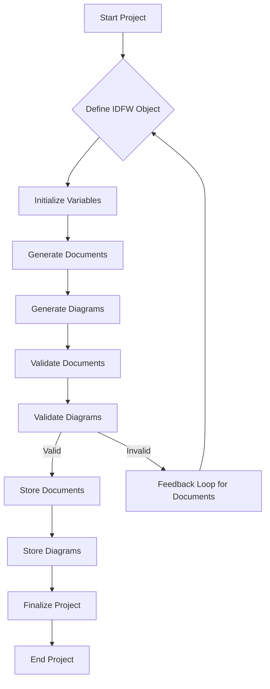
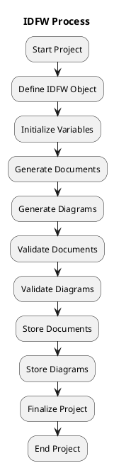

# Idea Definition Framework (IDFW) README

## Version: 2.1.1  

## Table of Contents
1. [High-Level Overview](#high-level-overview)
2. [Core Concepts](#core-concepts)
3. [Schema & Structure](#schema--structure)
    - [3.1 Axis Definitions](#31-axis-definitions)
    - [3.2 Master Axis](#32-master-axis)
    - [3.3 Documents](#33-documents)
4. [Project Actions & Iterative Updates](#project-actions--iterative-updates)
    - [4.1 Iterative Processing Flow](#41-iterative-processing-flow)
    - [4.2 Process Flow Diagram](#42-process-flow-diagram)
5. [Usage Scenarios](#usage-scenarios)
    - [5.1 Single MVP with Minimal Docs](#51-single-mvp-with-minimal-docs)
    - [5.2 Complex Enterprise Changes with Compliance](#52-complex-enterprise-changes-with-compliance)
    - [5.3 Multi-Axis Approach for Advanced Strategies](#53-multi-axis-approach-for-advanced-strategies)
6. [Reference Material](#reference-material)
    - [6.1 API Documentation](#61-api-documentation)
    - [6.2 Examples & Templates](#62-examples--templates)
7. [Iterative Nature & Referential Integrity](#iterative-nature--referential-integrity)
    - [7.1 Validation Function Example](#71-validation-function-example)
8. [Diagrams Integration](#diagrams-integration)
    - [8.1 Mermaid Flowchart](#81-mermaid-flowchart)
    - [8.2 PlantUML Diagram](#82-plantuml-diagram)
    - [8.3 Exploration of the Framework Schemas](#83-exploration-of-the-framework-schemas)
9. [Version History](#version-history)

---

## 1. High-Level Overview
The **Idea Definition Framework (IDFW)** is a comprehensive specification designed to define, structure, and maintain the various components of a project, including documents, diagrams, variables, and references. By encapsulating the project's scope within the IDFW object, the framework ensures efficient memory usage and optimal token management when interacting with Large Language Models (LLMs).

## 2. Core Concepts
- **Documents**: Structured textual artifacts such as BRD (Business Requirements Document) and FRS (Functional Requirements Specification).
- **Diagrams**: Visual representations like UML, BPMN, and Mermaid diagrams that illustrate system architecture and workflows.
- **Variables**: Key-value pairs that hold runtime or build-time data essential for project operations. The variables object is divided into immutable variables and mutable variables:
  - **Immutable Variables**: Variables that are established at the initialization of the IDFW object and remain constant throughout the project lifecycle.
  - **Mutable Variables**: Variables that can change based on use cases and project actions, retrieved by accessing collection arrays.
- **Project Actions**: Iterative processes for creating, updating, or removing artifacts within the project.

## 3. Schema & Structure
The IDFW is defined as a JSON object adhering to the [IDFW.schema.json](#file:IDFW.schema.json) specifications. Below are references to key schema objects:

### 3.1 Axis Definitions
```jsonc
{
  "axisName": { "type": "string" },
  "min": { "type": "number" },
  "max": { "type": "number" },
  "masterInfluence": { "type": "number" }
}
```

### 3.2 Master Axis
```jsonc
{
  "axisName": { "type": "string" },
  "min": { "type": "number" },
  "max": { "type": "number" },
  "formula": { "type": "string" }
}
```

### 3.3 Documents
```jsonc
{
  "docId": { "type": "string" },
  "title": { "type": "string" },
  "purpose": { "type": "string" },
  "ownerTeam": { "type": "string" },
  "version": { "type": "string" },
  "revision": { "type": "string" },
  "dateCreated": { "type": "string", "format": "date-time" },
  "dateUpdated": { "type": "string", "format": "date-time" },
  "references": { "type": "array", "items": { "type": "string" } },
  "variables": { "type": "array", "items": { "$ref": "#/definitions/Variable" } }
}
```

## 4. Project Actions & Iterative Updates
IDFW facilitates iterative processing of project components, ensuring each action maintains referential integrity through validation functions.

### 4.1 Iterative Processing Flow


### 4.2 Process Flow Diagram


## 5. Usage Scenarios
IDFW supports a range of project complexities, from single MVPs with minimal documentation to extensive enterprise projects requiring compliance and multi-axis strategies.

### 5.1 Single MVP with Minimal Docs
- Focused scope with essential documents and diagrams.
- Efficient token usage for quick iterations.
- **Variable Initialization**: Initialize necessary variables before documentation generation.

### 5.2 Complex Enterprise Changes with Compliance
- Comprehensive documentation in line with industry standards.
- Enhanced validation to maintain compliance across all artifacts.
- **Helper Functions**: Utilize helper functions to interact with IDPGs for streamlined processes.

### 5.3 Multi-Axis Approach for Advanced Strategies
- Incorporates multiple axes to manage various project dimensions.
- Utilizes master axis definitions for overarching project influences.
- **Iterative Feedback Loops**: Continuous validation and feedback to refine project components.

## 6. Reference Material

### 6.1 API Documentation
- **Overview:** Detailed information about the IDEA Framework APIs, including available endpoints, request/response structures, and usage examples.
- **Endpoints:**
  - **Initialize Framework**
  - **Generate Document**
  - **Generate Diagram**
  - **Validate Document**
  - **Validate Diagram**
  - **Store Document**
  - **Store Diagram**

### 6.2 Examples & Templates
- **Sample Projects:**
  - **Resume Enhancer MVP:** Demonstrates how to use the IDEA Framework to build a resume enhancement application leveraging LLMs for content updates.
- **Configuration Templates:**
  - **Basic Configuration:** Provides a starting point for setting up the IDEA Framework with default settings and minimal customization.
- **Best Practices:**
  - **Version Control:** Utilize Git for tracking changes in documentation and configuration files. Follow semantic versioning to manage releases.
  - **Modular Design:** Keep project components modular to facilitate easier updates and maintenance.

## 7. Iterative Nature & Referential Integrity
The IDFW framework emphasizes an iterative approach to processing project properties and objects. Each action performed within the framework undergoes rigorous validation to ensure referential integrity. Validation functions are invoked at every step, accepting single or multiple properties to verify data types and constraints against the Entity-Relationship Diagram (ERD). This continuous validation promotes feedback loops, allowing for real-time corrections and enhancements, thereby maintaining the robustness and reliability of the project artifacts.

### 7.1 Validation Function Example
```javascript
function validateProperties(properties) {
  if (Array.isArray(properties)) {
    for (const property of properties) {
      if (!validateProperty(property)) {
        return false;
      }
    }
    return true;
  }
  return validateProperty(properties);
}

function validateProperty(property) {
  // Validation logic...
  return true; // or false based on validation
}
```

## 8. Diagrams Integration
IDFW documentation includes visual representations to aid in understanding the framework's structure and processes.

### 8.1 Mermaid Flowchart


### 8.2 PlantUML Diagram


### 8.3 Exploration of the Framework Schemas
The IDEA Framework schemas define the structure and constraints for various components within the framework. These schemas ensure consistency and integrity across all project artifacts.

---

## 9. Version History

| **Version** | **Date**       | **Description**                                                                 |
|-------------|----------------|---------------------------------------------------------------------------------|
| 2.1.1       | 2025-01-01     | Updated README to include references to missing schemas and detailed examples.   |
| 2.1.0       | 2024-12-01     | Added support for multi-axis analysis and master axis definitions.               |
| 2.0.0       | 2024-06-01     | Major update with new schema definitions and enhanced validation functions.      |
| 1.0.0       | 2023-01-01     | Initial release of the IDEA Framework.                                           |

---
