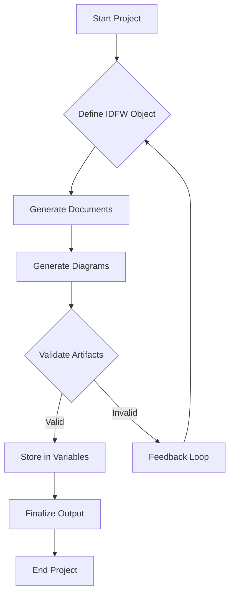
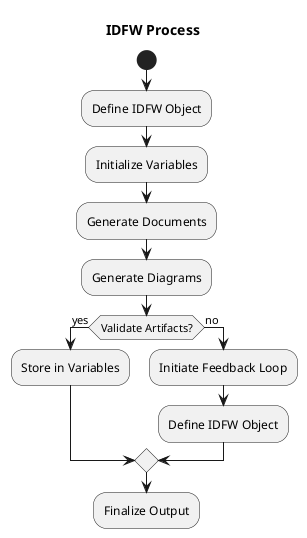
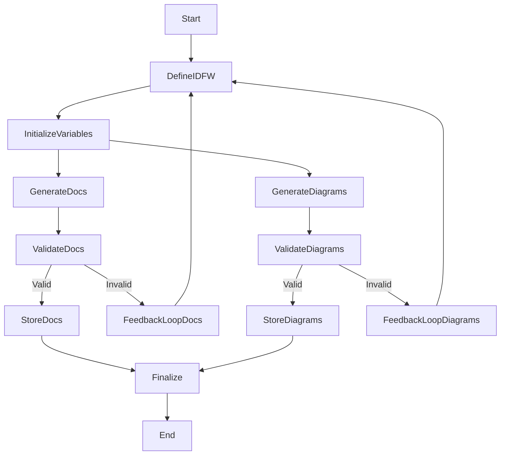
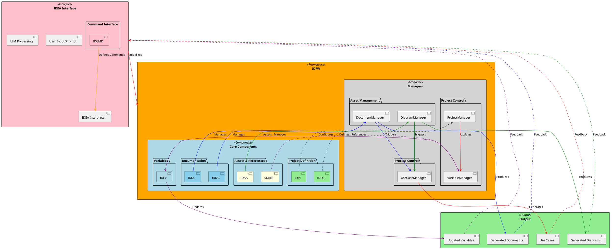
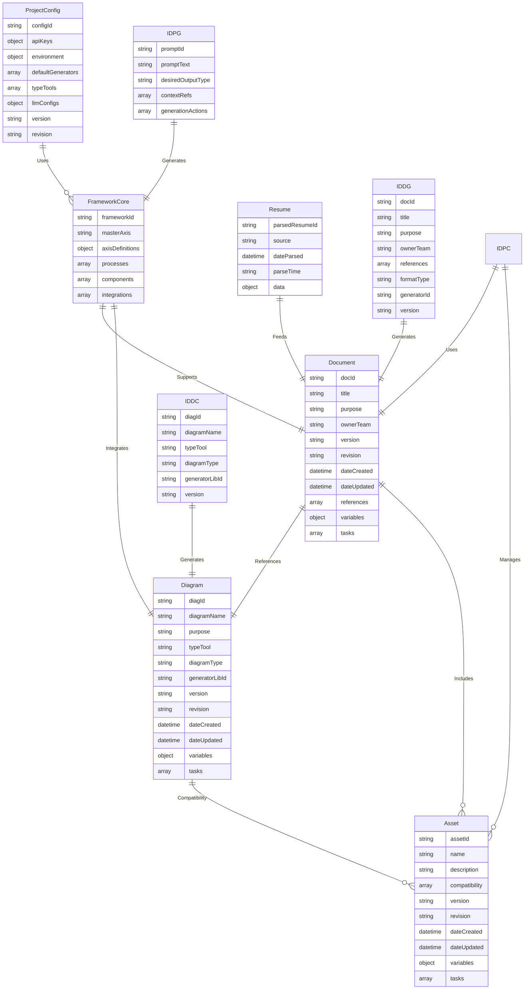
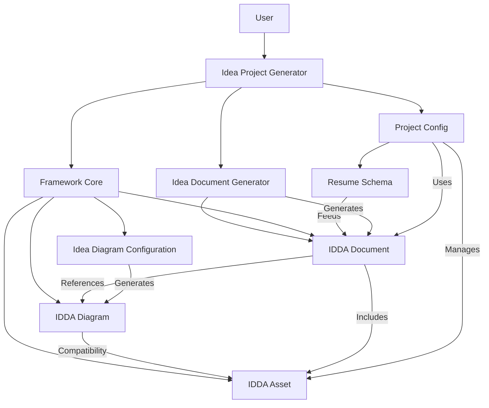

# Idea Definition Framework (IDFW) README

## Version: 2.1.1  

## Table of Contents
1. [High-Level Overview](#high-level-overview)
2. [Core Concepts](#core-concepts)
3. [Schema & Structure](#schema--structure)
    - [3.1 Axis Definitions](#31-axis-definitions)
    - [3.2 Master Axis](#32-master-axis)
    - [3.3 Documents](#33-documents)
4. [Project Actions & Iterative Updates](#project-actions--iterative-updates)
    - [4.1 Iterative Processing Flow](#41-iterative-processing-flow)
    - [4.2 Process Flow Diagram](#42-process-flow-diagram)
5. [Usage Scenarios](#usage-scenarios)
    - [5.1 Single MVP with Minimal Docs](#5-1-single-mvp-with-minimal-docs)
    - [5.2 Complex Enterprise Changes with Compliance](#5-2-complex-enterprise-changes-with-compliance)
    - [5.3 Multi-Axis Approach for Advanced Strategies](#5-3-multi-axis-approach-for-advanced-strategies)
6. [Reference Material](#reference-material)
    - [6.1 API Documentation](#61-api-documentation)
    - [6.2 Examples & Templates](#62-examples--templates)
7. [Iterative Nature & Referential Integrity](#iterative-nature--referential-integrity)
    - [7.1 Validation Function Example](#71-validation-function-example)
8. [Diagrams Integration](#diagrams-integration)
    - [8.1 Mermaid Flowchart](#81-mermaid-flowchart)
    - [8.2 PlantUML Process Flow](#82-plantuml-process-flow)
    - [8.3 Exploration of the Framework Schemas](#83-exploration-of-the-framework-schemas)
9. [Version History](#version-history)

---

## 1. High-Level Overview
The **Idea Definition Framework (IDFW)** is a comprehensive specification designed to define, structure, and maintain the various components of a project, including documents, diagrams, variables, and references. By encapsulating the project's scope within the IDFW object, the framework ensures efficient memory usage and optimal token management when interacting with Large Language Models (LLMs).

## 2. Core Concepts
- **Documents**: Structured textual artifacts such as BRD (Business Requirements Document) and FRS (Functional Requirements Specification).
- **Diagrams**: Visual representations like UML, BPMN, and Mermaid diagrams that illustrate system architecture and workflows.
- **Variables**: Key-value pairs that hold runtime or build-time data essential for project operations. The variables object is divided into immutable variables and mutable variables:
  - **Immutable Variables**: Variables that are established at the initialization of the IDFW object and remain constant throughout the project lifecycle.
  - **Mutable Variables**: Variables that can change based on use cases and project actions, retrieved by accessing collection arrays.
- **Project Actions**: Iterative processes for creating, updating, or removing artifacts within the project.

## 3. Schema & Structure
The IDFW is defined as a JSON object adhering to the [IDFW.schema.json](#file:IDFW.schema.json) specifications. Below are references to key schema objects:

### 3.1 Axis Definitions
```jsonc
{
  "axisName": { "type": "string" },
  "min": { "type": "number" },
  "max": { "type": "number" },
  "masterInfluence": { "type": "number" }
}
```

### 3.2 Master Axis
```jsonc
{
  "axisName": { "type": "string" },
  "min": { "type": "number" },
  "max": { "type": "number" },
  "formula": { "type": "string" }
}
```

### 3.3 Documents
```jsonc
{
  "docId": { "type": "string" },
  "version": { "type": "string" },
  "revision": { "type": "string" },
  "date": { "type": "string", "format": "date-time" },
  "properties": {
    // Additional properties...
  }
}
```

## 4. Project Actions & Iterative Updates
IDFW facilitates iterative processing of project components, ensuring each action maintains referential integrity through validation functions.

### 4.1 Iterative Processing Flow


### 4.2 Process Flow Diagram


## 5. Usage Scenarios
IDFW supports a range of project complexities, from single MVPs with minimal documentation to extensive enterprise projects requiring compliance and multi-axis strategies.

### 5.1 Single MVP with Minimal Docs
- Focused scope with essential documents and diagrams.
- Efficient token usage for quick iterations.
- **Variable Initialization**: Initialize necessary variables before documentation generation.

### 5.2 Complex Enterprise Changes with Compliance
- Comprehensive documentation in line with industry standards.
- Enhanced validation to maintain compliance across all artifacts.
- **Helper Functions**: Utilize helper functions to interact with IDPGs for streamlined processes.

### 5.3 Multi-Axis Approach for Advanced Strategies
- Incorporates multiple axes to manage various project dimensions.
- Utilizes master axis definitions for overarching project influences.
- **Iterative Feedback Loops**: Continuous validation and feedback to refine project components.

## 6. Reference Material

### 6.1 API Documentation
- **Overview:** Detailed information about the IDEA Framework APIs, including available endpoints, request/response structures, and usage examples.
- **Endpoints:**
  - **Initialize Framework**
    - **URL:** `/initialize`
    - **Method:** `POST`
    - **Description:** Initializes the IDEA Framework with the provided configuration.
    - **Request Body:**
      ```json
      {
        "config": { /* IDPC Configuration Object */ }
      }
      ```
    - **Response:**
      ```json
      {
        "status": "success",
        "message": "Framework initialized successfully."
      }
      ```
  - **Generate Artifacts**
    - **URL:** `/generate`
    - **Method:** `POST`
    - **Description:** Triggers the generation of documents and diagrams based on defined project actions.
    - **Request Body:**
      ```json
      {
        "projectId": "resume-enhancer-001",
        "actions": [ /* Array of Project Actions */ ]
      }
      ```
    - **Response:**
      ```json
      {
        "status": "success",
        "generatedArtifacts": [ /* Array of Generated Artifact IDs */ ]
      }
      ```

### 6.2 Examples & Templates
- **Sample Projects:**
  - **Resume Enhancer MVP:** Demonstrates how to use the IDEA Framework to build a resume enhancement application leveraging LLMs for content updates.
- **Configuration Templates:**
  - **Basic Configuration:**
    ```json
    {
      "docId": "IDPC",
      "version": "1.0.0",
      "projectName": "BasicProject",
      "apiKeys": {
        "openAIKey": "your-openai-key"
      },
      "llmConfigs": {
        "model": "gpt-4",
        "temperature": 0.7,
        "maxTokens": 1500
      },
      "defaultGenerators": [
        "gen-mermaid-flow",
        "gen-openapi"
      ],
      "environment": {
        "LOG_LEVEL": "info"
      },
      "security": {
        "kmsKeyId": "your-kms-key-id"
      },
      "projectActions": [],
      "versionControl": []
    }
    ```
  - **Advanced Configuration:**
    ```json
    {
      "docId": "IDPC",
      "version": "2.0.0",
      "projectName": "AdvancedProject",
      "apiKeys": {
        "openAIKey": "your-openai-key",
        "awsKey": "your-aws-key"
      },
      "llmConfigs": {
        "model": "gpt-4",
        "temperature": 0.65,
        "maxTokens": 3000
      },
      "defaultGenerators": [
        "gen-mermaid-flow",
        "gen-uml-class",
        "gen-bpmn-process"
      ],
      "environment": {
        "LOG_LEVEL": "debug",
        "FEATURE_FLAGS": {
          "enableAdvancedAnalytics": true
        }
      },
      "security": {
        "kmsKeyId": "your-kms-key-id",
        "vaultUrl": "https://your-vault-url.com"
      },
      "projectActions": [
        {
          "artifactId": "doc-api-spec",
          "actionType": "generate",
          "inputRefs": [],
          "actionParams": {
            "notes": "Generate OpenAPI specification for all endpoints."
          }
        }
      ],
      "versionControl": []
    }
    ```
- **Best Practices:**
  - **Version Control:** Utilize Git for tracking changes in documentation and configuration files. Follow semantic versioning to manage releases.
  - **Schema Validation:** Always validate JSON objects against their respective schemas before processing to ensure data integrity.
  - **Modular Design:** Keep project components modular to facilitate easier updates and maintenance.

## 7. Iterative Nature & Referential Integrity
The IDFW framework emphasizes an iterative approach to processing project properties and objects. Each action performed within the framework undergoes rigorous validation to ensure referential integrity. Validation functions are invoked at every step, accepting single or multiple properties to verify data types and constraints against the Entity-Relationship Diagram (ERD). This continuous validation promotes feedback loops, allowing for real-time corrections and enhancements, thereby maintaining the robustness and reliability of the project artifacts.

### 7.1 Validation Function Example
```javascript
function validateProperties(properties) {
  if (Array.isArray(properties)) {
    return properties.map(prop => validateProperty(prop));
  }
  return validateProperty(properties);
}

function validateProperty(property) {
  // Validation logic...
  return true; // or false based on validation
}
```

## 8. Diagrams Integration
IDFW documentation includes visual representations to aid in understanding the framework's structure and processes.

### 8.1 Mermaid Flowchart

### 8.2 PlantUML Process Flow


### 8.3 Exploration of the Framework Schemas

#### Goals for Schema Improvement
1. **Ease of Integration:**
   - Ensure schemas are well-documented with detailed `$id` and `$schema` fields for proper identification.
   - Use consistent terminology across all schemas to avoid confusion.
2. **Inter-schema Relationships:**
   - Ensure cross-schema references (e.g., document referencing diagram) are robust and clear.
3. **Extendability:**
   - Add reserved fields (e.g., `metadata`, `customAttributes`) for future-proofing without breaking the schema.
4. **Validation and Task Automation:**
   - Include validation rules for tasks and variables to prevent errors during runtime.
   - Clarify how task execution interacts across schemas.
5. **Error Handling:**
   - Define error messages or states explicitly in schemas (e.g., invalid tasks, missing variables).

#### Improvements Identified

**IDDA Document Schema**
- **Tasks Field:**
  - Add a type validator to restrict the structure of tasks.
  - Example: tasks could be an object with `taskName` and `params`.
- **Variable Definitions:**
  - Enforce key-value type consistency for variables.

**IDDA Diagram Schema**
- **Diagram Type Field:**
  - Use enums for `diagramType` to enforce consistent types (e.g., `entity-relationship`, `workflow`).
- **Task Execution Dependency:**
  - Define dependencies explicitly between diagrams (e.g., ERD triggering updates in a deployment diagram).

**IDDA Asset Schema**
- **Compatibility Field:**
  - Use structured objects instead of strings to specify compatibility (e.g., `{type: "diagram", subtype: "ERD"}`).
- **Task Automation:**
  - Introduce optional `preconditions` and `postconditions` for tasks to clarify when tasks should execute.

### 8.3.1 ERD (Mermaid)


### 8.3.2 System Workflow Diagram


#### Benefits of These Changes
• **Schema Robustness:**  
  • These enhancements ensure schemas are robust and modular, making them easy to import and integrate.
• **Clear Relationships:**
  • The diagrams clarify how components interact, simplifying onboarding for new developers.
• **Error Prevention:**
  • Improved task validation and dependencies reduce runtime errors.

## 9. Version History

| Version | Revision | Date       | Change Description                                                  |
| ------- | -------- | ---------- | ------------------------------------------------------------------- |
| 1.0.0   | _a1      | 2024-12-20 | Initial specification release                                       |
| 1.1.0   | _a1      | 2024-12-27 | Expanded documentation with detailed explanations and diagrams       |
| 1.2.0   | _a1      | 2025-01-14 | Included VC table under Revision and enhanced documentation sections |
| 2.0.0   | _b1      | 2025-01-15 | Major update with schema integration and documentation enhancements |
| 2.1.0   | _c1      | 2025-01-18 | Added dynamic update dependencies and enhanced project actions      |
| 2.1.1   | _c1      | 2025-01-21 | Enhanced schema validation and variable management with improved task automation cross-schema support |

---
