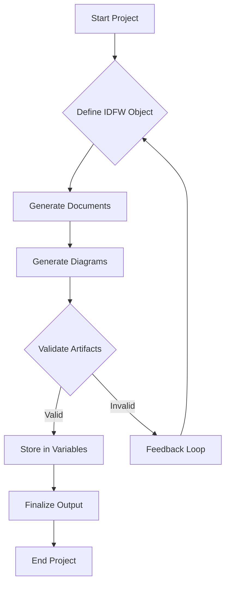
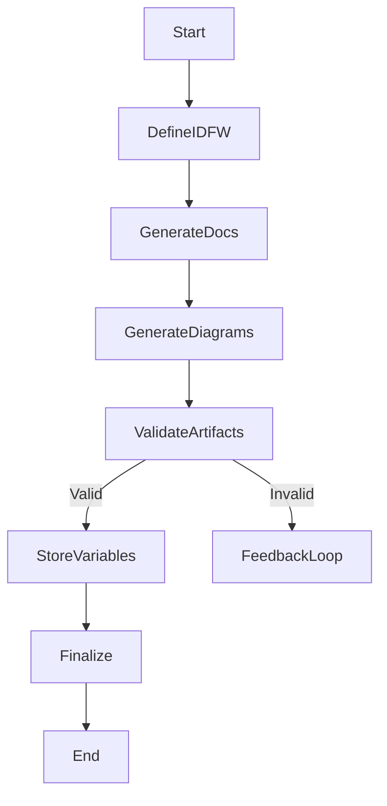

# IDFW Master Specification

**Version:** 1.2.0  
**Revision:** _a1  

| Version | Revision | Date       | Change Description                                                  |
| ------- | -------- | ---------- | ------------------------------------------------------------------- |
| 1.0.0   | _a1      | 2025-01-01 | Initial specification release                                        |
| 1.1.0   | _a1      | 2025-04-27 | Expanded documentation with detailed explanations and diagrams        |
| 1.2.0   | _a1      | 2025-05-05 | Included VC table under Revision and enhanced documentation sections |

## 1. High-Level Overview
The **Idea Definition Framework (IDFW)** is a comprehensive specification designed to define, structure, and maintain the various components of a project, including documents, diagrams, variables, and references. By encapsulating the project's scope within the IDFW object, the framework ensures efficient memory usage and optimal token management when interacting with Large Language Models (LLMs).

## 2. Core Concepts
- **Documents**: Structured textual artifacts such as BRD (Business Requirements Document) and FRS (Functional Requirements Specification).
- **Diagrams**: Visual representations like UML, BPMN, and Mermaid diagrams that illustrate system architecture and workflows.
- **Variables**: Key-value pairs that hold runtime or build-time data essential for project operations.
- **Project Actions**: Iterative processes for creating, updating, or removing artifacts within the project.
- **IDPV (Project Variables)**: Enhanced variable management system that handles both immutable and runtime variables.
- **IDCMD (Command Definitions)**: Structured command definitions for framework interactions.

## 3. Schema & Structure
The IDFW is defined as a JSON object adhering to the [IDFW.schema.json](#file:IDFW.schema.json) specifications. Below are references to key schema objects:

### 3.1 Axis Definitions
```jsonc
{
  "axisName": { "type": "string" },
  "min": { "type": "number" },
  "max": { "type": "number" },
  "masterInfluence": { "type": "number" }
}
```

### 3.2 Master Axis
```jsonc
{
  "axisName": { "type": "string" },
  "min": { "type": "number" },
  "max": { "type": "number" },
  "formula": { "type": "string" }
}
```

### 3.3 Documents
```jsonc
{
  "docId": { "type": "string" },
  "version": { "type": "string" },
  "revision": { "type": "string" },
  "date": { "type": "string", "format": "date-time" },
  "properties": {
    // Additional properties...
  }
}
```

### 3.4 IDPV Structure
```jsonc
{
  "idpv": {
    "constants": {
      // Immutable project variables defined at initialization
      "projectId": "string",
      "environment": "string",
      "baseConfig": {}
    },
    "runtime": {
      "axisDefinitions": [
        {
          "axisName": "string",
          "min": "number",
          "max": "number",
          "masterInfluence": "number"
        }
      ],
      "masterAxis": {
        "axisName": "string",
        "min": "number",
        "max": "number",
        "formula": "string"
      },
      "variableCollections": [
        {
          "collectionId": "string",
          "variables": {
            // Dynamic variables that can change during runtime
          },
          "scope": "string"
        }
      ]
    }
  }
}
```

### 3.5 IDCMD Structure
```jsonc
{
  "idcmd": {
    "commands": [
      {
        "command": "string",
        "shortname": "string",
        "arguments": [
          {
            "name": "string",
            "type": "string",
            "required": "boolean",
            "default": "string",
            "description": "string"
          }
        ],
        "description": "string"
      }
    ]
  }
}
```

## 4. Project Actions & Iterative Updates
IDFW facilitates iterative processing of project components, ensuring each action maintains referential integrity through validation functions.

### 4.1 Iterative Processing Flow


### 4.2 Process Flow Diagram


## 5. Usage Scenarios
IDFW supports a range of project complexities, from single MVPs with minimal documentation to extensive enterprise projects requiring compliance and multi-axis strategies.

### 5.1 Single MVP with Minimal Docs
- Focused scope with essential documents and diagrams.
- Efficient token usage for quick iterations.

### 5.2 Complex Enterprise Changes with Compliance
- Comprehensive documentation in line with industry standards.
- Enhanced validation to maintain compliance across all artifacts.

### 5.3 Multi-Axis Approach for Advanced Strategies
- Incorporates multiple axes to manage various project dimensions.
- Utilizes master axis definitions for overarching project influences.

## 6. References
- IDFW.schema.json for machine validation.
- SDREF.md for standard document and diagram formats.
- IDPG.md for generation scripts.
- IDPC.md for environment data.
- IDFPJs.md for predefined project journeys.

## 7. Iterative Nature & Referential Integrity
The IDFW framework emphasizes an iterative approach to processing project properties and objects. Each action performed within the framework undergoes rigorous validation to ensure referential integrity. Validation functions are invoked at every step, accepting single or multiple properties to verify data types and constraints against the Entity-Relationship Diagram (ERD). This continuous validation promotes feedback loops, allowing for real-time corrections and enhancements, thereby maintaining the robustness and reliability of the project artifacts.

### 7.1 Validation Function Example
```javascript
function validateProperties(properties) {
  if (Array.isArray(properties)) {
    return properties.map(prop => validateProperty(prop));
  }
  return validateProperty(properties);
}

function validateProperty(property) {
  // Validation logic...
  return true; // or false based on validation
}
```

## 8. Diagrams Integration
IDFW documentation includes visual representations to aid in understanding the framework's structure and processes.

### 8.1 Mermaid Flowchart


### 8.2 PlantUML Process Flow


---

**Version History**

| Version | Revision | Date       | Change Description                                                  |
| ------- | -------- | ---------- | ------------------------------------------------------------------- |
| 1.0.0   | _a1      | 2025-01-01 | Initial specification release                                        |
| 1.1.0   | _a1      | 2025-04-27 | Expanded documentation with detailed explanations and diagrams        |
| 1.2.0   | _a1      | 2025-05-05 | Included VC table under Revision and enhanced documentation sections |

---

**Update Log:** Updated for schema compatibility and workflow alignment.