# Diagrams for Liightbulb Package

This document contains all the diagrams for the `liightbulb` package, created using the IDEA Framework logic.

## Table of Contents
1. [System Context Diagram](#system-context-diagram)
2. [Component Diagram](#component-diagram)
3. [Entity-Relationship Diagram](#entity-relationship-diagram)
4. [User Flow Diagram](#user-flow-diagram)
5. [Security & Threat Model](#security--threat-model)
6. [Incident Response Flow](#incident-response-flow)
7. [Business Continuity Process](#business-continuity-process)
8. [UX Flow & Wireframe](#ux-flow--wireframe)
9. [HyperPlot Multi-Axis Diagram](#hyperplot-multi-axis-diagram)
10. [OpenAI Integration Flow](#openai-integration-flow)
11. [OpenAI API Interaction Sequence](#openai-api-interaction-sequence)
12. [OpenAI Component Hierarchy](#openai-component-hierarchy)
13. [OpenAI Architecture Overview](#openai-architecture-overview)

---

## 1. System Context Diagram

## 2. Component Diagram
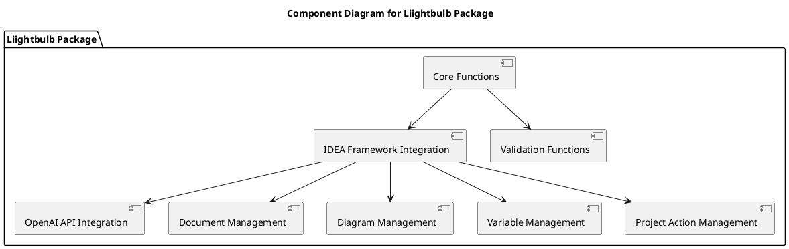

## 3. Entity-Relationship Diagram
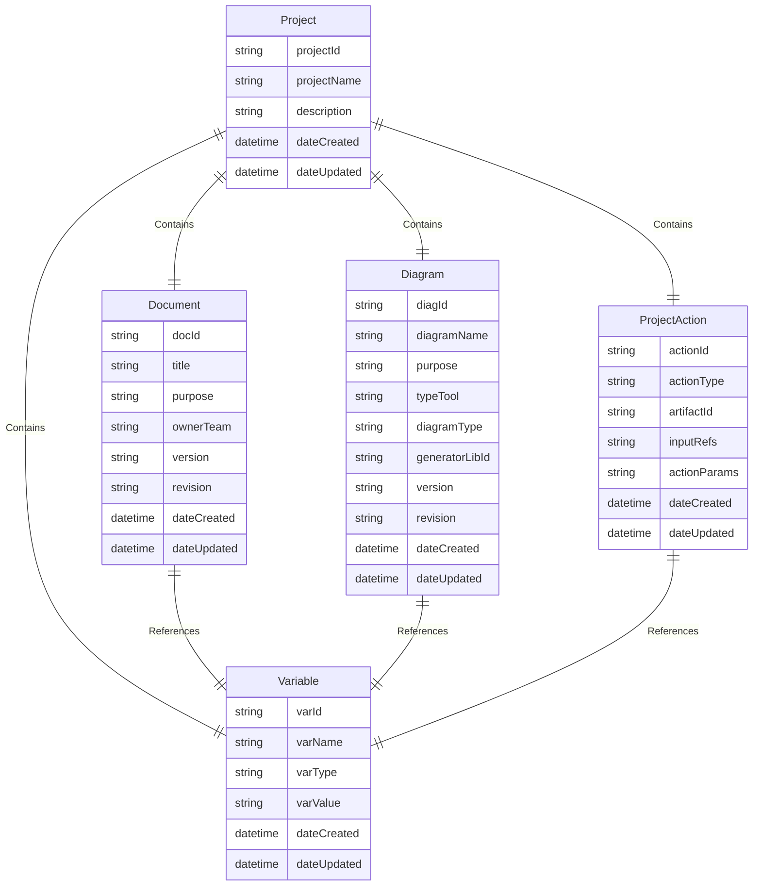

## 4. User Flow Diagram
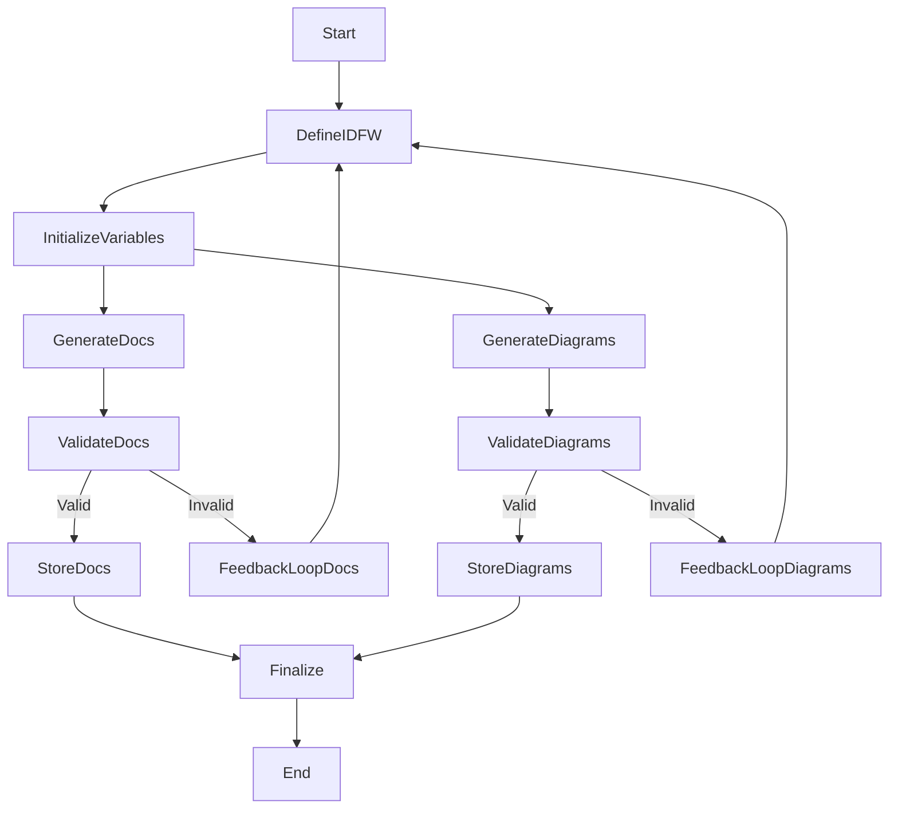

## 5. Security & Threat Model
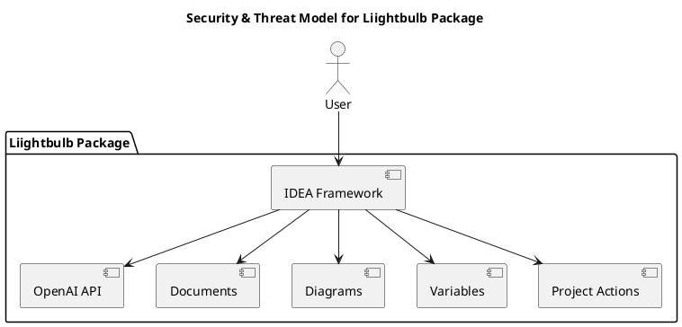

## 6. Incident Response Flow
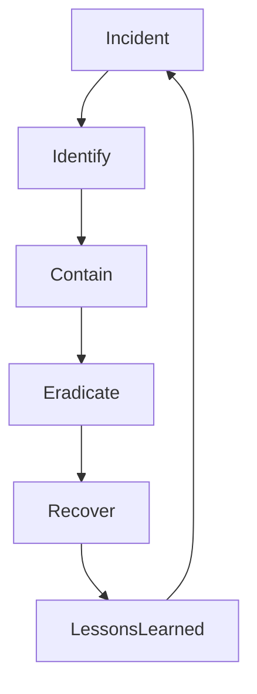

## 7. Business Continuity Process
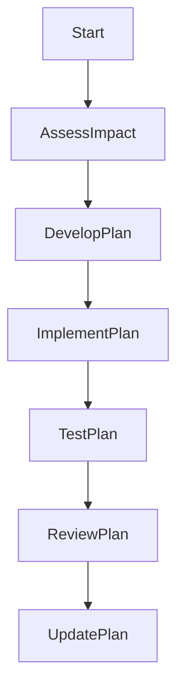

## 8. UX Flow & Wireframe
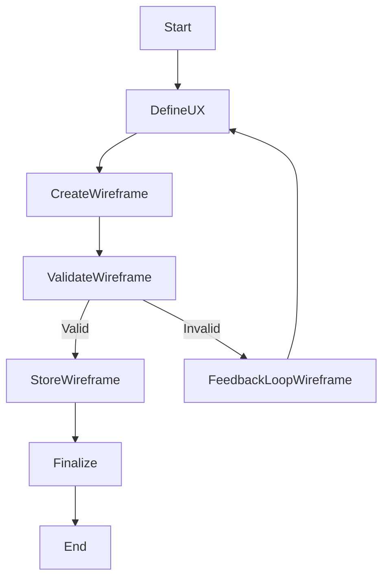

## 9. HyperPlot Multi-Axis Diagram
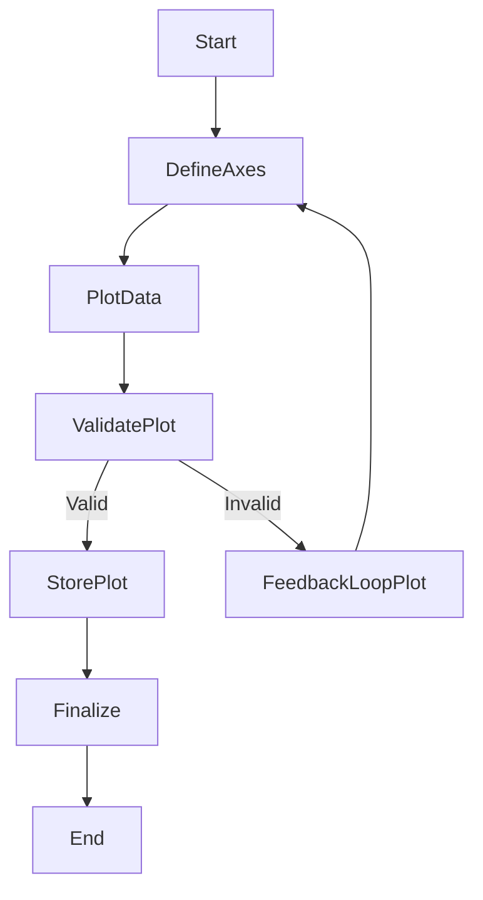

## 10. OpenAI Integration Flow
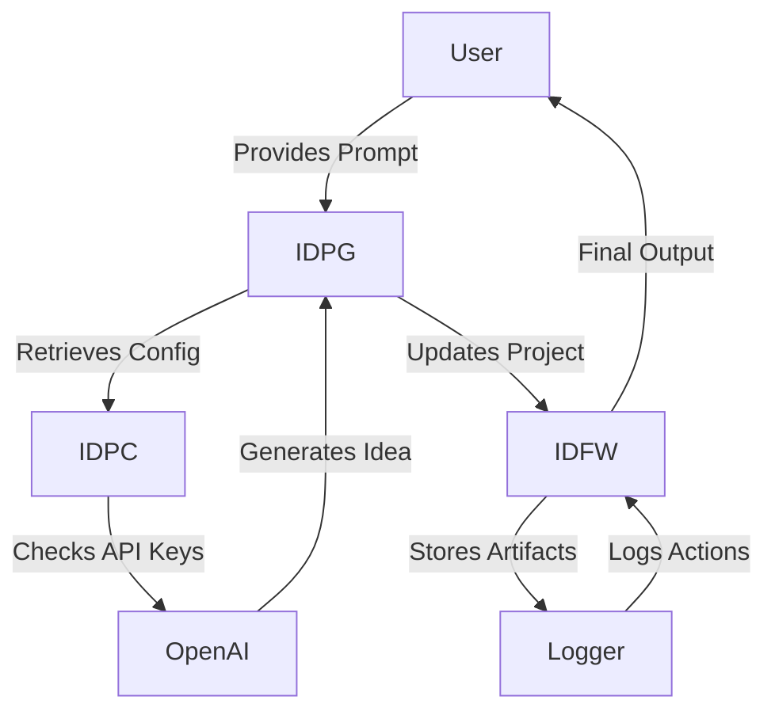

## 11. OpenAI API Interaction Sequence
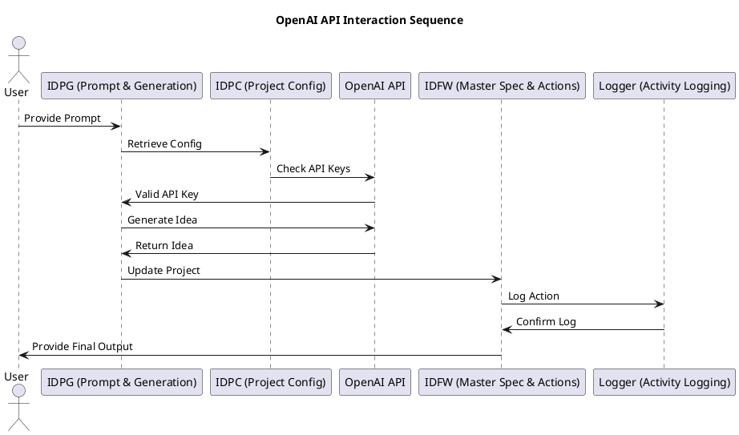

## 12. OpenAI Component Hierarchy
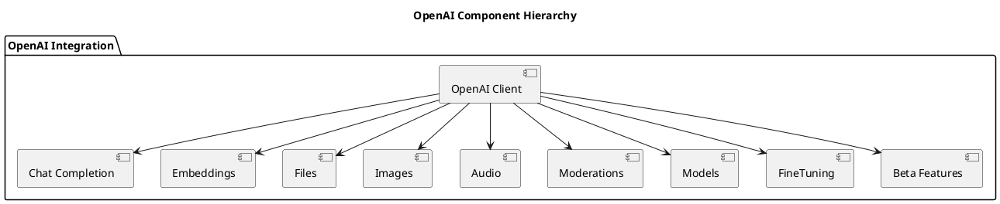

## 13. OpenAI Architecture Overview
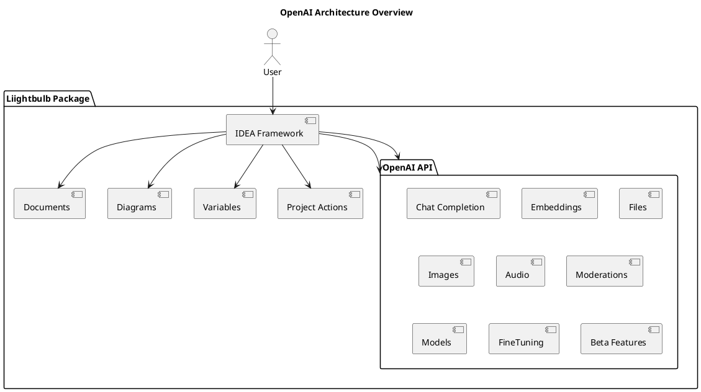

---

**Document Version**: 1.0.0  
**Publication Date**: 2025-01-01  
**IDEA Framework Version**: 2.0.0  
**Components Used**: IDFW, SDREF, DDD
