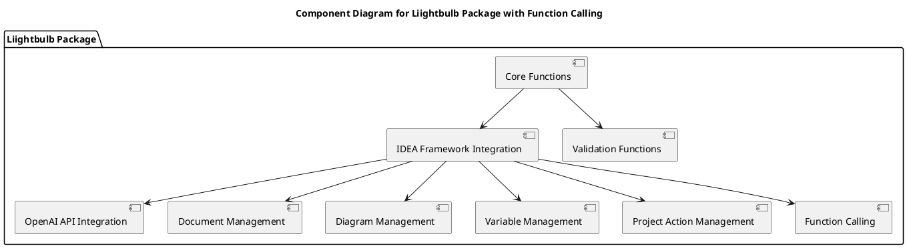
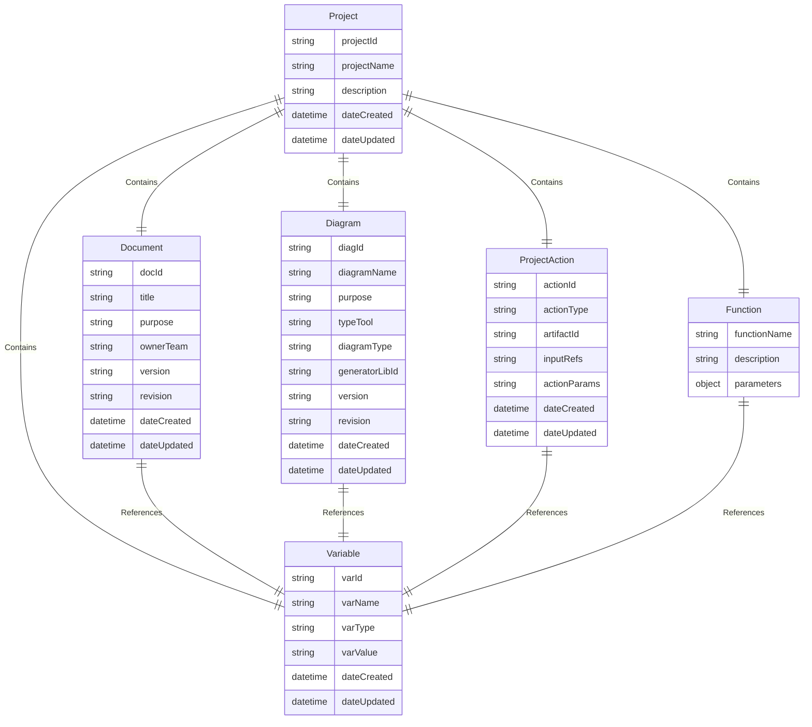
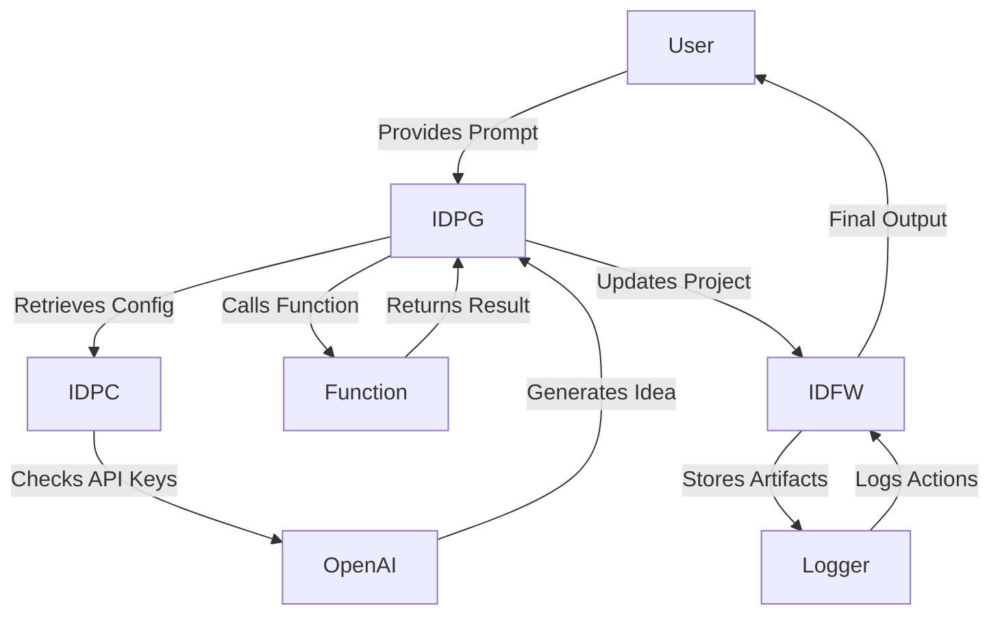
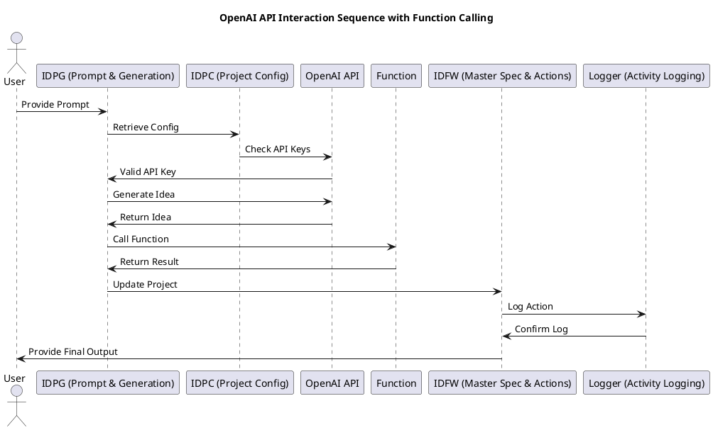
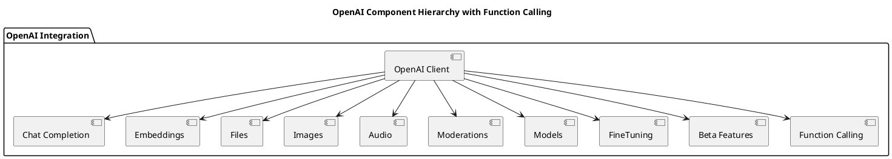
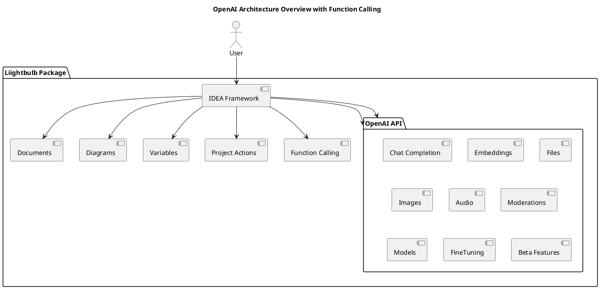

# Function Calling with OpenAI for Liightbulb Package

## Version: 1.3.0  
## Revision: _a1  
## Date: 2025-02-07  

---

## 1. Introduction
This document provides a detailed guide on using function calling with OpenAI for the `liightbulb` package. Function calling can increase efficiency and preserve memory by allowing the model to call predefined functions and return structured outputs.

## 2. Setup Instructions
### 2.1 Prerequisites
- Python 3.7 or higher
- OpenAI Python SDK
- IDEA Framework components

### 2.2 Installation
1. **Install OpenAI Python SDK**:
    ```bash
    pip install openai
    ```

2. **Set up Environment Variables**:
    ```bash
    export OPENAI_API_KEY="your-openai-api-key"
    ```

## 3. Example Code
### 3.1 Initializing OpenAI Client
```python
import openai
import os

# Initialize OpenAI client
openai.api_key = os.getenv('OPENAI_API_KEY')
```

### 3.2 Defining Functions
```python
def get_weather(location):
    # Example function to get weather information
    return {
        "location": location,
        "temperature": "22°C",
        "condition": "Sunny"
    }

functions = [{
    "name": "get_weather",
    "description": "Get current temperature for a given location.",
    "parameters": {
        "type": "object",
        "properties": {
            "location": {
                "type": "string",
                "description": "City and country e.g. Bogotá, Colombia"
            }
        },
        "required": ["location"]
    }
}]
```

### 3.3 Using Function Calling
```python
def call_function(prompt, function_name, function_params):
    response = openai.Completion.create(
        model="gpt-4",
        prompt=prompt,
        max_tokens=150,
        functions=functions,
        function_call={
            "name": function_name,
            "parameters": function_params
        }
    )
    return response.choices[0].text.strip()

# Example usage
prompt = "What is the weather like in Paris today?"
function_name = "get_weather"
function_params = {"location": "Paris, France"}
result = call_function(prompt, function_name, function_params)
print(f"Function Call Result: {result}")
```

## 4. Best Practices
### 4.1 Managing API Keys
- Store API keys securely using environment variables or a secrets manager.
- Avoid hardcoding API keys in your source code.

### 4.2 Handling API Rate Limits
- Implement retry logic to handle rate limits.
- Monitor your usage and adjust your plan as needed.

### 4.3 Optimizing Token Usage
- Use concise prompts to minimize token usage.
- Set appropriate `max_tokens` to control the length of responses.

## 5. Integration with IDEA Framework
### 5.1 Creating a New Project
```python
from idea_framework import Project

# Initialize a new project
project = Project(project_id="proj-001", project_name="Liightbulb Project", description="A project to integrate OpenAI with IDEA Framework")

# Add documents, diagrams, and variables as needed
project.add_document(Document(doc_id="doc-001", title="Project Plan", purpose="Outline the project plan"))
project.add_diagram(Diagram(diag_id="diag-001", diagram_name="System Architecture", purpose="Illustrate the system architecture"))
project.add_variable(Variable(var_id="var-001", var_name="API_KEY", var_type="string", var_value=os.getenv('OPENAI_API_KEY')))
```

### 5.2 Using Function Calling within the Project
```python
# Define functions and add them to the project
functions = [{
    "name": "get_weather",
    "description": "Get current temperature for a given location.",
    "parameters": {
        "type": "object",
        "properties": {
            "location": {
                "type": "string",
                "description": "City and country e.g. Bogotá, Colombia"
            }
        },
        "required": ["location"]
    }
}]
project.add_document(Document(doc_id="doc-002", title="Function Definitions", purpose="Store function definitions", content=functions))

# Call a function and add the result to the project
prompt = "What is the weather like in Paris today?"
function_name = "get_weather"
function_params = {"location": "Paris, France"}
result = call_function(prompt, function_name, function_params)
project.add_document(Document(doc_id="doc-003", title="Function Call Result", purpose="Store the result of the function call", content=result))
```

## 6. Technical Diagrams
### 6.1 Component Diagram


### 6.2 Entity-Relationship Diagram


### 6.3 OpenAI Integration Flow with Function Calling


### 6.4 OpenAI API Interaction Sequence with Function Calling


### 6.5 OpenAI Component Hierarchy with Function Calling


### 6.6 OpenAI Architecture Overview with Function Calling


---

**Document Version**: 1.3.0  
**Publication Date**: 2025-02-07  
**IDEA Framework Version**: 2.3.0  
**Components Used**: IDFW, SDREF, DDD
