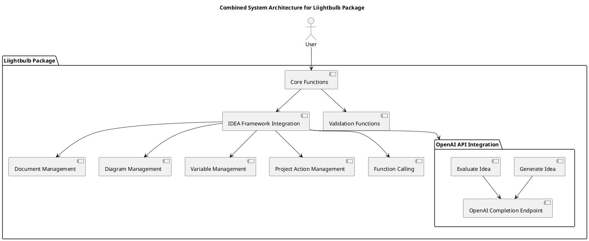

# Functions Overview for Liightbulb Package

## Version: 1.3.0  
## Revision: _a1  
## Date: 2025-02-07  

---

## 1. Introduction
This document provides an overview of the functions within the `liightbulb` package, detailing their inputs, returned data types, and references to structured outputs. It also explains how the OpenAI API will be leveraged in these processes.

## 2. Core Functions
### 2.1 create_project_component
Creates a new project component.

#### Inputs
- `component_type: str` - The type of component to create (e.g., "document", "diagram").
- `component_data: dict` - The data for the component.

#### Returns
- `component_id: str` - The ID of the created component.

### 2.2 update_project_component
Updates an existing project component.

#### Inputs
- `component_id: str` - The ID of the component to update.
- `update_data: dict` - The data to update the component with.

#### Returns
- `success: bool` - Whether the update was successful.

### 2.3 remove_project_component
Removes a project component.

#### Inputs
- `component_id: str` - The ID of the component to remove.

#### Returns
- `success: bool` - Whether the removal was successful.

### 2.4 generate_idea
Generates an idea using the OpenAI API.

#### Inputs
- `prompt: str` - The prompt to generate the idea.

#### Returns
- `idea: str` - The generated idea.

### 2.5 evaluate_idea
Evaluates an idea using the OpenAI API.

#### Inputs
- `idea: str` - The idea to evaluate.

#### Returns
- `evaluation: str` - The evaluation of the idea.

### 2.6 create_document
Creates a document using the IDEA Framework.

#### Inputs
- `document_data: dict` - The data for the document.

#### Returns
- `document_id: str` - The ID of the created document.

### 2.7 create_diagram
Creates a diagram using the IDEA Framework.

#### Inputs
- `diagram_data: dict` - The data for the diagram.

#### Returns
- `diagram_id: str` - The ID of the created diagram.

### 2.8 manage_variables
Manages variables using the IDEA Framework.

#### Inputs
- `variable_data: dict` - The data for the variable.

#### Returns
- `variable_id: str` - The ID of the managed variable.

## 3. Leveraging OpenAI API
### 3.1 Generating Ideas
The `generate_idea` function leverages the OpenAI API to generate ideas based on a given prompt. The function sends a request to the OpenAI API's completion endpoint and returns the generated idea.

#### Example
```python
def generate_idea(prompt):
    response = openai.Completion.create(
        model="gpt-4",
        prompt=prompt,
        max_tokens=150
    )
    return response.choices[0].text.strip()
```

### 3.2 Evaluating Ideas
The `evaluate_idea` function uses the OpenAI API to evaluate a given idea. The function sends a request to the OpenAI API's completion endpoint with the idea as the prompt and returns the evaluation.

#### Example
```python
def evaluate_idea(idea):
    response = openai.Completion.create(
        model="gpt-4",
        prompt=f"Evaluate the following idea: {idea}",
        max_tokens=150
    )
    return response.choices[0].text.strip()
```

## 4. Structured Outputs
For detailed information on structured outputs, please refer to the [Structured Outputs Documentation](./structured-outputs.md).

## 5. Combined System Diagram
### 5.1 System Architecture Diagram


---

**Document Version**: 1.3.0  
**Publication Date**: 2025-02-07  
**IDEA Framework Version**: 2.3.0  
**Components Used**: 
- IDFW (2.3.0) [IDFW.json](./idref/IDFW.json)
- IDPG (1.0.0) [IDPG.json](./idref/IDPG.json)
- IDPC (1.0.0) [IDPC.json](./idref/IDPC.json)
- IDPJ (1.0.0) [IDPJ.json](./idref/IDPJ.json)
- IDDC (1.0.0) [IDDC.json](./idref/IDDC.json)
- IDDG (1.0.0) [IDDG.json](./idref/IDDG.json)
- IDDV (1.0.0) [IDDV.json](./idref/IDDV.json)
