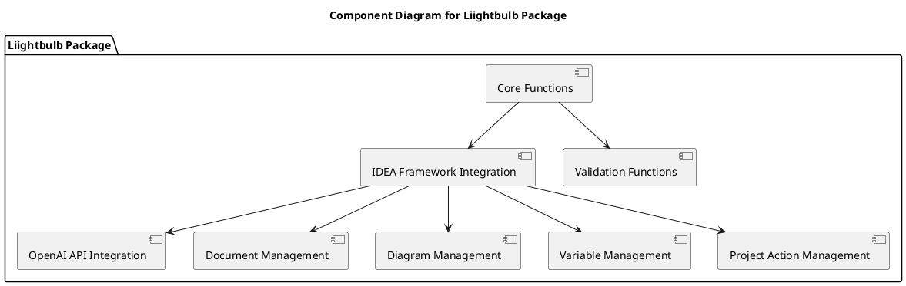
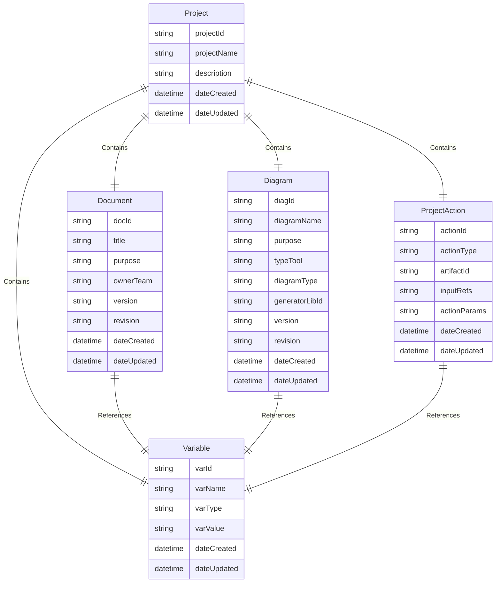
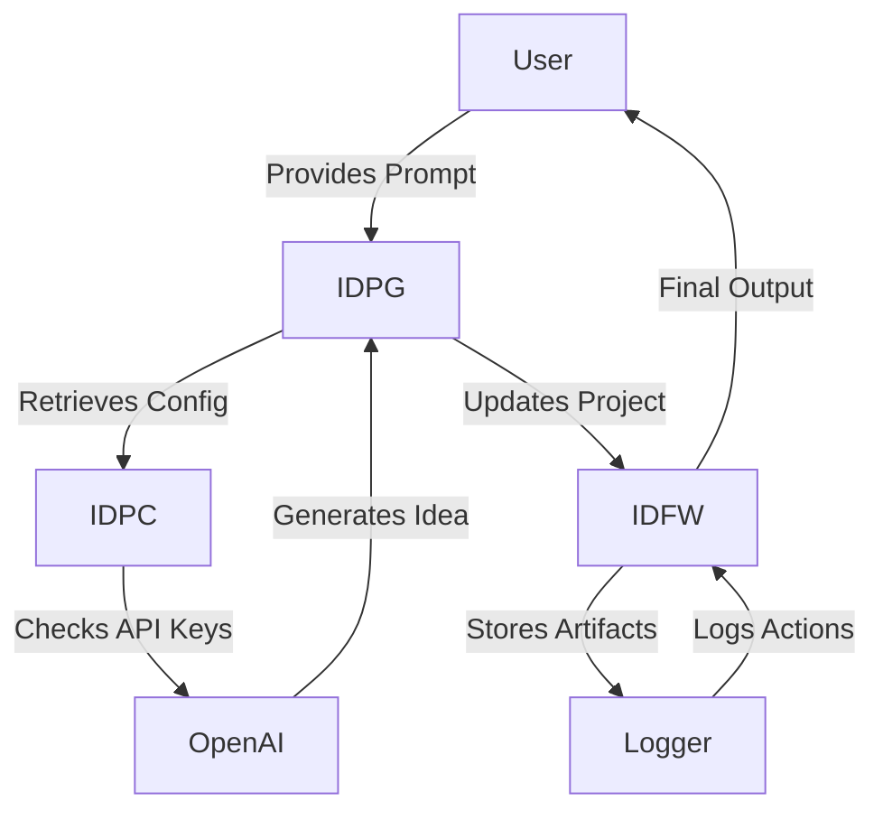
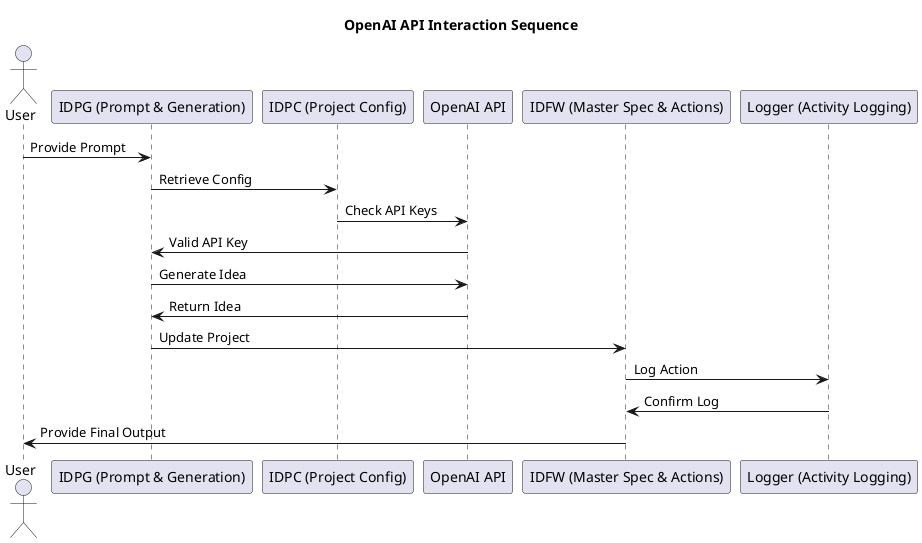
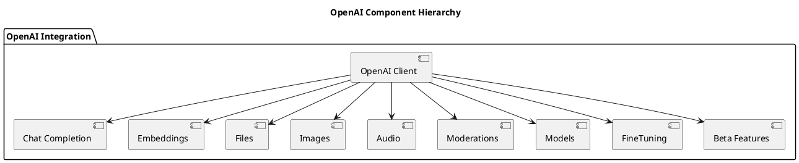
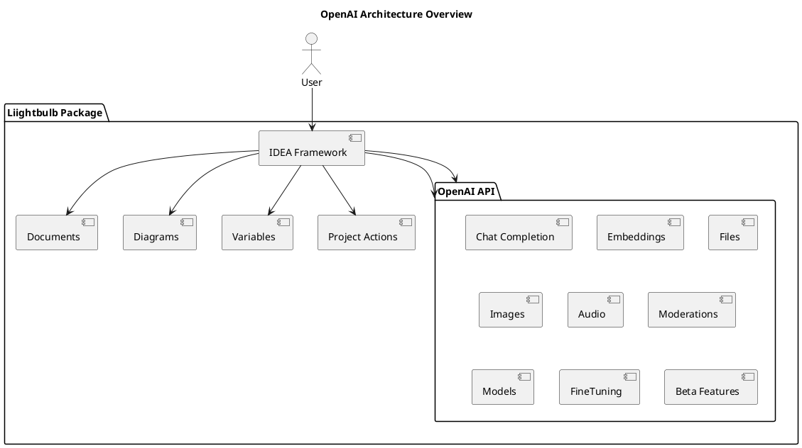

# Implementation Details for Liightbulb Package

## Version: 1.3.0  
## Revision: _a1  
## Date: 2025-02-07  

---

## 1. Introduction
The **Liightbulb Package** is designed to be a highly extensible and modular framework for developing, evaluating, and applying ideas using the IDEA Framework. This document provides a detailed implementation guide, including architectural diagrams, to illustrate how the various components and entities of the IDEA Framework are utilized within the `liightbulb` package.

## 2. Core Components and Their Roles
### 2.1 IDEA Framework Components
- **IDFW**: The master specification that defines the structure and relationships of documents, diagrams, variables, and project actions.
- **IDPG**: The project generator that handles prompt-based artifact generation.
- **IDPC**: The project configuration that stores environment settings, API keys, and LLM configurations.
- **IDDA, IDDC, IDDG, IDDV**: Documents for artifacts, components, generators, and variables.
- **IDFPJ**: Predefined project journeys that provide templates for common use cases.

### 2.2 Liightbulb Package Components
- **Core Functions**: Functions for creating, updating, and removing project components.
- **IDEA Framework Integration**: Manages documents, diagrams, variables, and project actions within the IDEA framework.
- **OpenAI API Integration**: Handles communication with the OpenAI API for generating and evaluating ideas.
- **Validation Functions**: Ensure referential integrity of project components.

## 3. Detailed Implementation Steps
### 3.1 Creating a New Project
1. **Initialize Project**: Create a new `Project` instance using the Project schema.
2. **Add Documents**: Use the `add_document` method to add documents to the project.
3. **Add Diagrams**: Use the `add_diagram` method to add diagrams to the project.
4. **Add Variables**: Use the `add_variable` method to add variables to the project.
5. **Add Project Actions**: Use the `add_project_action` method to add project actions to the project.

### 3.2 Generating and Evaluating Ideas
1. **Initialize OpenAI Client**: Create an instance of the OpenAI client.
2. **Generate Idea**: Use the `generate_idea` method to generate an idea using the OpenAI API.
3. **Evaluate Idea**: Use the `evaluate_idea` method to evaluate the generated idea.

### 3.3 Managing Variables
1. **Create Variable**: Create a new `Variable` instance using the Variable schema.
2. **Add Variable to Project**: Use the `add_variable` method to add the variable to the project.
3. **Update Variable**: Modify the variable's value and update the `date_updated` attribute.

## 4. Architectural Design
### 4.1 High-Level Architecture
The `liightbulb` package is designed to be highly extensible and modular, supporting various use cases such as web interfaces, mobile apps, and custom GPT or series of agents. The architecture is built around the IDEA Framework components, ensuring consistency and scalability.

### 4.2 Component Diagram


### 4.3 Entity-Relationship Diagram


### 4.4 OpenAI Integration Flow


### 4.5 OpenAI API Interaction Sequence


### 4.6 OpenAI Component Hierarchy


### 4.7 OpenAI Architecture Overview


## 5. Use Cases & Workflows
### 5.1 IF2IF: IDEA-Framework-to-IDEA-Framework
- **Self-referential** scenario. The framework generates or updates documentation about itself.
- Example projectActions:
  1. `artifactId: diag-idfw-erd, actionType: generate`
  2. `artifactId: hp-idfw, actionType: update, inputRefs: [diag-idfw-erd.latest]`

### 5.2 Expanding with Additional Tools
- Add new diagrams referencing “mermaid-gantt” or “plantuml-sequence.”
- Create or import new generator objects in DDD.

### 5.3 Recursive Iteration Examples
1. Generate “ERD.”
2. Update “API doc” referencing the new data model.
3. Refresh “HyperPlot” to reflect changes in complexity or compliance.

## 6. Implementing IDEA Framework Execution Logic with OpenAI
### 6.1 Predicted Outputs
Predicted Outputs enable you to speed up API responses from Chat Completions when many of the output tokens are known ahead of time. This is most common when you are regenerating a text or code file with minor modifications.

#### Example: Refactor a TypeScript Class
```typescript
import OpenAI from "openai";

const code = `
class User {
  firstName: string = "";
  lastName: string = "";
  username: string = "";
}

export default User;
`.trim();

const openai = new OpenAI();

const refactorPrompt = `
Replace the "username" property with an "email" property. Respond only 
with code, and with no markdown formatting.
`;

const completion = await openai.chat.completions.create({
  model: "gpt-4o",
  messages: [
    {
      role: "user",
      content: refactorPrompt
    },
    {
      role: "user",
      content: code
    }
  ],
  store: true,
  prediction: {
    type: "content",
    content: code
  }
});

console.log(completion);
console.log(completion.choices[0].message.content);
```

### 6.2 Function Calling
Function calling provides a powerful and flexible way for OpenAI models to interface with your code or external services.

#### Example: Get Weather
```python
from openai import OpenAI

client = OpenAI()

tools = [{
    "type": "function",
    "function": {
        "name": "get_weather",
        "description": "Get current temperature for a given location.",
        "parameters": {
            "type": "object",
            "properties": {
                "location": {
                    "type": "string",
                    "description": "City and country e.g. Bogotá, Colombia"
                }
            },
            "required": [
                "location"
            ],
            "additionalProperties": False
        },
        "strict": True
    }
}]

completion = client.chat.completions.create(
    model="gpt-4o",
    messages=[{"role": "user", "content": "What is the weather like in Paris today?"}],
    tools=tools
)

print(completion.choices[0].message.tool_calls);
```

### 6.3 Streaming
Streaming can be used to surface progress by showing which function is called as the model fills its arguments, and even displaying the arguments in real time.

#### Example: Streaming Function Calls
```python
from openai import OpenAI

client = OpenAI()

tools = [{
    "type": "function",
    "function": {
        "name": "get_weather",
        "description": "Get current temperature for a given location.",
        "parameters": {
            "type": "object",
            "properties": {
                "location": {
                    "type": "string",
                    "description": "City and country e.g. Bogotá, Colombia"
                }
            },
            "required": ["location"],
            "additionalProperties": False
        },
        "strict": True
    }
}]

stream = client.chat.completions.create(
    model="gpt-4o",
    messages=[{"role": "user", "content": "What's the weather like in Paris today?"}],
    tools=tools,
    stream=True
)

for chunk in stream:
    delta = chunk.choices[0].delta
    print(delta.tool_calls)
```

---

**Document Version**: 1.3.0  
**Publication Date**: 2025-02-07  
**IDEA Framework Version**: 2.3.0  
**Components Used**: IDFW, SDREF, DDD
