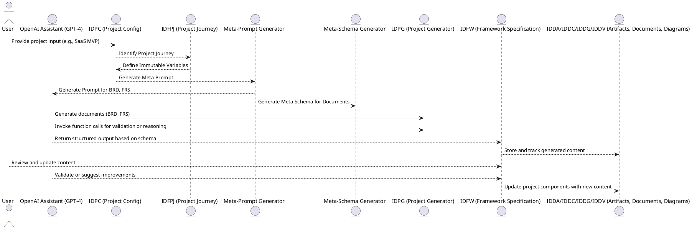
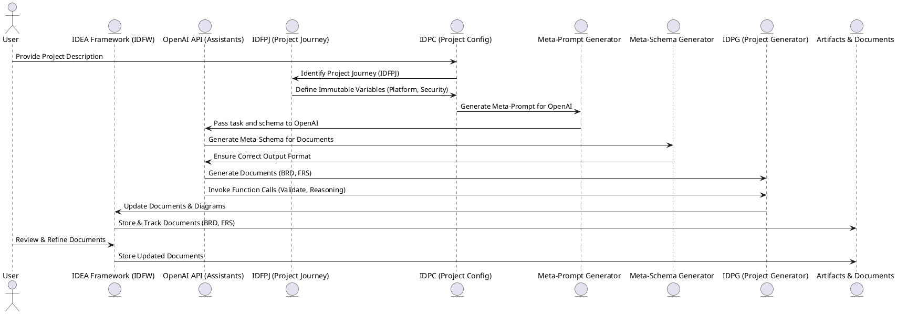
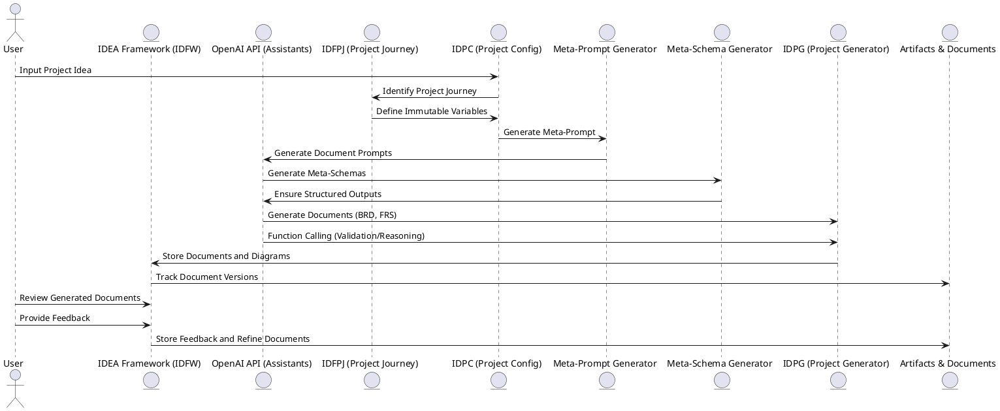
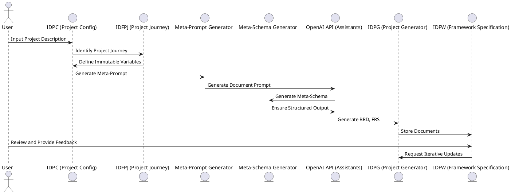

### **System Design Document for OpenAI Integration within IDEA Framework**

---

#### **Overview**

This document outlines the full system design for integrating **OpenAI** with the **IDEA Framework**, specifically within the **liightbulb** package. The goal is to provide a **guided approach** for **project development** using OpenAI’s powerful **Assistants API** combined with **meta-prompts**, **meta-schemas**, and **function calling**. The design emphasizes **interoperability** between **IDEA Framework** components and **OpenAI**, ensuring efficient document generation, validation, and iterative updates.

The system is **referential**, leveraging **schemas** to guide **OpenAI’s responses**, improving both the **speed** and **accuracy** of document generation while adhering to the defined project constraints.

---

### **Key Components**

1. **IDEA Framework**: The core framework for organizing project components, including documents, diagrams, and variables.
2. **OpenAI Integration**: Using the **Assistants API**, **meta-prompts**, **meta-schemas**, and **function calling** for dynamic task execution and reasoning.
3. **Iterative Document Generation**: Ensures project documents (BRD, FRS, TAD, etc.) evolve iteratively based on user input and feedback.

---

### **Process Flow**

1. **User Input** → The user provides the project description.
2. **IDFPJ Identification** → The system identifies the **IDFPJ (Project Journey)** based on the user's input.
3. **Immutable Variables** → The system generates **immutable variables** based on the identified **IDFPJ**, such as platform type, communication style, and security level.
4. **Meta-Prompt Generation** → **IDEA Framework** generates **meta-prompts** for OpenAI, guiding it to generate documents like **BRD** and **FRS**.
5. **Schema Generation** → **Meta-schemas** are used to define the structure of the required documents and ensure compliance with project constraints.
6. **OpenAI Interaction** → **OpenAI** generates documents or updates based on the provided **meta-prompts** and **meta-schemas**.
7. **Iterative Updates** → Documents and diagrams are updated iteratively with **reasoning** and **validation** from OpenAI.
8. **Final Document Storage** → The final documents and diagrams are stored and tracked in **IDFW (Framework Specification)**.

---

### **Component Diagram**

This diagram illustrates the major components of the system and how they interact.

---

### **System Diagram**

This diagram showcases the entire system flow from **user input** to **final document generation** using OpenAI and the IDEA Framework.

---

### **User Journey**

This journey illustrates the user’s experience, from providing input to reviewing and iterating on generated documents.

---

### **Detailed Breakdown of System Components**

#### **1. IDFPJ (Project Journey)**

The **IDFPJ** defines the project use case. It determines the required **documents** (BRD, FRS, TAD, etc.) and **diagrams** (ERD, SCTX, etc.). It also influences the generation of **immutable variables** (platform, communication type, security requirements) that are specific to the project.

---

#### **2. IDPC (Project Configuration)**

The **IDPC** component stores the **immutable variables** (such as platform, communication type, security) and passes them to **OpenAI** for document generation. These variables constrain the model’s responses, ensuring that **OpenAI** generates content that fits within the project’s defined constraints.

---

#### **3. Meta-Prompt Generator**

The **meta-prompt generator** creates a specialized **prompt** based on the **user input** and **IDFPJ** requirements. It includes detailed instructions for **OpenAI**, ensuring that the generated content adheres to the project’s requirements (e.g., content style, structure).

---

#### **4. Meta-Schema Generator**

The **meta-schema generator** defines the **schema** for the documents (e.g., **BRD**, **FRS**) and ensures the output is structured according to the predefined format. It validates that **OpenAI**'s output adheres to the required structure, ensuring that fields are present, required, and correctly formatted.

---

#### **5. IDPG (Project Generator)**

The **IDPG** invokes **OpenAI** to generate or update project documents and diagrams. It ensures that all generated content (e.g., **BRD**, **FRS**) follows the user’s instructions and aligns with the generated **meta-schemas**.

---

#### **6. IDFW (Framework Specification)**

The **IDFW** manages the iterative updates to the documents and ensures that generated content is stored and tracked. It keeps all documents and diagrams in sync, ensuring that new versions reflect changes based on user feedback and OpenAI reasoning.

---

### **Process Diagrams**

#### **1. Process Flow for Document Generation**

---

### **Conclusion**

This system design ensures that **OpenAI** integrates seamlessly with the **IDEA Framework**, providing efficient document generation, validation, and iterative updates. The use of **meta-prompts** and **meta-schemas** ensures that **OpenAI** generates content in the desired format, while the **IDEA Framework** manages the project lifecycle and ensures consistency across documents and diagrams. The use of **function calling** allows for enhanced interactivity and real-time updates during the project journey.

This design is **modular**, **scalable**, and allows for continuous improvement and adaptation based on user feedback and evolving project needs.

Let me know if you would like to proceed with coding or further clarification!