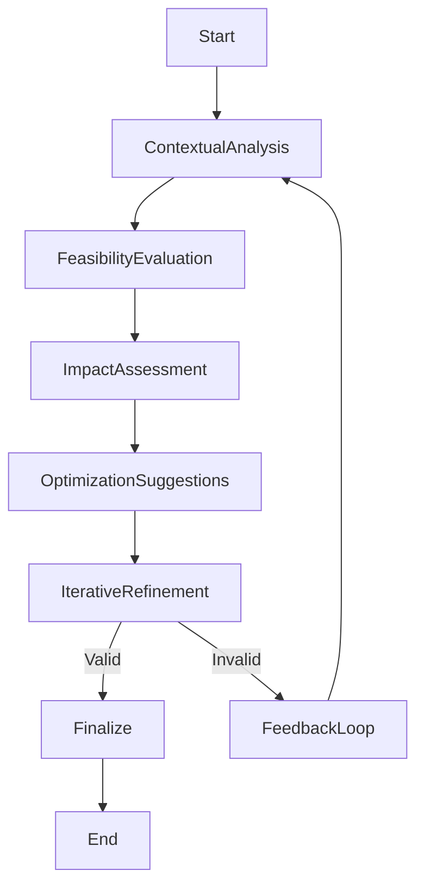
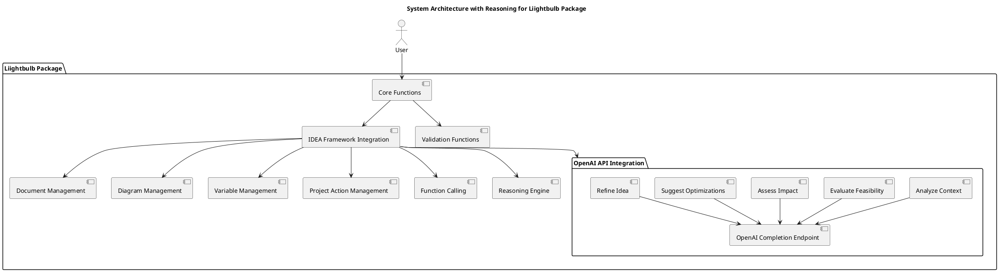

# Reasoning Implementation for Liightbulb Package

## Version: 1.3.0  
## Revision: _a1  
## Date: 2025-02-07  

---

## 1. Introduction
This document explains the implementation of reasoning when iterating and improving upon an idea within the `liightbulb` package. It includes relevant diagrams and references to ensure efficient and accurate idea development. It also explains how the OpenAI API will be leveraged in these processes.

## 2. Reasoning in Idea Iteration
### 2.1 Importance of Reasoning
Reasoning is crucial in the iterative process of idea development as it helps in:
- Evaluating the feasibility and impact of an idea.
- Identifying potential improvements and optimizations.
- Ensuring the idea aligns with project goals and constraints.

### 2.2 Implementing Reasoning
Reasoning can be implemented through the following steps:
1. **Contextual Analysis**: Analyze the context and requirements of the idea.
2. **Feasibility Evaluation**: Evaluate the feasibility of the idea using predefined criteria.
3. **Impact Assessment**: Assess the potential impact of the idea on the project.
4. **Optimization Suggestions**: Generate suggestions for optimizing the idea.
5. **Iterative Refinement**: Refine the idea based on the reasoning outcomes.

### 2.3 Example Workflow


## 3. Leveraging OpenAI API
### 3.1 Contextual Analysis
The OpenAI API can be used to analyze the context and requirements of the idea by generating insights based on the provided context.

#### Example
```python
def analyze_context(context):
    response = openai.Completion.create(
        model="gpt-4",
        prompt=f"Analyze the following context: {context}",
        max_tokens=150
    )
    return response.choices[0].text.strip()
```

### 3.2 Feasibility Evaluation
The OpenAI API can evaluate the feasibility of the idea by generating a feasibility report based on the provided criteria.

#### Example
```python
def evaluate_feasibility(idea, criteria):
    response = openai.Completion.create(
        model="gpt-4",
        prompt=f"Evaluate the feasibility of the following idea: {idea} based on these criteria: {criteria}",
        max_tokens=150
    )
    return response.choices[0].text.strip()
```

### 3.3 Impact Assessment
The OpenAI API can assess the potential impact of the idea on the project by generating an impact report.

#### Example
```python
def assess_impact(idea):
    response = openai.Completion.create(
        model="gpt-4",
        prompt=f"Assess the impact of the following idea: {idea}",
        max_tokens=150
    )
    return response.choices[0].text.strip()
```

### 3.4 Optimization Suggestions
The OpenAI API can generate suggestions for optimizing the idea based on the provided context and criteria.

#### Example
```python
def suggest_optimizations(idea, context):
    response = openai.Completion.create(
        model="gpt-4",
        prompt=f"Suggest optimizations for the following idea: {idea} based on this context: {context}",
        max_tokens=150
    )
    return response.choices[0].text.strip()
```

### 3.5 Iterative Refinement
The OpenAI API can be used to iteratively refine the idea based on the reasoning outcomes.

#### Example
```python
def refine_idea(idea, feedback):
    response = openai.Completion.create(
        model="gpt-4",
        prompt=f"Refine the following idea: {idea} based on this feedback: {feedback}",
        max_tokens=150
    )
    return response.choices[0].text.strip()
```

## 4. Technical Diagrams
### 4.1 Reasoning Flow Diagram


### 4.2 System Architecture with Reasoning


## 5. References
For more information on the IDEA Framework and its components, please refer to the following documents:
- [IDEA Framework Master Specification](./IDEA_Complete_Reference.md)
- [Structured Outputs Documentation](./structured-outputs.md)

---

**Document Version**: 1.3.0  
**Publication Date**: 2025-02-07  
**IDEA Framework Version**: 2.3.0  
**Components Used**: 
- IDFW (2.3.0) [IDFW.json](./idref/IDFW.json)
- IDPG (1.0.0) [IDPG.json](./idref/IDPG.json)
- IDPC (1.0.0) [IDPC.json](./idref/IDPC.json)
- IDPJ (1.0.0) [IDPJ.json](./idref/IDPJ.json)
