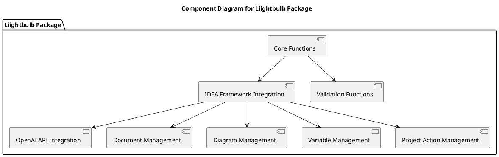
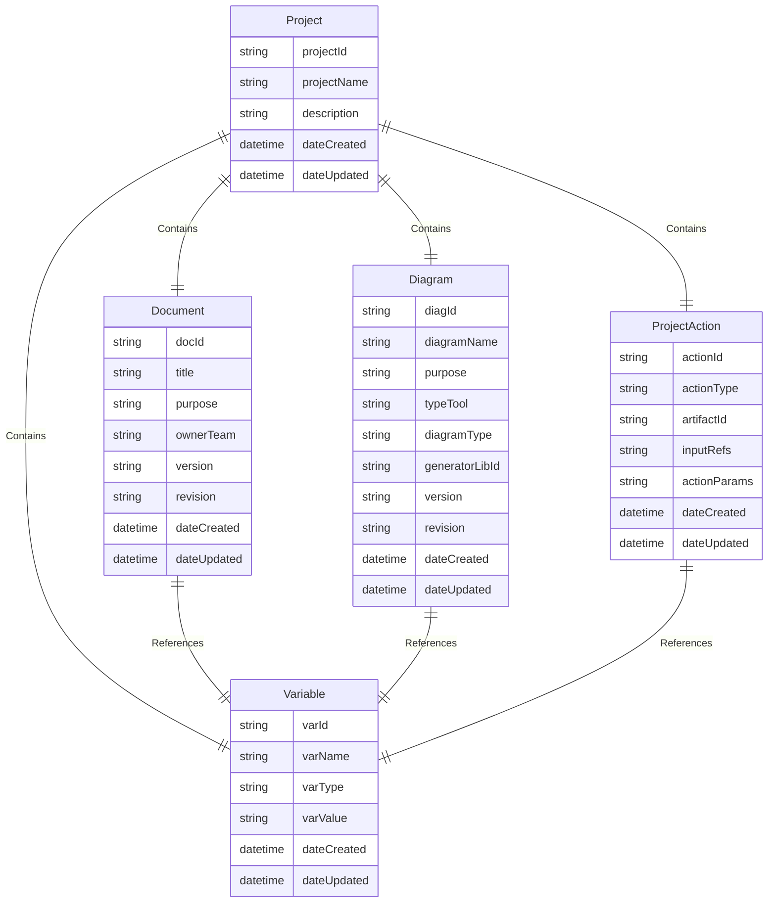

# Technical Details for Liightbulb Package Implementation

## Version: 1.3.0  
## Revision: _a1  
## Date: 2025-02-07  

---

## 1. Introduction
This document provides detailed technical information on the implementation of the `liightbulb` package, specifically referencing and incorporating parts of the IDEA framework, including foundational objects and their schemas.

## 2. Foundational Objects and Schemas
The `liightbulb` package leverages several foundational objects defined in the IDEA framework. These objects are structured according to specific schemas to ensure consistency and integrity across the project.

### 2.1 Project Object
The Project object is the central entity in the IDEA framework, encapsulating all components of a project, including documents, diagrams, variables, and project actions.

#### Schema Definition
```jsonc
{
  "type": "object",
  "properties": {
    "projectId": { "type": "string" },
    "projectName": { "type": "string" },
    "description": { "type": "string" },
    "dateCreated": { "type": "string", "format": "date-time" },
    "dateUpdated": { "type": "string", "format": "date-time" },
    "documents": { "type": "array", "items": { "$ref": "#/definitions/Document" } },
    "diagrams": { "type": "array", "items": { "$ref": "#/definitions/Diagram" } },
    "variables": { "type": "array", "items": { "$ref": "#/definitions/Variable" } },
    "projectActions": { "type": "array", "items": { "$ref": "#/definitions/ProjectAction" } }
  },
  "required": ["projectId", "projectName", "description", "dateCreated", "dateUpdated"]
}
```

### 2.2 Document Object
The Document object represents structured textual artifacts such as BRD (Business Requirements Document) and FRS (Functional Requirements Specification).

#### Schema Definition
```jsonc
{
  "type": "object",
  "properties": {
    "docId": { "type": "string" },
    "title": { "type": "string" },
    "purpose": { "type": "string" },
    "ownerTeam": { "type": "string" },
    "version": { "type": "string" },
    "revision": { "type": "string" },
    "dateCreated": { "type": "string", "format": "date-time" },
    "dateUpdated": { "type": "string", "format": "date-time" },
    "references": { "type": "array", "items": { "type": "string" } },
    "variables": { "type": "array", "items": { "$ref": "#/definitions/Variable" } }
  },
  "required": ["docId", "title", "purpose", "ownerTeam", "version", "revision", "dateCreated", "dateUpdated"]
}
```

### 2.3 Diagram Object
The Diagram object represents visual representations like UML, BPMN, and Mermaid diagrams that illustrate system architecture and workflows.

#### Schema Definition
```jsonc
{
  "type": "object",
  "properties": {
    "diagId": { "type": "string" },
    "diagramName": { "type": "string" },
    "purpose": { "type": "string" },
    "typeTool": { "type": "string" },
    "diagramType": { "type": "string" },
    "generatorLibId": { "type": "string" },
    "version": { "type": "string" },
    "revision": { "type": "string" },
    "dateCreated": { "type": "string", "format": "date-time" },
    "dateUpdated": { "type": "string", "format": "date-time" },
    "variables": { "type": "array", "items": { "$ref": "#/definitions/Variable" } }
  },
  "required": ["diagId", "diagramName", "purpose", "typeTool", "diagramType", "generatorLibId", "version", "revision", "dateCreated", "dateUpdated"]
}
```

### 2.4 Variable Object
The Variable object holds key-value pairs that contain runtime or build-time data essential for project operations.

#### Schema Definition
```jsonc
{
  "type": "object",
  "properties": {
    "varId": { "type": "string" },
    "varName": { "type": "string" },
    "varType": { "type": "string" },
    "varValue": { "type": "string" },
    "dateCreated": { "type": "string", "format": "date-time" },
    "dateUpdated": { "type": "string", "format": "date-time" }
  },
  "required": ["varId", "varName", "varType", "varValue", "dateCreated", "dateUpdated"]
}
```

### 2.5 ProjectAction Object
The ProjectAction object represents iterative processes for creating, updating, or removing artifacts within the project.

#### Schema Definition
```jsonc
{
  "type": "object",
  "properties": {
    "actionId": { "type": "string" },
    "actionType": { "type": "string" },
    "artifactId": { "type": "string" },
    "inputRefs": { "type": "array", "items": { "type": "string" } },
    "actionParams": { "type": "object" },
    "dateCreated": { "type": "string", "format": "date-time" },
    "dateUpdated": { "type": "string", "format": "date-time" }
  },
  "required": ["actionId", "actionType", "artifactId", "dateCreated", "dateUpdated"]
}
```

## 3. Integration with IDEA Framework
The `liightbulb` package integrates with the IDEA Framework by utilizing the foundational objects and schemas defined above. This integration ensures that all components of the project are managed consistently and efficiently.

### 3.1 Creating a New Project
1. **Initialize Project**: Create a new `Project` instance using the Project schema.
2. **Add Documents**: Use the `add_document` method to add documents to the project.
3. **Add Diagrams**: Use the `add_diagram` method to add diagrams to the project.
4. **Add Variables**: Use the `add_variable` method to add variables to the project.
5. **Add Project Actions**: Use the `add_project_action` method to add project actions to the project.

### 3.2 Generating and Evaluating Ideas
1. **Initialize OpenAI Client**: Create an instance of the OpenAI client.
2. **Generate Idea**: Use the `generate_idea` method to generate an idea using the OpenAI API.
3. **Evaluate Idea**: Use the `evaluate_idea` method to evaluate the generated idea.

### 3.3 Managing Variables
1. **Create Variable**: Create a new `Variable` instance using the Variable schema.
2. **Add Variable to Project**: Use the `add_variable` method to add the variable to the project.
3. **Update Variable**: Modify the variable's value and update the `date_updated` attribute.

## 4. Interactions and Workflows
### 4.1 Creating a New Project
1. **Initialize Project**: Create a new `Project` instance.
2. **Add Documents**: Use `add_document` method to add documents to the project.
3. **Add Diagrams**: Use `add_diagram` method to add diagrams to the project.
4. **Add Variables**: Use `add_variable` method to add variables to the project.
5. **Add Project Actions**: Use `add_project_action` method to add project actions to the project.

### 4.2 Generating an Idea
1. **Initialize OpenAI Client**: Create an instance of the OpenAI client.
2. **Generate Idea**: Use the `generate_idea` method to generate an idea using the OpenAI API.
3. **Evaluate Idea**: Use the `evaluate_idea` method to evaluate the generated idea.

### 4.3 Managing Variables
1. **Create Variable**: Create a new `Variable` instance.
2. **Add Variable to Project**: Use `add_variable` method to add the variable to the project.
3. **Update Variable**: Modify the variable's value and update the `date_updated` attribute.

## 5. Technical Diagrams
### 5.1 Component Diagram


### 5.2 Entity-Relationship Diagram


---

**Document Version**: 1.3.0  
**Publication Date**: 2025-02-07  
**IDEA Framework Version**: 2.0.0  
**Components Used**: IDFW, SDREF, DDD
