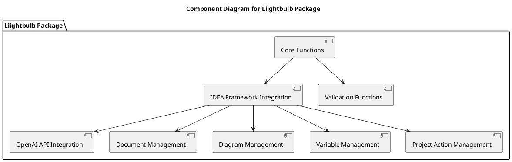
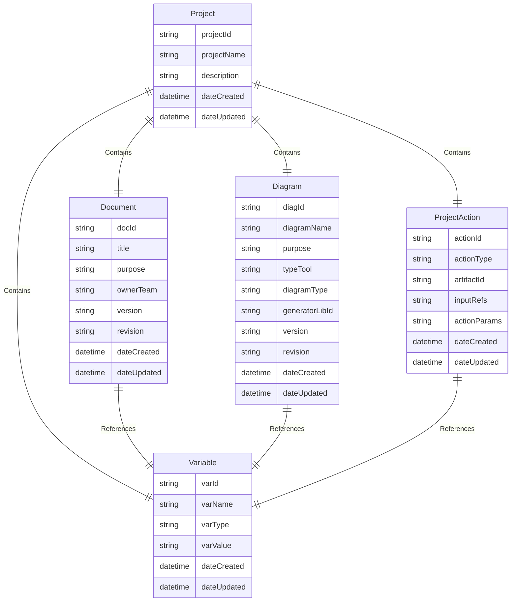

# Technical Reference for Liightbulb Package

## Version: 1.3.0  
## Revision: _a1  
## Date: 2025-02-07  

---

## 1. Introduction
The **Liightbulb Package** is a Python package designed to provide a framework for developing, evaluating, and applying ideas using the IDEA Framework. This document serves as a technical reference for the `liightbulb` package, detailing its components, classes, and interactions.

## 2. Core Components
### 2.1 Functions
- **create_project_component**: Creates a new project component.
- **update_project_component**: Updates an existing project component.
- **remove_project_component**: Removes a project component.

### 2.2 Integration with IDEA Framework
- **create_document**: Creates a document using the IDEA Framework.
- **create_diagram**: Creates a diagram using the IDEA Framework.
- **manage_variables**: Manages variables using the IDEA Framework.

### 2.3 Interaction with OpenAI API
- **generate_idea**: Generates an idea using the OpenAI API.
- **evaluate_idea**: Evaluates an idea using the OpenAI API.

## 3. Classes and Methods
### 3.1 Project Class
```python
class Project:
    def __init__(self, project_id, project_name, description):
        self.project_id = project_id
        self.project_name = project_name
        self.description = description
        self.date_created = datetime.now()
        self.date_updated = datetime.now()
        self.documents = []
        self.diagrams = []
        self.variables = []
        self.project_actions = []

    def add_document(self, document):
        self.documents.append(document)
        self.date_updated = datetime.now()

    def add_diagram(self, diagram):
        self.diagrams.append(diagram)
        self.date_updated = datetime.now()

    def add_variable(self, variable):
        self.variables.append(variable)
        self.date_updated = datetime.now()

    def add_project_action(self, project_action):
        self.project_actions.append(project_action)
        self.date_updated = datetime.now()
```

### 3.2 Document Class
```python
class Document:
    def __init__(self, doc_id, title, purpose, owner_team, version, revision):
        self.doc_id = doc_id
        self.title = title
        self.purpose = purpose
        self.owner_team = owner_team
        self.version = version
        self.revision = revision
        self.date_created = datetime.now()
        self.date_updated = datetime.now()
        self.references = []
        self.variables = []

    def add_reference(self, reference):
        self.references.append(reference)
        self.date_updated = datetime.now()

    def add_variable(self, variable):
        self.variables.append(variable)
        self.date_updated = datetime.now()
```

### 3.3 Diagram Class
```python
class Diagram:
    def __init__(self, diag_id, diagram_name, purpose, type_tool, diagram_type, generator_lib_id, version, revision):
        self.diag_id = diag_id
        self.diagram_name = diagram_name
        self.purpose = purpose
        self.type_tool = type_tool
        self.diagram_type = diagram_type
        self.generator_lib_id = generator_lib_id
        self.version = version
        self.revision = revision
        self.date_created = datetime.now()
        self.date_updated = datetime.now()
        self.variables = []

    def add_variable(self, variable):
        self.variables.append(variable)
        self.date_updated = datetime.now()
```

### 3.4 Variable Class
```python
class Variable:
    def __init__(self, var_id, var_name, var_type, var_value):
        self.var_id = var_id
        self.var_name = var_name
        self.var_type = var_type
        self.var_value = var_value
        self.date_created = datetime.now()
        self.date_updated = datetime.now()
```

### 3.5 ProjectAction Class
```python
class ProjectAction:
    def __init__(self, action_id, action_type, artifact_id, input_refs, action_params):
        self.action_id = action_id
        self.action_type = action_type
        self.artifact_id = artifact_id
        self.input_refs = input_refs
        self.action_params = action_params
        self.date_created = datetime.now()
        self.date_updated = datetime.now()
```

## 4. Interactions and Workflows
### 4.1 Creating a New Project
1. **Initialize Project**: Create a new `Project` instance.
2. **Add Documents**: Use `add_document` method to add documents to the project.
3. **Add Diagrams**: Use `add_diagram` method to add diagrams to the project.
4. **Add Variables**: Use `add_variable` method to add variables to the project.
5. **Add Project Actions**: Use `add_project_action` method to add project actions to the project.

### 4.2 Generating an Idea
1. **Initialize OpenAI Client**: Create an instance of the OpenAI client.
2. **Generate Idea**: Use `generate_idea` method to generate an idea using the OpenAI API.
3. **Evaluate Idea**: Use `evaluate_idea` method to evaluate the generated idea.

### 4.3 Managing Variables
1. **Create Variable**: Create a new `Variable` instance.
2. **Add Variable to Project**: Use `add_variable` method to add the variable to the project.
3. **Update Variable**: Modify the variable's value and update the `date_updated` attribute.

## 5. Technical Diagrams
### 5.1 Component Diagram


### 5.2 Entity-Relationship Diagram


---

**Document Version**: 1.3.0  
**Publication Date**: 2025-02-07  
**IDEA Framework Version**: 2.0.0  
**Components Used**: IDFW, SDREF, DDD
