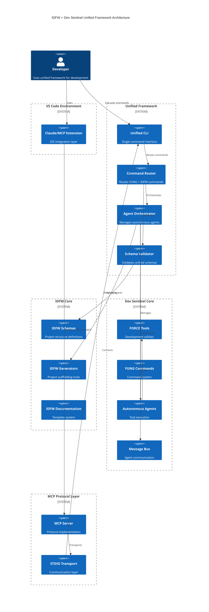

# IDFW + Dev Sentinel Unification: Executive Summary

## Linear Project Tracking
**Project ID**: 4d649a6501f7
**Project URL**: https://linear.app/projects/4d649a6501f7
**Team**: IDFWU (IDFW Unified Framework)

## Project Overview

This document outlines the unification of two complementary frameworks:
- **IDFW (IDEA Definition Framework)**: A JSON Schema-based specification framework for project structure and documentation
- **Dev Sentinel**: An AI-powered development assistant with autonomous agents and the FORCE framework

## Vision

Create a unified development framework that combines:
- IDFW's structured project definitions and documentation schemas
- Dev Sentinel's autonomous agent execution and FORCE tool system
- Seamless integration through MCP (Model Context Protocol) for VS Code/Claude
- Unified command interface merging YUNG commands with IDFW project actions

## Key Benefits

### 1. Complementary Strengths
- **IDFW**: Provides the "WHAT" - comprehensive project structure, documentation templates, and validation schemas
- **Dev Sentinel**: Provides the "HOW" - autonomous execution through intelligent agents and development tools

### 2. Unified Workflow
- Define project structure using IDFW schemas
- Execute development tasks through Dev Sentinel agents
- Maintain consistency through shared validation and schemas
- Single command interface for all operations

### 3. Enhanced Capabilities
- IDFW generators become autonomous agents
- Force tools understand IDFW project context
- Unified state management across systems
- Comprehensive MCP integration for IDE support

## Architecture Summary

### Core Components

#### 1. Schema Layer (Foundation)
- Unified JSON Schema system merging IDFW and Force schemas
- Shared validation framework
- Bidirectional schema conversion utilities

#### 2. Command Layer (Interface)
- Extended YUNG command system with IDFW actions
- Unified command parser and router
- Context-aware command execution

#### 3. Agent Layer (Execution)
- IDFW generators wrapped as Dev Sentinel agents
- Shared message bus for communication
- Task orchestration across both systems

#### 4. Protocol Layer (Integration)
- MCP servers exposing unified tools
- VS Code integration through standardized protocols
- RESTful and stdio transport options

## Implementation Phases

### Phase 1: Foundation (Week 1-2)
- Create unified directory structure
- Establish schema mapping framework
- Build basic command routing
- Create Linear epic and milestone tracking (Project ID: 4d649a6501f7)

### Phase 2: Schema Integration (Week 3-4)
- Merge JSON schemas
- Implement validation layer
- Create conversion utilities
- Update Linear issues with schema integration progress

### Phase 3: Command Unification (Week 5-6)
- Extend YUNG with IDFW commands
- Build unified CLI
- Implement command mapping
- Create Linear issues for command system milestones

### Phase 4: Agent Integration (Week 7-8)
- Wrap IDFW generators as agents
- Integrate message bus
- Implement state synchronization
- Track agent integration progress in Linear

### Phase 5: Protocol & Deployment (Week 9-10)
- Complete MCP integration
- VS Code extension updates
- Testing and documentation
- Final Linear project status updates and completion tracking

## Success Metrics

1. **Functional Integration**
   - All IDFW project actions executable through YUNG commands
   - IDFW schemas validated by Force tools
   - Bidirectional data flow between systems

2. **Performance**
   - No degradation in command execution speed
   - Efficient memory usage for large projects
   - Scalable agent orchestration

3. **Developer Experience**
   - Single unified CLI for all operations
   - Seamless VS Code integration
   - Comprehensive documentation and examples

## Risk Mitigation

1. **Schema Conflicts**: Implement namespace separation and conflict resolution
2. **State Synchronization**: Use event-driven architecture with proper versioning
3. **Backward Compatibility**: Maintain legacy command support with deprecation warnings
4. **Performance Impact**: Implement lazy loading and caching strategies

## Next Steps

1. Review and approve unification plan
2. Set up development environment with Linear integration (Project ID: 4d649a6501f7)
3. Create comprehensive Linear epic and milestone structure
4. Begin Phase 1 implementation with issue tracking
5. Establish testing framework with Linear integration
6. Create migration guides with progress tracking
7. Configure automated Linear updates for CI/CD pipeline

## Conclusion

The unification of IDFW and Dev Sentinel creates a comprehensive development framework that combines structured project management with autonomous execution capabilities. This integration leverages the strengths of both systems while maintaining their individual benefits, resulting in a powerful, unified development assistant.

---

*Document Version: 1.0.0*
*Date: 2025-09-29*
*Status: Planning Complete*