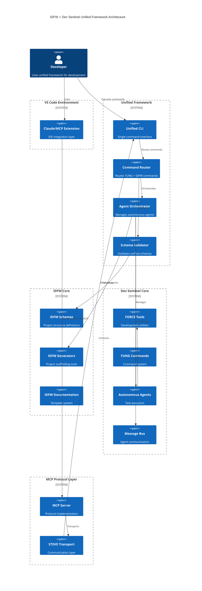

# IDFW + Dev Sentinel Unification: Executive Summary

## Linear Project Tracking
**Project ID**: 4d649a6501f7
**Project URL**: https://linear.app/projects/4d649a6501f7
**Team**: IDFWU (IDFW Unified Framework)

## Project Overview

This document outlines the unification of two complementary frameworks:
- **IDFW (IDEA Definition Framework)**: A JSON Schema-based specification framework for project structure and documentation
- **Dev Sentinel**: An AI-powered development assistant with autonomous agents and the FORCE framework

## Vision

Create a unified development framework that combines:
- IDFW's structured project definitions and documentation schemas
- Dev Sentinel's autonomous agent execution and FORCE tool system
- Seamless integration through MCP (Model Context Protocol) for VS Code/Claude
- Unified command interface merging YUNG commands with IDFW project actions

## Key Benefits

### 1. Complementary Strengths
- **IDFW**: Provides the "WHAT" - comprehensive project structure, documentation templates, and validation schemas
- **Dev Sentinel**: Provides the "HOW" - autonomous execution through intelligent agents and development tools

### 2. Unified Workflow
- Define project structure using IDFW schemas
- Execute development tasks through Dev Sentinel agents
- Maintain consistency through shared validation and schemas
- Single command interface for all operations

### 3. Enhanced Capabilities
- IDFW generators become autonomous agents
- Force tools understand IDFW project context
- Unified state management across systems
- Comprehensive MCP integration for IDE support

## Architecture Summary



### Core Components

#### 1. Schema Layer (Foundation)
- Unified JSON Schema system merging IDFW and Force schemas
- Shared validation framework
- Bidirectional schema conversion utilities

#### 2. Command Layer (Interface)
- Extended YUNG command system with IDFW actions
- Unified command parser and router
- Context-aware command execution

#### 3. Agent Layer (Execution)
- IDFW generators wrapped as Dev Sentinel agents
- Shared message bus for communication
- Task orchestration across both systems

#### 4. Protocol Layer (Integration)
- MCP servers exposing unified tools
- VS Code integration through standardized protocols
- RESTful and stdio transport options

## Implementation Phases

### Phase 1: Foundation (Week 1-2)
- Create unified directory structure
- Establish schema mapping framework
- Build basic command routing
- Create Linear epic and milestone tracking (Project ID: 4d649a6501f7)

### Phase 2: Schema Integration (Week 3-4)
- Merge JSON schemas
- Implement validation layer
- Create conversion utilities
- Update Linear issues with schema integration progress

### Phase 3: Command Unification (Week 5-6)
- Extend YUNG with IDFW commands
- Build unified CLI
- Implement command mapping
- Create Linear issues for command system milestones

### Phase 4: Agent Integration (Week 7-8)
- Wrap IDFW generators as agents
- Integrate message bus
- Implement state synchronization
- Track agent integration progress in Linear

### Phase 5: Protocol & Deployment (Week 9-10)
- Complete MCP integration
- VS Code extension updates
- Testing and documentation
- Final Linear project status updates and completion tracking

## Success Metrics

1. **Functional Integration**
   - All IDFW project actions executable through YUNG commands
   - IDFW schemas validated by Force tools
   - Bidirectional data flow between systems

2. **Performance**
   - No degradation in command execution speed
   - Efficient memory usage for large projects
   - Scalable agent orchestration

3. **Developer Experience**
   - Single unified CLI for all operations
   - Seamless VS Code integration
   - Comprehensive documentation and examples

## Risk Mitigation

1. **Schema Conflicts**: Implement namespace separation and conflict resolution
2. **State Synchronization**: Use event-driven architecture with proper versioning
3. **Backward Compatibility**: Maintain legacy command support with deprecation warnings
4. **Performance Impact**: Implement lazy loading and caching strategies

## Current State (v4.0.0)

The unification is complete. IDFW v4.0 ships the Inception Layer — a guided idea-to-execution lifecycle:

| Phase | Checkpoints | Status |
|-------|-------------|--------|
| Phase 1: Schema & Data Integrity | CP-01 to CP-06 | Complete |
| Phase 2: FORCE Schema Compliance | CP-07 to CP-12 | Complete |
| Phase 3: Critical Gap Resolution | CP-13 to CP-17 | Complete |
| Phase 4: Consolidation (4 repos → 1) | B01 to B08 | Complete |
| Phase 5: Wiki & Test Hardening | CP-18 to CP-21 | Complete |
| Phase 6: Quality & Documentation | CP-22 to CP-25 | In Progress |
| Phase 7: STFU Archive Sequence | CP-26 to CP-34 | Complete |
| Phase 8: IDEA Framework v4.0 | CP-35 to CP-50 | Complete |

### Key Deliverables (v4.0)

- **535 tests** passing (0 failures)
- **8 schemas** validated, **68 FORCE tools** validated
- **Project Discovery Framework** with 4 pluggable providers
- **/idea lifecycle**: new → discover → define → plan → execute
- **AG-UI daemon** with SSE streaming, decision gates, state management
- **IDFWU macOS app** (SwiftUI) consuming the daemon API
- **Skills catalog** (machine-readable index of all v3.0 skills)
- **3 archived repos** (idfwu, idfwu2, dev_sentinel) absorbed into IDFW

### Architecture (Implemented)

```
~/.claude/skills/idea/          # /idea skill (lifecycle orchestrator)
├── server/                     # FastAPI daemon (AG-UI protocol)
│   ├── app.py                  # Endpoints: health, events, state, decisions
│   ├── events.py               # EventBus with 16 AG-UI event types
│   └── storage.py              # SQLite persistence (gates, audits, events)
├── contexts/                   # Project context JSON files
└── ui/                         # Web dashboard

unified_framework/
├── core/                       # Schema bridge, converters
├── discovery/                  # Multi-source project discovery
│   ├── providers/              # Filesystem, Plane, APM, Config
│   └── resolver.py             # Concurrent resolution + merge
└── ...

idea-framework/
├── schemas/                    # 8 IDEA schemas (IDFW, IDDA, IDDV, etc.)
├── skills_index.json           # v3.0 skills catalog
└── phase_skill_mapping.json    # Phase → skill mapping

.force/                         # FORCE framework (68 validated tools)
dev_sentinel/                   # Dev Sentinel package (absorbed)
```

## Conclusion

The unification of IDFW and Dev Sentinel is complete. The resulting framework provides structured project definitions (schemas), autonomous execution (agents + FORCE tools), and a guided inception layer (/idea lifecycle) — all consolidated into a single repository with comprehensive test coverage.

---

*Document Version: 4.0.0*
*Date: 2026-04-07*
*Status: v4.0 Shipped*