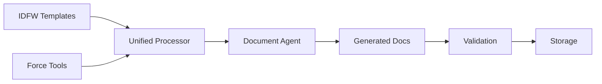

# Integration Points: IDFW + Dev Sentinel

## Overview

This document identifies and analyzes the key integration points between IDFW and Dev Sentinel, highlighting areas of synergy and potential unification strategies.

## 1. Schema System Integration

### Shared Foundation
Both systems utilize JSON Schema for validation and structure:

| Component | IDFW | Dev Sentinel | Integration Opportunity |
|-----------|------|--------------|-------------------------|
| Schema Version | JSON Schema draft/2020-12 | JSON Schema draft-07 | Standardize on 2020-12 |
| Validation | Multi-level with detailed errors | Parameter and type validation | Unified validation framework |
| Type System | Strong typing with scopes | Pydantic v2 models | Bidirectional type conversion |
| References | Cross-schema $ref support | Internal references | Unified reference resolver |

### Integration Strategy
```python
class UnifiedSchemaValidator:
    def validate_idfw(self, data, schema_type):
        # IDFW-specific validation logic
        pass

    def validate_force(self, tool, parameters):
        # Force tool validation logic
        pass

    def validate_unified(self, data, context):
        # Combined validation with context awareness
        pass
```

## 2. Command System Mapping

### Command Alignment

#### IDFW Project Actions → YUNG Commands
```
IDFW Action          →  YUNG Command
--------------------------------------------
generate_document    →  $CODE DOC GENERATE
update_diagram      →  $DIAGRAM UPDATE
validate_project    →  $VIC PROJECT
remove_artifact     →  $CODE REMOVE
```

#### Extended YUNG Commands for IDFW
```
$IDEA INIT <project_type>      # Initialize IDFW project
$IDEA GENERATE <artifact>      # Generate IDFW artifact
$IDEA VALIDATE <scope>         # Validate IDFW structures
$IDEA MIGRATE <version>        # Migrate IDFW schemas
```

### Unified Command Processor
```python
class UnifiedCommandProcessor:
    def __init__(self):
        self.yung_processor = YUNGCommandParser()
        self.idfw_processor = IDFWActionProcessor()

    def process(self, command: str):
        if command.startswith('$IDEA'):
            return self.idfw_processor.handle(command)
        else:
            return self.yung_processor.parse(command)
```

## 3. Agent Architecture Integration

### IDFW Generators as Agents

| IDFW Component | Agent Wrapper | Capabilities |
|----------------|---------------|--------------|
| IDDG (Document Generator) | DocumentGeneratorAgent | Async document creation, template processing |
| IDPG (Project Generator) | ProjectGeneratorAgent | Project scaffolding, structure creation |
| IDAA (Architecture Analyzer) | ArchitectureAnalyzerAgent | System analysis, documentation extraction |
| HyperPlot | ConstraintAnalyzerAgent | Multi-dimensional analysis, optimization |

### Agent Wrapper Implementation
```python
class IDFWAgentWrapper(BaseAgent):
    """Wrap IDFW generators as Dev Sentinel agents"""

    def __init__(self, idfw_component):
        super().__init__()
        self.idfw_component = idfw_component
        self.setup_message_handlers()

    async def process_task(self, task: Dict[str, Any]):
        # Convert task to IDFW format
        idfw_input = self.convert_task_to_idfw(task)

        # Execute IDFW component
        result = await self.idfw_component.execute(idfw_input)

        # Publish results to message bus
        await self.message_bus.publish(
            f"idfw.{self.component_type}.completed",
            result
        )
        return result
```

## 4. State Management Unification

### Variable System Integration

#### Mapping Strategy
```
IDFW Variables          ↔  Dev Sentinel State
------------------------------------------------
Immutable Variables     →  Agent Configuration
Mutable Variables       →  Agent Runtime State
Project Variables       →  Task Context
Document Variables      →  Tool Parameters
```

### Unified State Manager
```python
class UnifiedStateManager:
    def __init__(self):
        self.idfw_vars = IDFWVariableManager()
        self.agent_state = AgentStateManager()

    def sync_state(self):
        # Bidirectional state synchronization
        idfw_state = self.idfw_vars.get_all()
        agent_state = self.agent_state.get_all()

        # Merge and resolve conflicts
        unified = self.merge_states(idfw_state, agent_state)

        # Update both systems
        self.idfw_vars.update(unified)
        self.agent_state.update(unified)
```

## 5. Document Management Synergy

### Combined Documentation Pipeline



### Integration Benefits
1. **IDFW Templates**: Provide structure and standards
2. **Dev Sentinel Agents**: Execute generation and validation
3. **Force Tools**: Handle file operations and versioning
4. **Combined Output**: Comprehensive documentation suite

## 6. Tool System Integration

### IDFW Actions as Force Tools

```json
{
  "id": "idfw_generate_brd",
  "category": "documentation",
  "description": "Generate Business Requirements Document using IDFW",
  "parameters": {
    "project_id": {"type": "string", "required": true},
    "template": {"type": "string", "default": "standard"},
    "variables": {"type": "object"}
  },
  "execution": {
    "strategy": "sequential",
    "commands": [
      "idfw.load_template",
      "idfw.resolve_variables",
      "idfw.generate_document",
      "idfw.validate_output"
    ]
  }
}
```

### Tool Registry Extension
```python
class UnifiedToolRegistry:
    def __init__(self):
        self.force_tools = ForceToolRegistry()
        self.idfw_tools = IDFWToolAdapter()

    def register_all(self):
        # Register Force native tools
        self.force_tools.discover_and_register()

        # Adapt and register IDFW actions as tools
        for action in self.idfw_tools.get_actions():
            tool = self.adapt_idfw_to_force(action)
            self.force_tools.register(tool)
```

## 7. MCP Protocol Extensions

### Unified MCP Server

```python
class UnifiedMCPServer:
    """Combined MCP server for IDFW and Dev Sentinel"""

    def __init__(self):
        self.server = MCPCompat.Server("unified-framework")
        self.force_engine = ForceEngine()
        self.idfw_engine = IDFWEngine()

    @server.list_tools()
    async def handle_list_tools(self):
        tools = []

        # Add Force tools
        tools.extend(self.force_engine.get_mcp_tools())

        # Add IDFW tools
        tools.extend(self.idfw_engine.get_mcp_tools())

        return tools
```

### VS Code Integration
```json
{
  "mcpServers": {
    "unified-framework": {
      "command": "unified-mcp-server",
      "args": ["--idfw", "--force"],
      "env": {
        "UNIFIED_MODE": "true",
        "ENABLE_IDFW": "true",
        "ENABLE_FORCE": "true"
      }
    }
  }
}
```

## 8. Workflow Orchestration

### Combined Workflow Engine

```yaml
workflows:
  complete_project_setup:
    description: "Initialize project with IDFW and Dev Sentinel"
    steps:
      - idfw: initialize_project
        params:
          type: "enterprise"
          template: "multi-tenant"

      - force: setup_repository
        params:
          vcs: "git"
          branch_strategy: "gitflow"

      - idfw: generate_artifacts
        params:
          documents: ["BRD", "FRS", "TAD"]
          diagrams: ["architecture", "flow"]

      - agents: validate_all
        parallel:
          - saa: analyze_code
          - cdia: check_documentation
          - rdia: validate_readme
```

## 9. Error Handling and Recovery

### Unified Error Framework

```python
class UnifiedErrorHandler:
    def handle_error(self, error, context):
        if isinstance(error, IDFWValidationError):
            return self.handle_idfw_error(error, context)
        elif isinstance(error, ForceExecutionError):
            return self.handle_force_error(error, context)
        elif isinstance(error, AgentError):
            return self.handle_agent_error(error, context)
        else:
            return self.handle_generic_error(error, context)
```

## 10. Migration and Compatibility

### Backward Compatibility Strategy

1. **Legacy Command Support**: Maintain original command syntax
2. **Deprecation Warnings**: Gradual migration to unified commands
3. **Schema Migration Tools**: Convert between schema versions
4. **Adapter Layers**: Bridge old and new APIs

### Migration Tools
```python
class MigrationManager:
    def migrate_idfw_to_unified(self, project_path):
        # Convert IDFW project to unified structure
        pass

    def migrate_force_to_unified(self, force_config):
        # Convert Force configuration to unified format
        pass

    def validate_migration(self, before, after):
        # Ensure migration preserves functionality
        pass
```

## Integration Priority Matrix

| Integration Area | Impact | Complexity | Priority |
|------------------|---------|------------|----------|
| Schema System | High | Medium | P0 |
| Command Mapping | High | Low | P0 |
| Agent Wrappers | High | Medium | P1 |
| State Management | Medium | High | P1 |
| MCP Extensions | High | Low | P0 |
| Tool Registry | Medium | Low | P1 |
| Document Pipeline | Medium | Medium | P2 |
| Error Handling | Low | Low | P2 |
| Migration Tools | Low | Medium | P3 |

## Conclusion

The integration points between IDFW and Dev Sentinel reveal significant opportunities for creating a unified, more powerful framework. The systems complement each other well:

- **IDFW** provides structured project definitions and schemas
- **Dev Sentinel** provides autonomous execution and orchestration

The integration strategy focuses on:
1. Preserving the strengths of both systems
2. Creating seamless interoperability
3. Maintaining backward compatibility
4. Enhancing developer experience

---

*Document Version: 1.0.0*
*Date: 2025-09-29*
*Status: Analysis Complete*