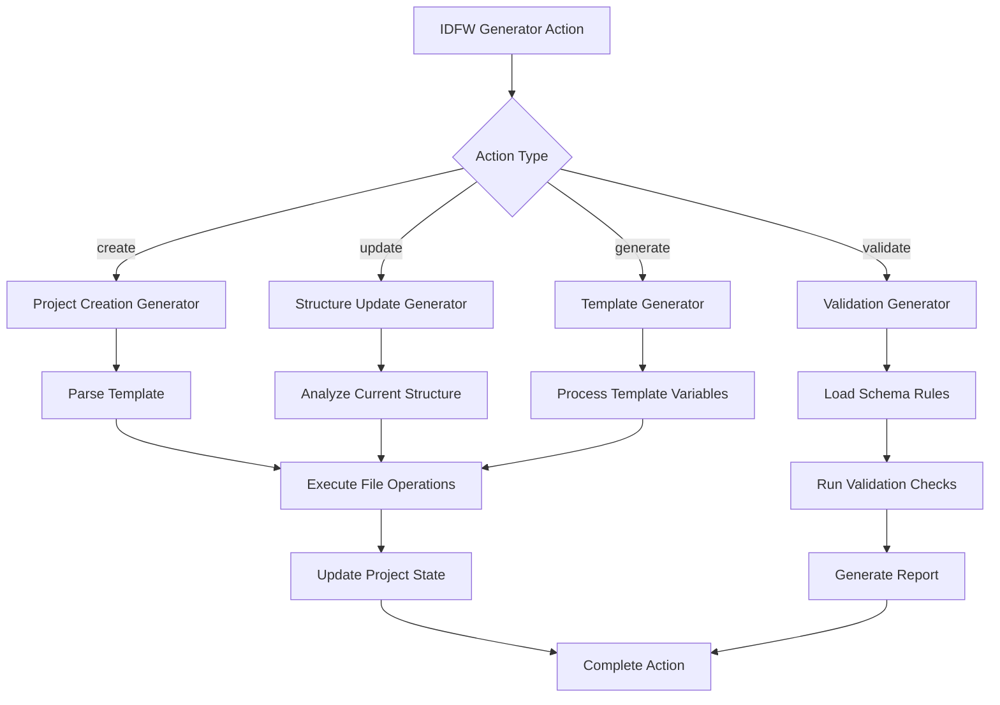
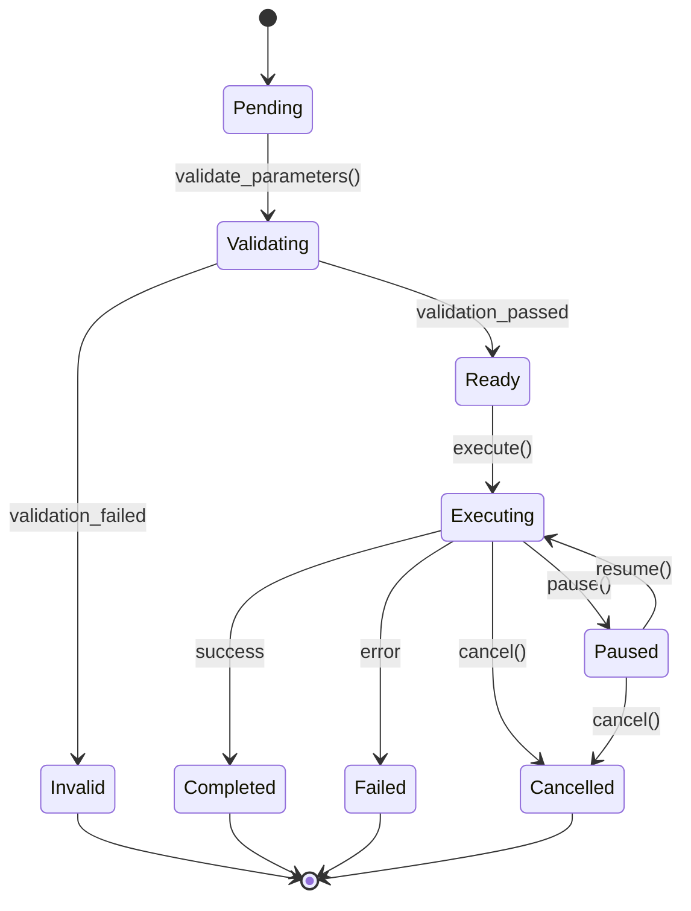
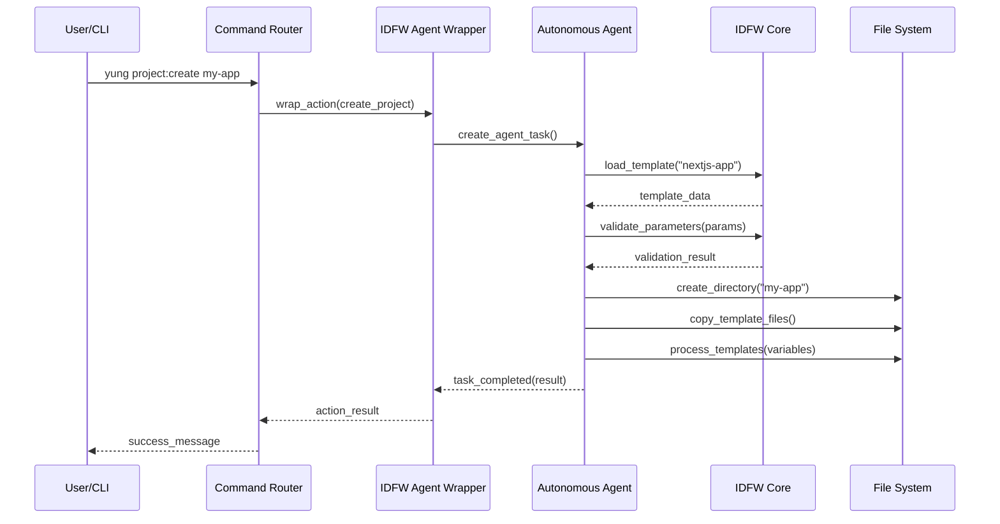

# IDFW Actions Mapping

## Overview

This document defines how IDFW (IDEA Definition Framework) actions are mapped and integrated into the unified command system. IDFW actions represent project operations, generators, and schema management tasks that can be executed through the YUNG command interface or autonomous agents.

## Action Categories

### 1. Project Lifecycle Actions

#### Create Actions
Actions for creating new projects and components.

```yaml
action_type: "create"
namespace: "project"
operations:
  - project_creation
  - component_scaffolding
  - template_instantiation
  - directory_structure_generation
```

**Mapping to YUNG Commands:**
```bash
yung project:create <template> <name>    # Maps to: idfw.create.project
yung project:component <type> <name>     # Maps to: idfw.create.component
yung project:scaffold <structure>        # Maps to: idfw.create.scaffold
```

#### Validate Actions
Actions for validating project structure and schemas.

```yaml
action_type: "validate"
namespace: "project"
operations:
  - schema_validation
  - structure_compliance
  - dependency_verification
  - documentation_completeness
```

**Mapping to YUNG Commands:**
```bash
yung project:validate [path]             # Maps to: idfw.validate.structure
yung schema:validate <schema> [data]     # Maps to: idfw.validate.schema
yung project:check-deps                  # Maps to: idfw.validate.dependencies
yung docs:validate                       # Maps to: idfw.validate.docs
```

#### Update Actions
Actions for updating and maintaining projects.

```yaml
action_type: "update"
namespace: "project"
operations:
  - structure_updates
  - template_synchronization
  - dependency_updates
  - documentation_refresh
```

**Mapping to YUNG Commands:**
```bash
yung project:update <generator>          # Maps to: idfw.update.structure
yung project:sync <template>             # Maps to: idfw.update.template
yung project:refresh-docs                # Maps to: idfw.update.docs
```

### 2. Schema Management Actions

#### Schema Definition Actions
```yaml
action_type: "schema"
namespace: "schema"
operations:
  - schema_creation
  - schema_merging
  - schema_conversion
  - schema_validation
```

**Action Definitions:**

```json
{
  "idfw.schema.create": {
    "description": "Create new JSON schema definition",
    "parameters": {
      "name": "string",
      "type": "object|array|string|number|boolean",
      "properties": "object",
      "output": "string"
    },
    "yung_mapping": "schema:create"
  },
  "idfw.schema.merge": {
    "description": "Merge multiple schemas into unified schema",
    "parameters": {
      "schemas": "array",
      "strategy": "deep|shallow|custom",
      "output": "string"
    },
    "yung_mapping": "schema:merge"
  },
  "idfw.schema.convert": {
    "description": "Convert between schema formats",
    "parameters": {
      "input": "string",
      "from_format": "idfw|jsonschema|typescript|openapi",
      "to_format": "idfw|jsonschema|typescript|openapi",
      "output": "string"
    },
    "yung_mapping": "schema:convert"
  }
}
```

### 3. Generator Actions

#### Template Generation
```yaml
action_type: "generate"
namespace: "template"
operations:
  - file_generation
  - directory_creation
  - content_templating
  - configuration_setup
```

**Generator Action Flow:**



### 4. Documentation Actions

#### Documentation Generation
```yaml
action_type: "documentation"
namespace: "docs"
operations:
  - api_documentation
  - user_guides
  - technical_specifications
  - changelog_generation
```

**Documentation Action Mapping:**

```json
{
  "idfw.docs.generate.api": {
    "description": "Generate API documentation from code",
    "parameters": {
      "source": "string",
      "format": "markdown|html|json",
      "template": "string",
      "output": "string"
    },
    "yung_mapping": "docs:generate --template=api"
  },
  "idfw.docs.generate.user": {
    "description": "Generate user documentation",
    "parameters": {
      "sections": "array",
      "format": "markdown|html|pdf",
      "output": "string"
    },
    "yung_mapping": "docs:generate --template=user"
  },
  "idfw.docs.validate": {
    "description": "Validate documentation completeness",
    "parameters": {
      "check_links": "boolean",
      "check_examples": "boolean",
      "check_api": "boolean"
    },
    "yung_mapping": "docs:validate"
  }
}
```

## Action Execution Model

### Synchronous Actions
Actions that execute immediately and return results.

```typescript
interface SyncAction {
  id: string;
  type: 'sync';
  operation: string;
  parameters: Record<string, any>;
  execute(): ActionResult;
}
```

**Examples:**
- Schema validation
- File existence checks
- Simple file operations

### Asynchronous Actions
Actions that may take time and can be monitored.

```typescript
interface AsyncAction {
  id: string;
  type: 'async';
  operation: string;
  parameters: Record<string, any>;
  execute(): Promise<ActionResult>;
  monitor(): ActionStatus;
  cancel(): boolean;
}
```

**Examples:**
- Project creation
- Large file generation
- Complex validations

### Agent-Wrapped Actions
Actions executed through autonomous agents.

```typescript
interface AgentAction {
  id: string;
  type: 'agent';
  operation: string;
  parameters: Record<string, any>;
  agent: Agent;
  execute(): AgentTask;
}
```

## Action State Management

### Action Lifecycle States



### State Persistence

```json
{
  "action_state": {
    "action_id": "idfw.project.create.20231201_143022",
    "status": "executing",
    "progress": 0.65,
    "started_at": "2023-12-01T14:30:22Z",
    "parameters": {
      "template": "nextjs-app",
      "name": "my-project",
      "output": "./projects"
    },
    "steps": [
      {
        "step": "validate_template",
        "status": "completed",
        "completed_at": "2023-12-01T14:30:23Z"
      },
      {
        "step": "create_structure",
        "status": "executing",
        "progress": 0.8
      },
      {
        "step": "install_dependencies",
        "status": "pending"
      }
    ]
  }
}
```

## Action Configuration

### Global Action Configuration

```yaml
# ~/.idfw/actions.yml
actions:
  default_timeout: 300
  max_concurrent: 3
  retry_attempts: 2

  templates:
    path: "~/.idfw/templates"
    cache_enabled: true
    cache_ttl: 3600

  schemas:
    path: "~/.idfw/schemas"
    validation_strict: false
    auto_fix: true

  generators:
    path: "~/.idfw/generators"
    parallel_execution: true

  output:
    default_format: "json"
    verbose: false
    log_level: "info"
```

### Project-Specific Action Configuration

```json
{
  "idfw_actions": {
    "create": {
      "default_template": "react-component",
      "output_directory": "./src/components",
      "auto_import": true
    },
    "validate": {
      "schema_path": "./schemas/project.json",
      "strict_mode": true,
      "auto_fix": false
    },
    "update": {
      "generators": ["structure", "docs", "types"],
      "backup_enabled": true,
      "confirmation_required": false
    },
    "docs": {
      "output_format": "markdown",
      "include_examples": true,
      "auto_publish": false
    }
  }
}
```

## Integration with Agent System

### Agent Wrapper Interface

```typescript
interface IDFWAgentWrapper {
  wrapAction(action: IDFWAction): Agent;
  unwrapResult(agentResult: AgentResult): ActionResult;
  mapParameters(actionParams: any): AgentParameters;
}
```

### Agent Action Execution



## Error Handling and Recovery

### Action Error Types

```typescript
enum ActionErrorType {
  VALIDATION_ERROR = 'validation_error',
  EXECUTION_ERROR = 'execution_error',
  TIMEOUT_ERROR = 'timeout_error',
  DEPENDENCY_ERROR = 'dependency_error',
  PERMISSION_ERROR = 'permission_error',
  RESOURCE_ERROR = 'resource_error'
}

interface ActionError {
  type: ActionErrorType;
  message: string;
  details: Record<string, any>;
  recoverable: boolean;
  suggested_actions: string[];
}
```

### Recovery Strategies

```yaml
error_recovery:
  validation_error:
    strategy: "fix_parameters"
    auto_retry: false

  execution_error:
    strategy: "rollback_and_retry"
    max_retries: 2
    retry_delay: 5000

  timeout_error:
    strategy: "extend_timeout"
    new_timeout: 600

  dependency_error:
    strategy: "install_dependencies"
    auto_install: true

  permission_error:
    strategy: "request_elevation"
    prompt_user: true

  resource_error:
    strategy: "cleanup_and_retry"
    cleanup_temp: true
```

## Performance Optimization

### Action Caching

```json
{
  "cache_config": {
    "enabled": true,
    "strategies": {
      "template_loading": {
        "type": "memory",
        "ttl": 3600,
        "max_size": "100MB"
      },
      "schema_validation": {
        "type": "disk",
        "ttl": 86400,
        "path": "~/.idfw/cache/validation"
      },
      "generated_files": {
        "type": "hybrid",
        "memory_ttl": 300,
        "disk_ttl": 86400
      }
    }
  }
}
```

### Parallel Execution

```typescript
class ActionOrchestrator {
  async executeParallel(actions: IDFWAction[]): Promise<ActionResult[]> {
    const dependencies = this.analyzeDependencies(actions);
    const executionPlan = this.createExecutionPlan(dependencies);

    return await this.executeWithDependencies(executionPlan);
  }

  private analyzeDependencies(actions: IDFWAction[]): DependencyGraph {
    // Analyze action dependencies for parallel execution
  }
}
```

---

*Document Version: 1.0.0*
*Date: 2025-09-29*
*Status: Implementation Ready*