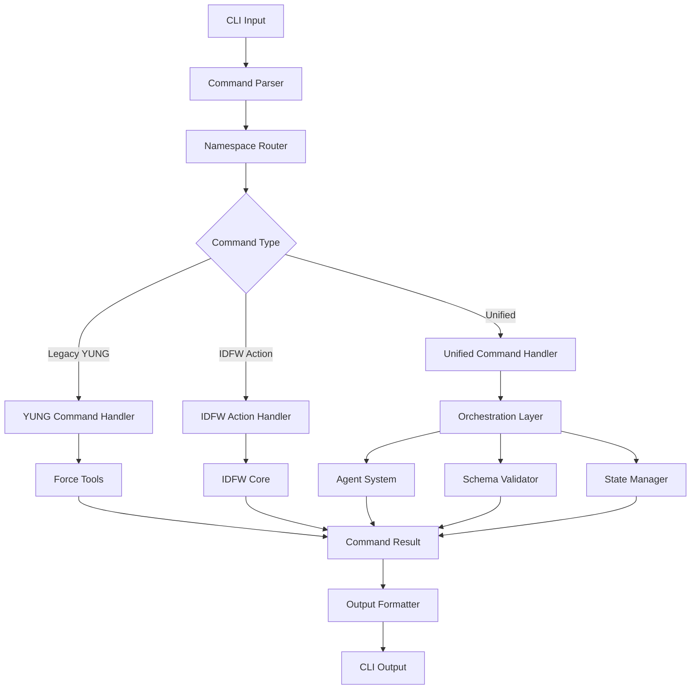
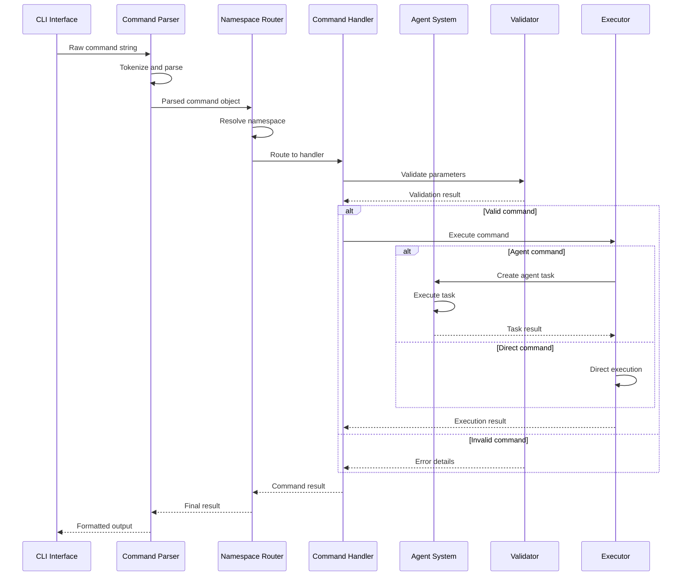
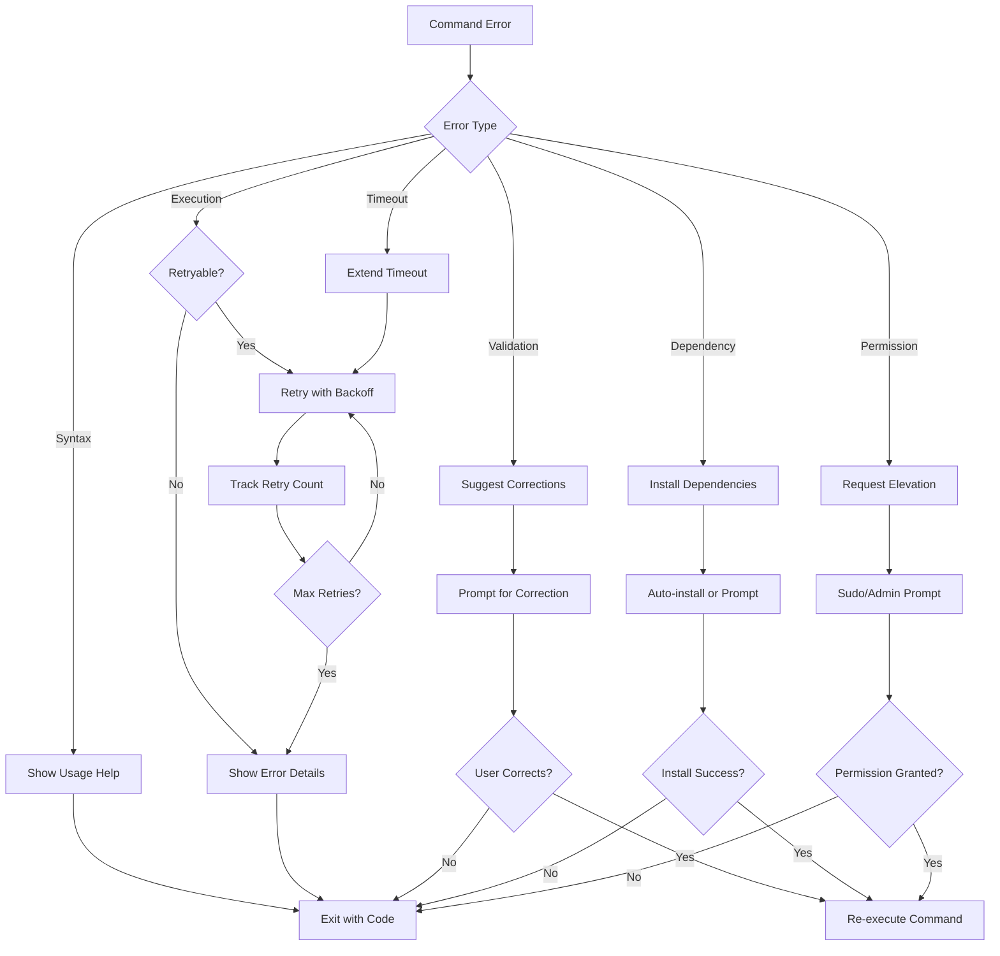

# Unified Command Interface Design

## Overview

The unified command interface merges YUNG commands from Dev Sentinel with IDFW actions to create a seamless, comprehensive development command system. This interface provides a single entry point for all development operations while maintaining backward compatibility and extending functionality.

## Design Principles

### 1. Consistency
- Uniform command syntax across all operations
- Predictable parameter patterns
- Consistent output formats

### 2. Discoverability
- Intuitive namespace organization
- Comprehensive help system
- Command suggestions and auto-completion

### 3. Extensibility
- Plugin architecture for custom commands
- Configurable command aliases
- Hook system for command lifecycle events

### 4. Backward Compatibility
- Existing YUNG commands remain unchanged
- Legacy command mapping and deprecation warnings
- Gradual migration path for existing workflows

## Command Architecture

### Unified Command Structure

```
yung <namespace>:<action> [subcommand] [options] [arguments]
```

#### Components:
- **namespace**: Logical grouping of related commands
- **action**: Primary operation to perform
- **subcommand**: Optional sub-operation
- **options**: Flags and configuration parameters
- **arguments**: Positional parameters

### Command Flow Architecture



## Namespace Organization

### Core Namespaces

#### 1. `force:` - Original FORCE Tools
Maintains all existing FORCE tool functionality.

```bash
yung force:build [options]
yung force:test [options]
yung force:deploy [options]
yung force:init [project-name]
```

#### 2. `project:` - IDFW Project Operations
Project lifecycle management and structure operations.

```bash
yung project:create <template> <name> [options]
yung project:validate [path] [options]
yung project:update <generator> [options]
yung project:analyze [options]
yung project:info [path]
```

#### 3. `schema:` - Schema Management
JSON Schema operations and validation.

```bash
yung schema:validate <schema> [data] [options]
yung schema:merge <schema1> <schema2> [...] [options]
yung schema:convert <input> [options]
yung schema:generate [options]
```

#### 4. `agent:` - Agent Management
Autonomous agent control and orchestration.

```bash
yung agent:list [options]
yung agent:start <agent> [options]
yung agent:stop <agent> [options]
yung agent:orchestrate <task> [options]
yung agent:status [agent]
```

#### 5. `docs:` - Documentation Operations
Documentation generation and management.

```bash
yung docs:generate [options]
yung docs:validate [options]
yung docs:serve [options]
yung docs:build [options]
```

#### 6. `template:` - Template Management
Template operations and customization.

```bash
yung template:list [options]
yung template:create <name> [options]
yung template:update <name> [options]
yung template:validate <template> [options]
```

#### 7. `config:` - Configuration Management
Framework and project configuration.

```bash
yung config:get [key] [options]
yung config:set <key> <value> [options]
yung config:list [options]
yung config:validate [options]
```

### Extended Namespaces

#### 8. `workflow:` - Workflow Automation
Pre-defined development workflows.

```bash
yung workflow:run <workflow> [options]
yung workflow:create <name> [options]
yung workflow:list [options]
yung workflow:validate <workflow> [options]
```

#### 9. `integration:` - External Integrations
Third-party tool integrations.

```bash
yung integration:setup <tool> [options]
yung integration:sync <tool> [options]
yung integration:status [tool]
```

## Command Execution Model

### Execution Types

#### 1. Direct Execution
Commands that execute immediately in the current process.

```typescript
interface DirectCommand {
  type: 'direct';
  handler: (args: CommandArgs) => CommandResult;
  timeout?: number;
}
```

#### 2. Agent Execution
Commands that delegate to autonomous agents.

```typescript
interface AgentCommand {
  type: 'agent';
  agentType: string;
  handler: (args: CommandArgs) => AgentTask;
  monitoring: boolean;
}
```

#### 3. Orchestrated Execution
Commands that coordinate multiple operations.

```typescript
interface OrchestratedCommand {
  type: 'orchestrated';
  steps: CommandStep[];
  parallel: boolean;
  dependencies: DependencyMap;
}
```

### Command Execution Flow



## Command Configuration System

### Global Configuration

```yaml
# ~/.yung/config.yml
unified_commands:
  default_namespace: "force"
  timeout: 300
  parallel_execution: true
  auto_complete: true

  namespaces:
    force:
      enabled: true
      timeout: 180
    project:
      enabled: true
      timeout: 600
      default_template: "nextjs-app"
    agent:
      enabled: true
      max_concurrent: 5

  aliases:
    p: "project"
    f: "force"
    a: "agent"
    s: "schema"
    d: "docs"

  output:
    format: "table"
    colors: true
    verbose: false

  logging:
    level: "info"
    file: "~/.yung/logs/commands.log"
```

### Project Configuration

```json
{
  "yung": {
    "project_config": {
      "default_commands": {
        "build": "force:build --env=development",
        "test": "force:test --coverage",
        "validate": "project:validate && schema:validate",
        "deploy": "project:validate && force:deploy"
      },
      "shortcuts": {
        "dev": ["force:build --watch", "force:test --watch"],
        "ci": ["project:validate --strict", "force:test", "force:build"]
      },
      "hooks": {
        "pre_build": "project:validate",
        "post_deploy": "docs:generate"
      }
    }
  }
}
```

## Command Composition and Chaining

### Command Chaining
Execute multiple commands in sequence.

```bash
yung project:validate && yung force:build && yung force:deploy
```

### Command Composition
Combine commands into reusable workflows.

```bash
yung workflow:create deploy-pipeline \
  --steps="project:validate,force:test,force:build,force:deploy" \
  --on-failure="agent:stop --all"
```

### Parallel Execution
Execute compatible commands in parallel.

```bash
yung --parallel force:test force:lint docs:generate
```

## Error Handling and Recovery

### Error Classification

```typescript
enum CommandErrorType {
  SYNTAX_ERROR = 'syntax_error',
  VALIDATION_ERROR = 'validation_error',
  EXECUTION_ERROR = 'execution_error',
  TIMEOUT_ERROR = 'timeout_error',
  DEPENDENCY_ERROR = 'dependency_error',
  PERMISSION_ERROR = 'permission_error'
}
```

### Error Recovery Strategies



## Help System and Discoverability

### Hierarchical Help

```bash
# Global help
yung help

# Namespace help
yung help project

# Command help
yung help project:create

# Subcommand help
yung project:create --help
```

### Auto-completion

```bash
# Namespace completion
yung <TAB>
force:  project:  schema:  agent:  docs:

# Command completion
yung project:<TAB>
create  validate  update  analyze  info

# Option completion
yung project:create --<TAB>
--template  --output  --config  --dry-run  --help
```

### Command Discovery

```bash
# Search commands by keyword
yung search "validate"
Found commands:
- project:validate: Validate project structure
- schema:validate: Validate JSON schemas
- docs:validate: Validate documentation

# List all commands in namespace
yung list project
Available project commands:
- create: Create new project from template
- validate: Validate project structure
- update: Update project using generators
- analyze: Analyze project structure
- info: Show project information
```

## Plugin Architecture

### Plugin Interface

```typescript
interface CommandPlugin {
  name: string;
  namespace: string;
  version: string;
  commands: CommandDefinition[];
  hooks?: PluginHooks;
  dependencies?: string[];
}

interface CommandDefinition {
  name: string;
  description: string;
  usage: string;
  options: OptionDefinition[];
  handler: CommandHandler;
}
```

### Plugin Registration

```javascript
// ~/.yung/plugins/custom-commands.js
module.exports = {
  name: 'custom-commands',
  namespace: 'custom',
  version: '1.0.0',
  commands: [
    {
      name: 'deploy-all',
      description: 'Deploy to all environments',
      usage: 'custom:deploy-all [options]',
      options: [
        { name: 'env', type: 'string', multiple: true },
        { name: 'parallel', type: 'boolean', default: false }
      ],
      handler: async (args) => {
        // Custom deployment logic
      }
    }
  ],
  hooks: {
    beforeCommand: (command, args) => {
      console.log(`Executing custom command: ${command}`);
    }
  }
};
```

## Testing and Validation

### Command Testing Framework

```typescript
class CommandTester {
  async testCommand(
    command: string,
    expectedOutput?: string,
    expectedCode?: number
  ): Promise<TestResult> {
    const result = await this.executeCommand(command);
    return this.validateResult(result, expectedOutput, expectedCode);
  }

  async testWorkflow(
    commands: string[],
    expectations: TestExpectation[]
  ): Promise<WorkflowTestResult> {
    // Test command sequences and workflows
  }
}
```

### Integration Tests

```bash
# Test basic functionality
yung test:commands --suite=basic

# Test integration between namespaces
yung test:commands --suite=integration

# Test error handling
yung test:commands --suite=error-handling

# Test performance
yung test:commands --suite=performance
```

## Migration and Backward Compatibility

### Legacy Command Support

```typescript
class LegacyCommandAdapter {
  adaptCommand(legacyCommand: string): UnifiedCommand {
    const mapping = this.getLegacyMapping(legacyCommand);
    if (mapping) {
      this.showDeprecationWarning(legacyCommand, mapping.replacement);
      return this.convertToUnified(mapping);
    }
    throw new Error(`Unknown legacy command: ${legacyCommand}`);
  }
}
```

### Migration Utilities

```bash
# Analyze project for legacy commands
yung migrate:analyze [path]

# Convert legacy commands to unified format
yung migrate:convert [config-file]

# Generate migration report
yung migrate:report [options]
```

---

*Document Version: 1.0.0*
*Date: 2025-09-29*
*Status: Implementation Ready*