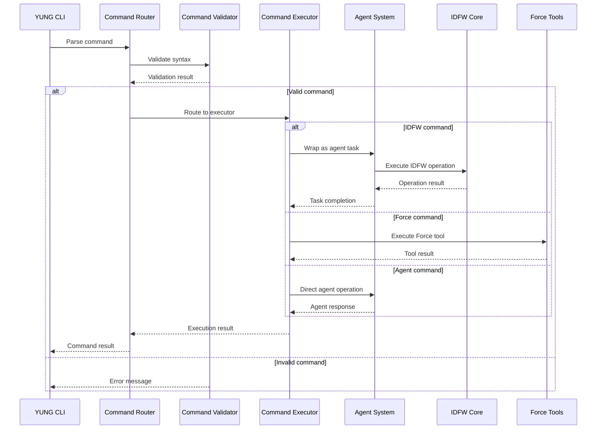

# YUNG Commands Reference

## Overview

YUNG (Yet Another Universal Next Generation) is the command system at the heart of Dev Sentinel, providing a flexible and extensible interface for development operations. In the unified framework, YUNG commands are extended to include IDFW project actions, creating a single command interface for all operations.

## Command Structure

```
yung <namespace>:<action> [options] [arguments]
```

### Namespaces
- `force`: Original FORCE tool commands
- `agent`: Agent management and orchestration
- `project`: IDFW project operations (new)
- `schema`: Schema validation and management (new)
- `docs`: Documentation generation (new)

## Core YUNG Commands

### Force Namespace (`force:`)

#### `force:init`
Initialize a new Force workspace.
```bash
yung force:init [project-name]
```

#### `force:build`
Build the current project using Force tools.
```bash
yung force:build [--watch] [--env=production]
```

#### `force:test`
Run tests using Force testing framework.
```bash
yung force:test [--coverage] [--watch] [pattern]
```

#### `force:deploy`
Deploy project using Force deployment tools.
```bash
yung force:deploy [--env=staging|production] [--dry-run]
```

### Agent Namespace (`agent:`)

#### `agent:list`
List all available agents and their status.
```bash
yung agent:list [--status=active|idle|busy]
```

#### `agent:start`
Start specific agents or agent groups.
```bash
yung agent:start <agent-name> [--config=path]
```

#### `agent:stop`
Stop running agents.
```bash
yung agent:stop <agent-name> [--force]
```

#### `agent:orchestrate`
Orchestrate multiple agents for complex tasks.
```bash
yung agent:orchestrate <task-definition> [--parallel] [--timeout=60s]
```

#### `agent:status`
Get detailed status of agent execution.
```bash
yung agent:status [agent-name]
```

## Extended YUNG Commands (IDFW Integration)

### Project Namespace (`project:`)

#### `project:create`
Create a new project using IDFW templates.
```bash
yung project:create <template-name> <project-name> [--output=path]
```

**Options:**
- `--template-version`: Specify template version
- `--config`: Custom configuration file
- `--dry-run`: Preview without creating files

**Examples:**
```bash
yung project:create nextjs-app my-app --output=./projects
yung project:create python-api backend-service --config=custom.json
```

#### `project:validate`
Validate project structure against IDFW schemas.
```bash
yung project:validate [project-path] [--schema=path] [--fix]
```

**Options:**
- `--strict`: Enable strict validation mode
- `--format`: Output format (json, yaml, table)
- `--fix`: Automatically fix validation issues

#### `project:update`
Update project structure using IDFW generators.
```bash
yung project:update <generator-name> [--target=path] [--config=path]
```

#### `project:analyze`
Analyze project structure and generate reports.
```bash
yung project:analyze [--output=report.json] [--metrics=all|structure|dependencies]
```

### Schema Namespace (`schema:`)

#### `schema:validate`
Validate JSON schemas and data files.
```bash
yung schema:validate <schema-file> [data-file] [--output=json]
```

#### `schema:merge`
Merge multiple schemas into unified schema.
```bash
yung schema:merge <schema1> <schema2> [...schemas] --output=merged.json
```

#### `schema:convert`
Convert between IDFW and Force schema formats.
```bash
yung schema:convert <input-schema> --from=idfw --to=force --output=converted.json
```

#### `schema:generate`
Generate schemas from existing code or data.
```bash
yung schema:generate --from=typescript --input=src/ --output=schema.json
```

### Documentation Namespace (`docs:`)

#### `docs:generate`
Generate documentation using IDFW templates.
```bash
yung docs:generate [--template=api|user|dev] [--output=docs/] [--format=md|html]
```

#### `docs:validate`
Validate documentation completeness and accuracy.
```bash
yung docs:validate [--check-links] [--check-examples] [--check-api]
```

#### `docs:serve`
Serve documentation locally for development.
```bash
yung docs:serve [--port=3000] [--watch] [--open]
```

## Command Flow Sequence



## Command Configuration

### Global Configuration (`~/.yung/config.json`)

```json
{
  "defaultNamespace": "force",
  "timeout": 300,
  "parallelExecution": true,
  "logging": {
    "level": "info",
    "file": "~/.yung/logs/yung.log"
  },
  "agents": {
    "maxConcurrent": 5,
    "defaultTimeout": 60
  },
  "idfw": {
    "templatePath": "~/.idfw/templates",
    "schemaPath": "~/.idfw/schemas",
    "generatorPath": "~/.idfw/generators"
  }
}
```

### Project Configuration (`.yung.json`)

```json
{
  "namespace": "project",
  "commands": {
    "build": "force:build --env=development",
    "test": "force:test --coverage",
    "deploy": "project:validate && force:deploy"
  },
  "agents": {
    "autoStart": ["validator", "builder"],
    "orchestration": {
      "enabled": true,
      "strategy": "parallel"
    }
  },
  "idfw": {
    "schema": "./project-schema.json",
    "generators": ["structure", "docs", "tests"]
  }
}
```

## Command Aliases

Common command aliases for improved developer experience:

```bash
# Project operations
yung p:create    # project:create
yung p:validate  # project:validate
yung p:update    # project:update

# Agent operations
yung a:list      # agent:list
yung a:start     # agent:start
yung a:stop      # agent:stop

# Force operations
yung f:build     # force:build
yung f:test      # force:test
yung f:deploy    # force:deploy

# Schema operations
yung s:validate  # schema:validate
yung s:merge     # schema:merge

# Documentation operations
yung d:generate  # docs:generate
yung d:serve     # docs:serve
```

## Error Handling

### Command Not Found
```bash
$ yung invalid:command
Error: Command 'invalid:command' not found
Did you mean: 'project:validate'?

Available namespaces: force, agent, project, schema, docs
Use 'yung help' for more information.
```

### Invalid Arguments
```bash
$ yung project:create
Error: Missing required argument: <template-name>

Usage: yung project:create <template-name> <project-name> [options]
Use 'yung project:create --help' for more information.
```

### Agent Execution Errors
```bash
$ yung agent:start non-existent-agent
Error: Agent 'non-existent-agent' not found

Available agents:
- validator
- builder
- deployer
- generator

Use 'yung agent:list' to see all available agents.
```

## Integration Points

### VS Code Integration
YUNG commands are exposed through MCP protocol, allowing execution from VS Code:

```typescript
// VS Code command palette
"YUNG: Create Project" -> yung project:create
"YUNG: Validate Schema" -> yung schema:validate
"YUNG: Start Agents" -> yung agent:start
```

### CI/CD Integration
YUNG commands can be used in CI/CD pipelines:

```yaml
# .github/workflows/build.yml
- name: Validate Project
  run: yung project:validate --strict

- name: Build with Force
  run: yung force:build --env=production

- name: Run Tests
  run: yung force:test --coverage
```

## Extension Mechanism

### Custom Commands
Add custom commands through plugins:

```javascript
// ~/.yung/plugins/custom-commands.js
module.exports = {
  namespace: 'custom',
  commands: {
    'deploy-staging': {
      description: 'Deploy to staging environment',
      handler: async (args) => {
        // Custom deployment logic
      }
    }
  }
};
```

### Command Hooks
Implement pre/post command hooks:

```javascript
// ~/.yung/hooks/logging.js
module.exports = {
  beforeCommand: (command, args) => {
    console.log(`Executing: ${command}`);
  },
  afterCommand: (command, result) => {
    console.log(`Completed: ${command} (${result.status})`);
  }
};
```

---

*Document Version: 1.0.0*
*Date: 2025-09-29*
*Status: Implementation Ready*