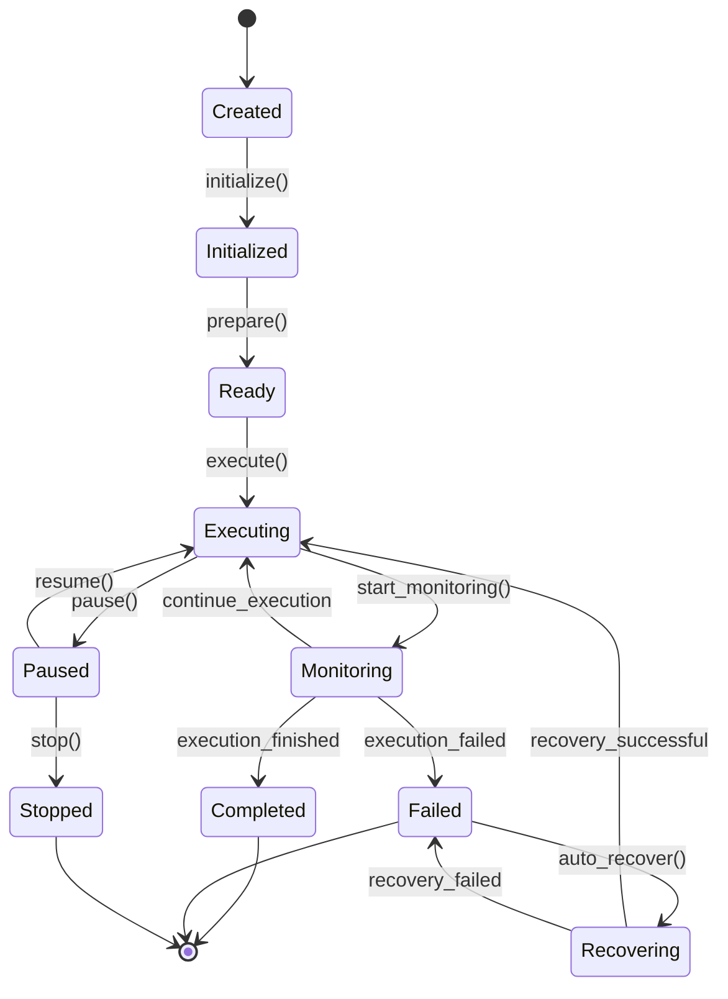
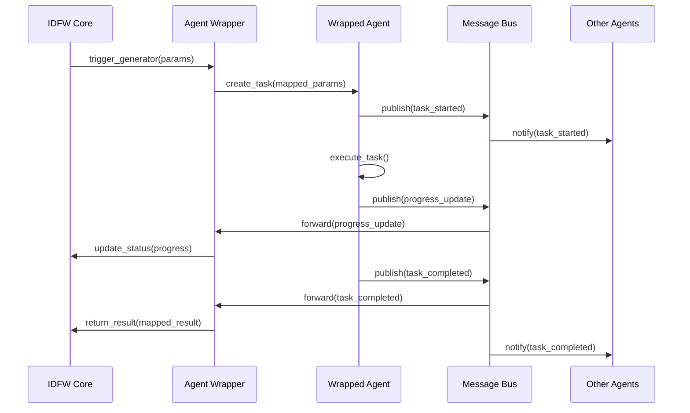

# Agent Wrappers for IDFW Generators

## Overview

Agent wrappers transform IDFW generators into autonomous agents within the Dev Sentinel framework. This integration allows IDFW's declarative project operations to be executed as intelligent, self-managing tasks while maintaining the benefits of both systems.

## Wrapper Architecture

### Core Wrapper Interface

```typescript
interface IDFWAgentWrapper {
  // Core wrapper methods
  wrapGenerator(generator: IDFWGenerator): Agent;
  unwrapResult(agentResult: AgentResult): IDFWResult;

  // Parameter mapping
  mapParameters(idfwParams: IDFWParams): AgentParams;
  mapResults(agentResults: AgentResult): IDFWResult;

  // State management
  syncState(agent: Agent, idfwState: IDFWState): void;
  getState(agent: Agent): IDFWState;

  // Error handling
  handleError(error: AgentError): IDFWError;
  recoverFromError(error: IDFWError): RecoveryAction;
}
```

### Wrapper Implementation

```typescript
class IDFWGeneratorWrapper implements IDFWAgentWrapper {
  private agentFactory: AgentFactory;
  private stateManager: StateManager;
  private errorHandler: ErrorHandler;

  constructor(
    agentFactory: AgentFactory,
    stateManager: StateManager,
    errorHandler: ErrorHandler
  ) {
    this.agentFactory = agentFactory;
    this.stateManager = stateManager;
    this.errorHandler = errorHandler;
  }

  wrapGenerator(generator: IDFWGenerator): Agent {
    const agentConfig = this.createAgentConfig(generator);
    const agent = this.agentFactory.createAgent(agentConfig);

    // Inject IDFW-specific capabilities
    this.injectIDFWCapabilities(agent, generator);

    return agent;
  }

  private createAgentConfig(generator: IDFWGenerator): AgentConfig {
    return {
      id: `idfw-${generator.name}-${Date.now()}`,
      type: 'idfw-generator',
      name: generator.name,
      description: generator.description,
      capabilities: this.mapCapabilities(generator),
      parameters: this.mapParameters(generator.parameters),
      execution: {
        timeout: generator.timeout || 300,
        retries: generator.retries || 2,
        parallel: generator.parallel || false
      }
    };
  }
}
```

## Generator-to-Agent Mapping

### IDFW Generator Types

#### 1. Project Creation Generators

```typescript
interface ProjectCreationGenerator extends IDFWGenerator {
  type: 'project-creation';
  template: TemplateDefinition;
  structure: DirectoryStructure;
  dependencies: DependencyList;
  configurations: ConfigurationSet;
}
```

**Agent Wrapper:**
```typescript
class ProjectCreationAgentWrapper extends IDFWGeneratorWrapper {
  wrapGenerator(generator: ProjectCreationGenerator): ProjectCreationAgent {
    const agent = super.wrapGenerator(generator);

    // Add project creation specific capabilities
    agent.addCapability('template-processing', {
      processor: new TemplateProcessor(),
      validator: new TemplateValidator()
    });

    agent.addCapability('directory-management', {
      creator: new DirectoryCreator(),
      validator: new StructureValidator()
    });

    agent.addCapability('dependency-management', {
      installer: new DependencyInstaller(),
      resolver: new DependencyResolver()
    });

    return agent as ProjectCreationAgent;
  }
}
```

#### 2. Structure Update Generators

```typescript
interface StructureUpdateGenerator extends IDFWGenerator {
  type: 'structure-update';
  updates: StructureUpdate[];
  migrations: MigrationStep[];
  validations: ValidationRule[];
}
```

**Agent Wrapper:**
```typescript
class StructureUpdateAgentWrapper extends IDFWGeneratorWrapper {
  wrapGenerator(generator: StructureUpdateGenerator): StructureUpdateAgent {
    const agent = super.wrapGenerator(generator);

    agent.addCapability('structure-analysis', {
      analyzer: new StructureAnalyzer(),
      differ: new StructureDiffer()
    });

    agent.addCapability('migration-execution', {
      executor: new MigrationExecutor(),
      rollback: new RollbackManager()
    });

    return agent as StructureUpdateAgent;
  }
}
```

#### 3. Validation Generators

```typescript
interface ValidationGenerator extends IDFWGenerator {
  type: 'validation';
  schemas: SchemaSet;
  rules: ValidationRuleSet;
  fixers: AutoFixerSet;
}
```

**Agent Wrapper:**
```typescript
class ValidationAgentWrapper extends IDFWGeneratorWrapper {
  wrapGenerator(generator: ValidationGenerator): ValidationAgent {
    const agent = super.wrapGenerator(generator);

    agent.addCapability('schema-validation', {
      validator: new JSONSchemaValidator(),
      reporter: new ValidationReporter()
    });

    agent.addCapability('auto-fixing', {
      fixer: new AutoFixer(),
      verifier: new FixVerifier()
    });

    return agent as ValidationAgent;
  }
}
```

## Agent Lifecycle Management

### Agent Lifecycle States



### State Management

```typescript
class AgentStateManager {
  private states = new Map<string, AgentState>();

  saveState(agentId: string, state: AgentState): void {
    this.states.set(agentId, {
      ...state,
      timestamp: Date.now(),
      checksum: this.calculateChecksum(state)
    });
  }

  loadState(agentId: string): AgentState | null {
    return this.states.get(agentId) || null;
  }

  syncWithIDFW(agentId: string, idfwState: IDFWState): void {
    const agentState = this.loadState(agentId);
    if (agentState) {
      const mergedState = this.mergeStates(agentState, idfwState);
      this.saveState(agentId, mergedState);
    }
  }
}
```

## Parameter Mapping and Validation

### Parameter Transformation

```typescript
class ParameterMapper {
  mapIDFWToAgent(idfwParams: IDFWParameters): AgentParameters {
    return {
      execution: {
        timeout: idfwParams.timeout || 300,
        retries: idfwParams.retries || 2,
        parallel: idfwParams.parallel || false
      },
      input: this.transformInputParameters(idfwParams.input),
      output: this.transformOutputParameters(idfwParams.output),
      context: this.transformContextParameters(idfwParams.context)
    };
  }

  mapAgentToIDFW(agentParams: AgentParameters): IDFWParameters {
    return {
      timeout: agentParams.execution?.timeout,
      retries: agentParams.execution?.retries,
      parallel: agentParams.execution?.parallel,
      input: this.reverseTransformInput(agentParams.input),
      output: this.reverseTransformOutput(agentParams.output),
      context: this.reverseTransformContext(agentParams.context)
    };
  }
}
```

### Parameter Validation

```typescript
class ParameterValidator {
  validateIDFWParameters(params: IDFWParameters): ValidationResult {
    const errors: ValidationError[] = [];

    // Validate required parameters
    if (!params.input) {
      errors.push(new ValidationError('input', 'Input parameters are required'));
    }

    // Validate parameter types
    if (params.timeout && typeof params.timeout !== 'number') {
      errors.push(new ValidationError('timeout', 'Timeout must be a number'));
    }

    // Validate parameter ranges
    if (params.retries && (params.retries < 0 || params.retries > 10)) {
      errors.push(new ValidationError('retries', 'Retries must be between 0 and 10'));
    }

    return {
      valid: errors.length === 0,
      errors
    };
  }
}
```

## Communication and Message Passing

### Message Bus Integration

```typescript
interface AgentMessage {
  id: string;
  type: MessageType;
  source: string;
  target: string;
  payload: any;
  timestamp: number;
  correlation_id?: string;
}

class IDFWAgentMessageHandler {
  constructor(private messageBus: MessageBus) {}

  handleIDFWMessage(message: IDFWMessage): void {
    const agentMessage = this.convertToAgentMessage(message);
    this.messageBus.send(agentMessage);
  }

  handleAgentMessage(message: AgentMessage): void {
    if (this.isIDFWRelated(message)) {
      const idfwMessage = this.convertToIDFWMessage(message);
      this.forwardToIDFW(idfwMessage);
    }
  }

  private convertToAgentMessage(idfwMessage: IDFWMessage): AgentMessage {
    return {
      id: `agent-${Date.now()}`,
      type: this.mapMessageType(idfwMessage.type),
      source: `idfw-${idfwMessage.source}`,
      target: `agent-${idfwMessage.target}`,
      payload: this.transformPayload(idfwMessage.payload),
      timestamp: Date.now(),
      correlation_id: idfwMessage.id
    };
  }
}
```

### Event Synchronization



## Error Handling and Recovery

### Error Types and Mapping

```typescript
enum IDFWErrorType {
  TEMPLATE_ERROR = 'template_error',
  VALIDATION_ERROR = 'validation_error',
  FILE_OPERATION_ERROR = 'file_operation_error',
  DEPENDENCY_ERROR = 'dependency_error',
  CONFIGURATION_ERROR = 'configuration_error'
}

enum AgentErrorType {
  EXECUTION_ERROR = 'execution_error',
  COMMUNICATION_ERROR = 'communication_error',
  RESOURCE_ERROR = 'resource_error',
  TIMEOUT_ERROR = 'timeout_error',
  CANCELLATION_ERROR = 'cancellation_error'
}

class ErrorMapper {
  mapIDFWToAgent(idfwError: IDFWError): AgentError {
    const mapping = {
      [IDFWErrorType.TEMPLATE_ERROR]: AgentErrorType.EXECUTION_ERROR,
      [IDFWErrorType.VALIDATION_ERROR]: AgentErrorType.EXECUTION_ERROR,
      [IDFWErrorType.FILE_OPERATION_ERROR]: AgentErrorType.RESOURCE_ERROR,
      [IDFWErrorType.DEPENDENCY_ERROR]: AgentErrorType.RESOURCE_ERROR,
      [IDFWErrorType.CONFIGURATION_ERROR]: AgentErrorType.EXECUTION_ERROR
    };

    return new AgentError(
      mapping[idfwError.type] || AgentErrorType.EXECUTION_ERROR,
      idfwError.message,
      { originalError: idfwError }
    );
  }
}
```

### Recovery Strategies

```typescript
class RecoveryManager {
  async recoverFromError(
    agent: Agent,
    error: AgentError,
    context: ExecutionContext
  ): Promise<RecoveryResult> {

    switch (error.type) {
      case AgentErrorType.EXECUTION_ERROR:
        return await this.recoverFromExecutionError(agent, error, context);

      case AgentErrorType.RESOURCE_ERROR:
        return await this.recoverFromResourceError(agent, error, context);

      case AgentErrorType.TIMEOUT_ERROR:
        return await this.recoverFromTimeoutError(agent, error, context);

      default:
        return { success: false, action: 'manual_intervention_required' };
    }
  }

  private async recoverFromExecutionError(
    agent: Agent,
    error: AgentError,
    context: ExecutionContext
  ): Promise<RecoveryResult> {

    // Try to fix common execution issues
    if (this.isTemplateError(error)) {
      return await this.fixTemplateError(agent, error, context);
    }

    if (this.isValidationError(error)) {
      return await this.fixValidationError(agent, error, context);
    }

    // Fallback: retry with modified parameters
    return await this.retryWithModifiedParams(agent, context);
  }
}
```

## Performance Optimization

### Lazy Loading and Caching

```typescript
class CachingWrapper extends IDFWGeneratorWrapper {
  private cache = new Map<string, CacheEntry>();

  async wrapGenerator(generator: IDFWGenerator): Promise<Agent> {
    const cacheKey = this.generateCacheKey(generator);
    const cached = this.cache.get(cacheKey);

    if (cached && !this.isExpired(cached)) {
      return this.cloneAgent(cached.agent);
    }

    const agent = await super.wrapGenerator(generator);

    this.cache.set(cacheKey, {
      agent: agent,
      timestamp: Date.now(),
      ttl: 300000 // 5 minutes
    });

    return agent;
  }

  private generateCacheKey(generator: IDFWGenerator): string {
    return `${generator.name}-${generator.version}-${this.hashParams(generator.parameters)}`;
  }
}
```

### Resource Management

```typescript
class ResourceManager {
  private maxConcurrentAgents: number = 5;
  private activeAgents = new Set<string>();
  private waitingQueue: Array<AgentRequest> = [];

  async requestAgent(request: AgentRequest): Promise<Agent> {
    if (this.activeAgents.size < this.maxConcurrentAgents) {
      return await this.createAgent(request);
    }

    return new Promise((resolve) => {
      this.waitingQueue.push({ ...request, resolve });
    });
  }

  releaseAgent(agentId: string): void {
    this.activeAgents.delete(agentId);

    if (this.waitingQueue.length > 0) {
      const next = this.waitingQueue.shift()!;
      this.createAgent(next).then(next.resolve);
    }
  }
}
```

## Testing and Quality Assurance

### Wrapper Testing Framework

```typescript
class WrapperTestSuite {
  async testGeneratorWrapping(): Promise<TestResult[]> {
    const results: TestResult[] = [];

    // Test basic wrapping functionality
    results.push(await this.testBasicWrapping());

    // Test parameter mapping
    results.push(await this.testParameterMapping());

    // Test state synchronization
    results.push(await this.testStateSynchronization());

    // Test error handling
    results.push(await this.testErrorHandling());

    // Test performance
    results.push(await this.testPerformance());

    return results;
  }

  private async testBasicWrapping(): Promise<TestResult> {
    const generator = this.createTestGenerator();
    const wrapper = new IDFWGeneratorWrapper();

    const agent = wrapper.wrapGenerator(generator);

    return {
      name: 'Basic Wrapping',
      passed: agent !== null && agent.id.startsWith('idfw-'),
      details: { agentId: agent?.id }
    };
  }
}
```

### Integration Tests

```typescript
class IntegrationTestSuite {
  async testIDFWAgentIntegration(): Promise<void> {
    // Test full IDFW generator to agent workflow
    const generator = new ProjectCreationGenerator({
      name: 'test-project',
      template: 'nextjs-app',
      output: './test-output'
    });

    const wrapper = new ProjectCreationAgentWrapper();
    const agent = wrapper.wrapGenerator(generator);

    // Execute agent task
    const task = agent.createTask({
      projectName: 'integration-test',
      template: 'nextjs-app'
    });

    const result = await agent.execute(task);

    // Validate results
    assert(result.success);
    assert(result.output.projectCreated);
    assert(fs.existsSync('./test-output/integration-test'));
  }
}
```

---

*Document Version: 1.0.0*
*Date: 2025-09-29*
*Status: Implementation Ready*