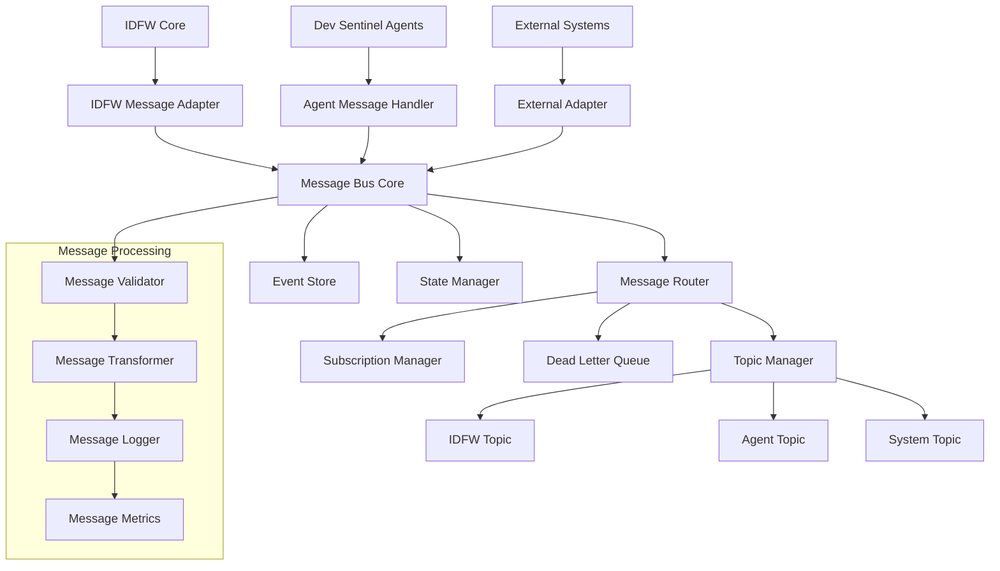
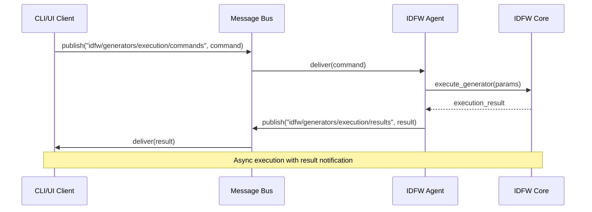
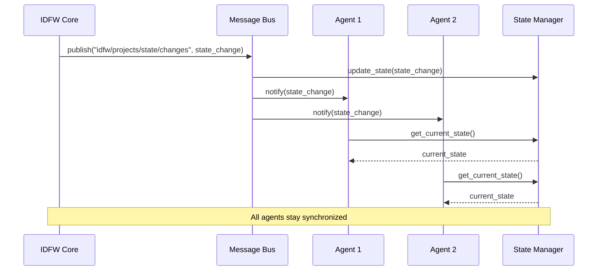
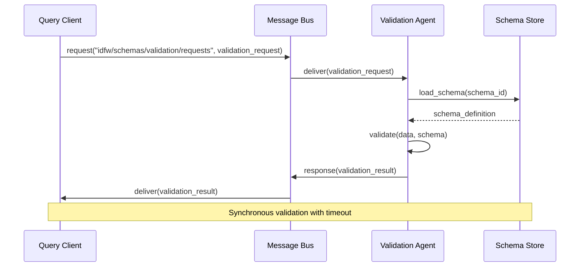
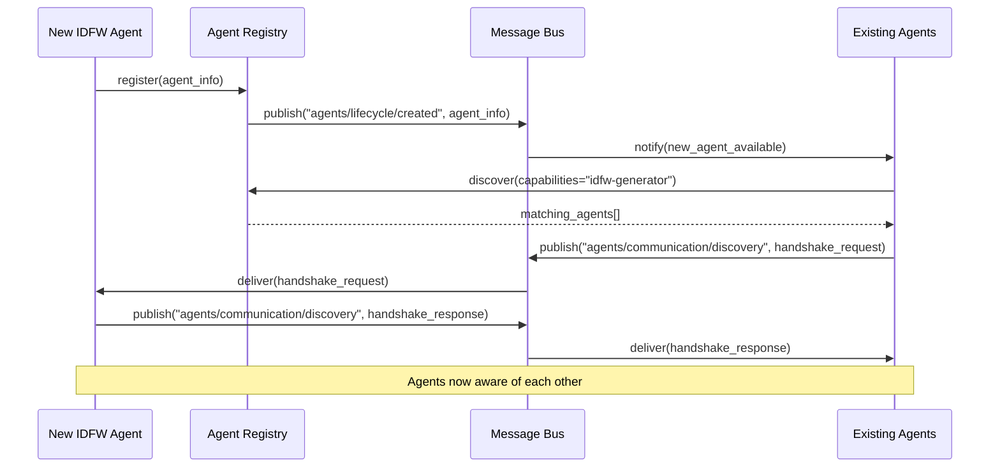
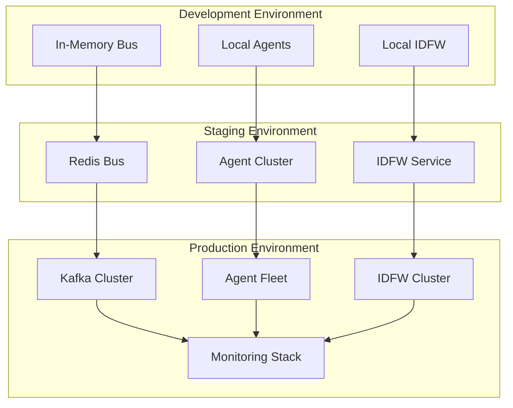

# Message Bus Integration for Agent Communication

## Overview

The message bus integration provides a unified communication layer between IDFW generators (wrapped as agents) and the broader Dev Sentinel agent ecosystem. This integration enables seamless coordination, state synchronization, and event-driven workflows across the unified framework.

## Message Bus Architecture

### Core Components



### Message Bus Interface

```typescript
interface MessageBus {
  // Core messaging operations
  publish<T>(topic: string, message: Message<T>): Promise<void>;
  subscribe<T>(topic: string, handler: MessageHandler<T>): Subscription;
  unsubscribe(subscription: Subscription): void;

  // Request-response pattern
  request<TRequest, TResponse>(
    topic: string,
    message: Message<TRequest>,
    timeout?: number
  ): Promise<Message<TResponse>>;

  // Batch operations
  publishBatch<T>(topic: string, messages: Message<T>[]): Promise<void>;
  subscribePattern(pattern: string, handler: MessageHandler<any>): Subscription;

  // State management
  getState(key: string): Promise<any>;
  setState(key: string, value: any): Promise<void>;

  // Health and monitoring
  getHealth(): BusHealth;
  getMetrics(): BusMetrics;
}
```

## Message Types and Formats

### Base Message Structure

```typescript
interface Message<T = any> {
  id: string;
  type: MessageType;
  source: string;
  target?: string;
  timestamp: number;
  correlation_id?: string;
  headers: MessageHeaders;
  payload: T;
  metadata?: MessageMetadata;
}

interface MessageHeaders {
  content_type: string;
  encoding: string;
  priority: MessagePriority;
  ttl?: number;
  retry_count?: number;
}

enum MessageType {
  COMMAND = 'command',
  EVENT = 'event',
  QUERY = 'query',
  RESPONSE = 'response',
  ERROR = 'error',
  HEARTBEAT = 'heartbeat'
}
```

### IDFW-Specific Message Types

#### Generator Execution Messages

```typescript
interface GeneratorExecutionMessage {
  generator_id: string;
  action: 'create' | 'update' | 'validate' | 'analyze';
  parameters: IDFWParameters;
  context: ExecutionContext;
  priority: number;
}

interface GeneratorResultMessage {
  generator_id: string;
  execution_id: string;
  status: 'success' | 'failure' | 'partial';
  result: IDFWResult;
  metrics: ExecutionMetrics;
  error?: ErrorDetails;
}
```

#### Schema Validation Messages

```typescript
interface SchemaValidationMessage {
  schema_id: string;
  data: any;
  validation_rules: ValidationRule[];
  strict_mode: boolean;
}

interface ValidationResultMessage {
  schema_id: string;
  validation_id: string;
  valid: boolean;
  errors: ValidationError[];
  warnings: ValidationWarning[];
  suggestions: ValidationSuggestion[];
}
```

#### Project State Messages

```typescript
interface ProjectStateMessage {
  project_id: string;
  state_type: 'structure' | 'configuration' | 'dependencies' | 'metadata';
  state_data: any;
  version: string;
  checksum: string;
}

interface StateChangeMessage {
  project_id: string;
  change_type: 'added' | 'modified' | 'deleted';
  changed_items: StateChangeItem[];
  previous_version: string;
  new_version: string;
}
```

## Topic Organization

### Topic Hierarchy

```
idfw/
├── generators/
│   ├── execution/
│   │   ├── commands        # Generator execution commands
│   │   ├── status         # Execution status updates
│   │   └── results        # Execution results
│   ├── lifecycle/
│   │   ├── created        # Generator created events
│   │   ├── started        # Generator started events
│   │   ├── completed      # Generator completed events
│   │   └── failed         # Generator failed events
│   └── monitoring/
│       ├── health         # Generator health checks
│       ├── metrics        # Performance metrics
│       └── logs           # Execution logs
├── schemas/
│   ├── validation/
│   │   ├── requests       # Validation requests
│   │   ├── results        # Validation results
│   │   └── errors         # Validation errors
│   ├── management/
│   │   ├── created        # Schema created events
│   │   ├── updated        # Schema updated events
│   │   └── deleted        # Schema deleted events
│   └── sync/
│       ├── changes        # Schema change events
│       └── conflicts      # Schema conflict events
├── projects/
│   ├── lifecycle/
│   │   ├── created        # Project created events
│   │   ├── updated        # Project updated events
│   │   └── deleted        # Project deleted events
│   ├── state/
│   │   ├── changes        # State change events
│   │   ├── sync           # State synchronization
│   │   └── conflicts      # State conflict events
│   └── analysis/
│       ├── requests       # Analysis requests
│       ├── results        # Analysis results
│       └── reports        # Analysis reports
└── system/
    ├── health/            # System health events
    ├── errors/            # System error events
    ├── metrics/           # System metrics
    └── config/            # Configuration changes

agents/
├── communication/
│   ├── discovery/         # Agent discovery
│   ├── coordination/      # Agent coordination
│   └── negotiation/       # Task negotiation
├── execution/
│   ├── tasks/             # Task execution events
│   ├── results/           # Task results
│   └── status/            # Agent status updates
├── monitoring/
│   ├── health/            # Agent health
│   ├── performance/       # Performance metrics
│   └── errors/            # Agent errors
└── lifecycle/
    ├── created/           # Agent created
    ├── started/           # Agent started
    ├── stopped/           # Agent stopped
    └── destroyed/         # Agent destroyed
```

## Message Flow Patterns

### Command Pattern
For executing IDFW operations through agents.



### Event-Driven State Synchronization



### Request-Response Pattern
For queries and validation operations.



## Message Routing and Delivery

### Routing Rules

```typescript
class MessageRouter {
  private routes: Map<string, RoutingRule[]> = new Map();

  addRoute(pattern: string, rule: RoutingRule): void {
    const existing = this.routes.get(pattern) || [];
    existing.push(rule);
    this.routes.set(pattern, existing);
  }

  route(message: Message): RoutingDecision[] {
    const decisions: RoutingDecision[] = [];

    for (const [pattern, rules] of this.routes) {
      if (this.matchesPattern(message.headers.topic, pattern)) {
        for (const rule of rules) {
          const decision = rule.evaluate(message);
          if (decision) {
            decisions.push(decision);
          }
        }
      }
    }

    return decisions;
  }
}

interface RoutingRule {
  name: string;
  condition: (message: Message) => boolean;
  action: RoutingAction;
  priority: number;
}

enum RoutingAction {
  DELIVER = 'deliver',
  DISCARD = 'discard',
  REDIRECT = 'redirect',
  DUPLICATE = 'duplicate',
  DELAY = 'delay'
}
```

### Delivery Guarantees

```typescript
enum DeliveryGuarantee {
  AT_MOST_ONCE = 'at_most_once',    // Fire and forget
  AT_LEAST_ONCE = 'at_least_once',  // With retries
  EXACTLY_ONCE = 'exactly_once'     // Idempotent delivery
}

interface DeliveryOptions {
  guarantee: DeliveryGuarantee;
  timeout: number;
  max_retries: number;
  retry_backoff: BackoffStrategy;
  dead_letter_topic?: string;
}
```

## Agent Discovery and Registration

### Agent Registry

```typescript
interface AgentRegistry {
  register(agent: AgentInfo): Promise<void>;
  unregister(agentId: string): Promise<void>;
  discover(criteria: DiscoveryCriteria): Promise<AgentInfo[]>;
  getAgent(agentId: string): Promise<AgentInfo | null>;
  listAgents(): Promise<AgentInfo[]>;
}

interface AgentInfo {
  id: string;
  name: string;
  type: string;
  capabilities: Capability[];
  endpoints: Endpoint[];
  status: AgentStatus;
  health: HealthInfo;
  metadata: Record<string, any>;
}

interface Capability {
  name: string;
  version: string;
  description: string;
  input_schema: JSONSchema;
  output_schema: JSONSchema;
  supported_operations: string[];
}
```

### Discovery Process



## State Management and Consistency

### Distributed State Management

```typescript
interface StateManager {
  // State operations
  setState(key: string, value: any, version?: string): Promise<void>;
  getState(key: string): Promise<StateValue>;
  deleteState(key: string): Promise<void>;

  // Consistency
  compareAndSet(key: string, expected: any, value: any): Promise<boolean>;
  multiSet(operations: StateOperation[]): Promise<void>;

  // Observation
  watch(key: string, callback: StateChangeCallback): StateWatcher;
  watchPattern(pattern: string, callback: StateChangeCallback): StateWatcher;

  // Snapshots
  createSnapshot(keys: string[]): Promise<StateSnapshot>;
  restoreSnapshot(snapshot: StateSnapshot): Promise<void>;
}

interface StateValue {
  value: any;
  version: string;
  timestamp: number;
  metadata: Record<string, any>;
}
```

### Conflict Resolution

```typescript
enum ConflictResolution {
  LAST_WRITE_WINS = 'last_write_wins',
  FIRST_WRITE_WINS = 'first_write_wins',
  MERGE = 'merge',
  MANUAL = 'manual'
}

class ConflictResolver {
  resolve(
    conflict: StateConflict,
    strategy: ConflictResolution
  ): Promise<StateValue> {
    switch (strategy) {
      case ConflictResolution.LAST_WRITE_WINS:
        return this.resolveLastWriteWins(conflict);

      case ConflictResolution.MERGE:
        return this.resolveMerge(conflict);

      case ConflictResolution.MANUAL:
        return this.requestManualResolution(conflict);

      default:
        throw new Error(`Unsupported resolution strategy: ${strategy}`);
    }
  }
}
```

## Error Handling and Resilience

### Error Types

```typescript
enum MessageBusError {
  CONNECTION_FAILED = 'connection_failed',
  TIMEOUT = 'timeout',
  SERIALIZATION_ERROR = 'serialization_error',
  ROUTING_ERROR = 'routing_error',
  AUTHORIZATION_ERROR = 'authorization_error',
  RESOURCE_EXHAUSTED = 'resource_exhausted',
  INVALID_MESSAGE = 'invalid_message'
}

interface ErrorHandler {
  handleError(error: MessageBusError, context: ErrorContext): ErrorHandlingDecision;
}

enum ErrorHandlingDecision {
  RETRY = 'retry',
  DEAD_LETTER = 'dead_letter',
  DISCARD = 'discard',
  ESCALATE = 'escalate'
}
```

### Circuit Breaker Pattern

```typescript
class CircuitBreaker {
  private state: CircuitState = CircuitState.CLOSED;
  private failureCount: number = 0;
  private lastFailureTime: number = 0;
  private config: CircuitBreakerConfig;

  async execute<T>(operation: () => Promise<T>): Promise<T> {
    if (this.state === CircuitState.OPEN) {
      if (this.shouldAttemptReset()) {
        this.state = CircuitState.HALF_OPEN;
      } else {
        throw new CircuitBreakerOpenError();
      }
    }

    try {
      const result = await operation();
      this.onSuccess();
      return result;
    } catch (error) {
      this.onFailure();
      throw error;
    }
  }
}
```

## Performance Optimization

### Message Batching

```typescript
class MessageBatcher {
  private batches = new Map<string, MessageBatch>();
  private batchConfig: BatchConfig;

  addMessage(topic: string, message: Message): void {
    const batch = this.getBatch(topic);
    batch.messages.push(message);

    if (this.shouldFlush(batch)) {
      this.flushBatch(topic);
    }
  }

  private shouldFlush(batch: MessageBatch): boolean {
    return (
      batch.messages.length >= this.batchConfig.maxSize ||
      Date.now() - batch.createdAt >= this.batchConfig.maxDelay
    );
  }
}
```

### Message Compression

```typescript
class MessageCompressor {
  compress(message: Message): Promise<CompressedMessage> {
    const serialized = JSON.stringify(message);
    const compressed = await this.gzipCompress(serialized);

    return {
      ...message,
      payload: compressed,
      headers: {
        ...message.headers,
        compressed: true,
        original_size: serialized.length
      }
    };
  }

  decompress(compressed: CompressedMessage): Promise<Message> {
    if (!compressed.headers.compressed) {
      return Promise.resolve(compressed as Message);
    }

    return this.gzipDecompress(compressed.payload)
      .then(decompressed => JSON.parse(decompressed));
  }
}
```

## Monitoring and Observability

### Metrics Collection

```typescript
interface MessageBusMetrics {
  // Throughput metrics
  messagesPerSecond: number;
  bytesPerSecond: number;

  // Latency metrics
  averageLatency: number;
  p95Latency: number;
  p99Latency: number;

  // Error metrics
  errorRate: number;
  timeoutRate: number;

  // Resource metrics
  queueDepth: number;
  connectionCount: number;
  memoryUsage: number;
}

class MetricsCollector {
  private metrics = new Map<string, Metric>();

  recordMessage(topic: string, message: Message, latency: number): void {
    this.increment(`messages.${topic}.count`);
    this.recordLatency(`messages.${topic}.latency`, latency);
    this.recordSize(`messages.${topic}.size`, this.getMessageSize(message));
  }

  recordError(topic: string, error: Error): void {
    this.increment(`errors.${topic}.count`);
    this.increment(`errors.${error.constructor.name}.count`);
  }
}
```

### Health Checks

```typescript
interface HealthChecker {
  checkHealth(): Promise<HealthStatus>;
  checkComponentHealth(component: string): Promise<ComponentHealth>;
}

interface HealthStatus {
  overall: 'healthy' | 'degraded' | 'unhealthy';
  components: Map<string, ComponentHealth>;
  timestamp: number;
}

interface ComponentHealth {
  status: 'healthy' | 'degraded' | 'unhealthy';
  latency: number;
  errorRate: number;
  details: Record<string, any>;
}
```

## Configuration and Deployment

### Configuration Schema

```yaml
message_bus:
  transport:
    type: "redis" | "rabbitmq" | "kafka" | "memory"
    connection:
      host: "localhost"
      port: 6379
      database: 0
      password: null
      ssl: false

  routing:
    default_timeout: 30000
    max_retries: 3
    dead_letter_enabled: true

  performance:
    batch_size: 100
    batch_timeout: 1000
    compression_enabled: true
    compression_threshold: 1024

  topics:
    idfw:
      retention_period: 604800  # 7 days
      max_message_size: 1048576  # 1MB

    agents:
      retention_period: 86400   # 1 day
      max_message_size: 262144  # 256KB

  monitoring:
    metrics_enabled: true
    health_check_interval: 30
    log_level: "info"
```

### Deployment Architecture



---

*Document Version: 1.0.0*
*Date: 2025-09-29*
*Status: Implementation Ready*