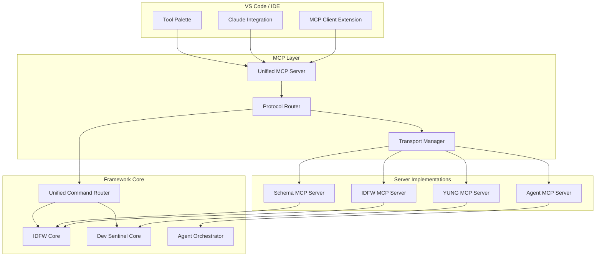
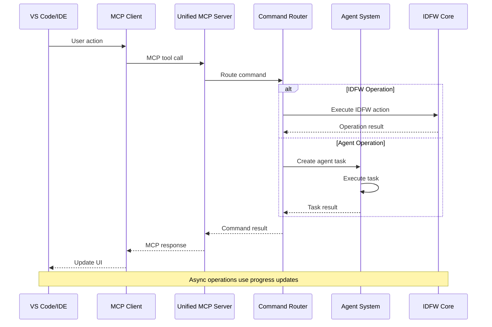

# MCP Protocol Extensions for Unified Framework

## Overview

The Model Context Protocol (MCP) extensions enable seamless integration of the unified IDFW + Dev Sentinel framework with VS Code, Claude, and other development environments. These extensions expose unified framework capabilities through standardized MCP servers while maintaining compatibility with existing tooling.

## MCP Architecture Extensions

### Unified MCP Server Structure



## MCP Server Specifications

### 1. Unified Framework MCP Server

The main server that orchestrates all unified framework operations.

```typescript
interface UnifiedMCPServer extends MCPServer {
  // Server identification
  name: "idfw-dev-sentinel-unified";
  version: "1.0.0";
  protocol_version: "2024-11-05";

  // Capabilities
  capabilities: {
    tools: {
      list: true;
      call: true;
    };
    resources: {
      list: true;
      read: true;
      watch: true;
    };
    prompts: {
      list: true;
      get: true;
    };
  };

  // Tool categories
  tools: [
    ...IDFWTools,
    ...YUNGTools,
    ...AgentTools,
    ...SchemaTools,
    ...WorkflowTools
  ];
}
```

### 2. IDFW MCP Server

Exposes IDFW project operations and generators.

```json
{
  "name": "idfw-server",
  "version": "1.0.0",
  "tools": [
    {
      "name": "idfw_create_project",
      "description": "Create a new project using IDFW templates",
      "inputSchema": {
        "type": "object",
        "properties": {
          "template": {
            "type": "string",
            "description": "Template name to use"
          },
          "name": {
            "type": "string",
            "description": "Project name"
          },
          "output": {
            "type": "string",
            "description": "Output directory path"
          },
          "config": {
            "type": "object",
            "description": "Additional configuration options"
          }
        },
        "required": ["template", "name"]
      }
    },
    {
      "name": "idfw_validate_project",
      "description": "Validate project structure against IDFW schemas",
      "inputSchema": {
        "type": "object",
        "properties": {
          "path": {
            "type": "string",
            "description": "Project path to validate"
          },
          "schema": {
            "type": "string",
            "description": "Schema file path (optional)"
          },
          "strict": {
            "type": "boolean",
            "description": "Enable strict validation mode",
            "default": false
          },
          "fix": {
            "type": "boolean",
            "description": "Automatically fix validation issues",
            "default": false
          }
        }
      }
    },
    {
      "name": "idfw_update_project",
      "description": "Update project structure using IDFW generators",
      "inputSchema": {
        "type": "object",
        "properties": {
          "generator": {
            "type": "string",
            "description": "Generator name to run"
          },
          "target": {
            "type": "string",
            "description": "Target directory path"
          },
          "config": {
            "type": "object",
            "description": "Generator configuration"
          }
        },
        "required": ["generator"]
      }
    }
  ]
}
```

### 3. YUNG Commands MCP Server

Exposes YUNG command system through MCP protocol.

```json
{
  "name": "yung-server",
  "version": "1.0.0",
  "tools": [
    {
      "name": "yung_execute",
      "description": "Execute YUNG command",
      "inputSchema": {
        "type": "object",
        "properties": {
          "command": {
            "type": "string",
            "description": "YUNG command to execute (e.g., 'project:create')"
          },
          "args": {
            "type": "array",
            "items": { "type": "string" },
            "description": "Command arguments"
          },
          "options": {
            "type": "object",
            "description": "Command options"
          },
          "cwd": {
            "type": "string",
            "description": "Working directory for command execution"
          }
        },
        "required": ["command"]
      }
    },
    {
      "name": "yung_list_commands",
      "description": "List available YUNG commands",
      "inputSchema": {
        "type": "object",
        "properties": {
          "namespace": {
            "type": "string",
            "description": "Filter by namespace (optional)"
          },
          "category": {
            "type": "string",
            "description": "Filter by category (optional)"
          }
        }
      }
    },
    {
      "name": "yung_command_help",
      "description": "Get help for specific YUNG command",
      "inputSchema": {
        "type": "object",
        "properties": {
          "command": {
            "type": "string",
            "description": "Command to get help for"
          }
        },
        "required": ["command"]
      }
    }
  ]
}
```

### 4. Agent Management MCP Server

Provides agent orchestration and management capabilities.

```json
{
  "name": "agent-server",
  "version": "1.0.0",
  "tools": [
    {
      "name": "agent_list",
      "description": "List available agents and their status",
      "inputSchema": {
        "type": "object",
        "properties": {
          "type": {
            "type": "string",
            "enum": ["idfw", "force", "validation", "all"],
            "description": "Filter agents by type"
          },
          "status": {
            "type": "string",
            "enum": ["active", "idle", "busy", "error"],
            "description": "Filter agents by status"
          }
        }
      }
    },
    {
      "name": "agent_start",
      "description": "Start specific agent or agent group",
      "inputSchema": {
        "type": "object",
        "properties": {
          "agent": {
            "type": "string",
            "description": "Agent name or ID to start"
          },
          "config": {
            "type": "object",
            "description": "Agent configuration parameters"
          },
          "async": {
            "type": "boolean",
            "description": "Start agent asynchronously",
            "default": true
          }
        },
        "required": ["agent"]
      }
    },
    {
      "name": "agent_orchestrate",
      "description": "Orchestrate multiple agents for complex tasks",
      "inputSchema": {
        "type": "object",
        "properties": {
          "task_definition": {
            "type": "object",
            "description": "Task definition for orchestration",
            "properties": {
              "name": { "type": "string" },
              "agents": {
                "type": "array",
                "items": { "type": "string" }
              },
              "workflow": {
                "type": "object",
                "description": "Workflow definition"
              },
              "parallel": {
                "type": "boolean",
                "default": false
              }
            },
            "required": ["name", "agents"]
          },
          "timeout": {
            "type": "number",
            "description": "Orchestration timeout in seconds",
            "default": 300
          }
        },
        "required": ["task_definition"]
      }
    }
  ]
}
```

## MCP Resource Management

### Resource Types

#### 1. Project Resources

```typescript
interface ProjectResource extends MCPResource {
  uri: string;  // idfw://project/{project-id}
  name: string;
  mimeType: "application/json";

  // Project-specific metadata
  metadata: {
    project_type: string;
    template: string;
    version: string;
    structure_version: string;
    last_validated: string;
    validation_status: "valid" | "invalid" | "unknown";
  };
}
```

#### 2. Schema Resources

```typescript
interface SchemaResource extends MCPResource {
  uri: string;  // idfw://schema/{schema-id}
  name: string;
  mimeType: "application/schema+json";

  metadata: {
    schema_type: "idfw" | "jsonschema" | "openapi";
    version: string;
    dependencies: string[];
    compatibility: string[];
  };
}
```

#### 3. Agent Resources

```typescript
interface AgentResource extends MCPResource {
  uri: string;  // agent://{agent-id}
  name: string;
  mimeType: "application/json";

  metadata: {
    agent_type: string;
    status: AgentStatus;
    capabilities: string[];
    current_task?: string;
    performance_metrics: AgentMetrics;
  };
}
```

### Resource Watching

```typescript
class ResourceWatcher {
  async watchProject(projectId: string): Promise<ResourceWatchHandle> {
    const handle = await this.createWatch(`idfw://project/${projectId}`);

    // Set up event listeners
    handle.on('structure_changed', (event) => {
      this.notifyClient(event);
    });

    handle.on('validation_status_changed', (event) => {
      this.notifyClient(event);
    });

    return handle;
  }
}
```

## MCP Prompt Templates

### Project Creation Prompts

```typescript
const projectCreationPrompts: MCPPrompt[] = [
  {
    name: "create_nextjs_project",
    description: "Guide through creating a Next.js project with IDFW",
    arguments: [
      {
        name: "project_name",
        description: "Name of the project to create",
        required: true
      },
      {
        name: "features",
        description: "Features to include (TypeScript, Tailwind, etc.)",
        required: false
      }
    ],
    template: `
I'll help you create a new Next.js project using IDFW templates.

Project Name: {{project_name}}
Features: {{features}}

Let me start by creating the project structure:

<mcp:tool name="idfw_create_project">
<mcp:parameter name="template">nextjs-app</mcp:parameter>
<mcp:parameter name="name">{{project_name}}</mcp:parameter>
<mcp:parameter name="config">{
  "features": {{features}},
  "typescript": true,
  "tailwind": true
}</mcp:parameter>
</mcp:tool>

After creating the project, I'll validate the structure and install dependencies.
    `
  },
  {
    name: "validate_and_fix_project",
    description: "Validate project structure and fix common issues",
    arguments: [
      {
        name: "project_path",
        description: "Path to the project to validate",
        required: false
      }
    ],
    template: `
I'll validate your project structure and fix any issues found.

<mcp:tool name="idfw_validate_project">
<mcp:parameter name="path">{{project_path}}</mcp:parameter>
<mcp:parameter name="strict">true</mcp:parameter>
<mcp:parameter name="fix">true</mcp:parameter>
</mcp:tool>

Let me also check if there are any YUNG commands that can help optimize your project:

<mcp:tool name="yung_list_commands">
<mcp:parameter name="namespace">project</mcp:parameter>
</mcp:tool>
    `
  }
];
```

### Agent Orchestration Prompts

```typescript
const agentOrchestrationPrompts: MCPPrompt[] = [
  {
    name: "deploy_full_stack",
    description: "Deploy a full-stack application using multiple agents",
    arguments: [
      {
        name: "environment",
        description: "Target environment (staging/production)",
        required: true
      }
    ],
    template: `
I'll orchestrate a full-stack deployment to {{environment}} using multiple agents:

1. First, let me validate the project structure:

<mcp:tool name="idfw_validate_project">
<mcp:parameter name="strict">true</mcp:parameter>
</mcp:tool>

2. Now I'll start the deployment orchestration:

<mcp:tool name="agent_orchestrate">
<mcp:parameter name="task_definition">{
  "name": "full_stack_deploy_{{environment}}",
  "agents": ["validator", "builder", "tester", "deployer"],
  "workflow": {
    "steps": [
      {
        "agent": "validator",
        "action": "validate_all",
        "required": true
      },
      {
        "agent": "builder",
        "action": "build_production",
        "depends_on": ["validator"]
      },
      {
        "agent": "tester",
        "action": "run_all_tests",
        "depends_on": ["builder"]
      },
      {
        "agent": "deployer",
        "action": "deploy_to_{{environment}}",
        "depends_on": ["tester"]
      }
    ]
  },
  "parallel": false
}</mcp:parameter>
<mcp:parameter name="timeout">600</mcp:parameter>
</mcp:tool>

I'll monitor the deployment progress and report back with results.
    `
  }
];
```

## Communication Flow

### MCP Message Flow



### Transport Layer

```typescript
interface MCPTransport {
  // Standard MCP transports
  stdio: StdioTransport;
  sse: SSETransport;
  websocket: WebSocketTransport;

  // Custom transport for local development
  ipc: IPCTransport;
}

class UnifiedMCPTransportManager {
  private transports = new Map<string, MCPTransport>();

  registerTransport(name: string, transport: MCPTransport): void {
    this.transports.set(name, transport);
  }

  async handleRequest(transport: string, request: MCPRequest): Promise<MCPResponse> {
    const transportImpl = this.transports.get(transport);
    if (!transportImpl) {
      throw new Error(`Unknown transport: ${transport}`);
    }

    return await this.processRequest(request);
  }
}
```

## Error Handling and Diagnostics

### MCP Error Types

```typescript
enum MCPErrorCode {
  // Standard MCP errors
  PARSE_ERROR = -32700,
  INVALID_REQUEST = -32600,
  METHOD_NOT_FOUND = -32601,
  INVALID_PARAMS = -32602,
  INTERNAL_ERROR = -32603,

  // Framework-specific errors
  IDFW_VALIDATION_ERROR = -31000,
  AGENT_EXECUTION_ERROR = -31001,
  YUNG_COMMAND_ERROR = -31002,
  SCHEMA_ERROR = -31003,
  ORCHESTRATION_ERROR = -31004
}

interface MCPErrorResponse {
  error: {
    code: MCPErrorCode;
    message: string;
    data?: {
      details: string;
      stack_trace?: string;
      recovery_suggestions?: string[];
      related_resources?: string[];
    };
  };
}
```

### Diagnostic Tools

```typescript
class MCPDiagnostics {
  async runDiagnostics(): Promise<DiagnosticReport> {
    const report: DiagnosticReport = {
      timestamp: Date.now(),
      status: 'unknown',
      checks: []
    };

    // Check IDFW connectivity
    report.checks.push(await this.checkIDFWConnection());

    // Check agent system
    report.checks.push(await this.checkAgentSystem());

    // Check schema validation
    report.checks.push(await this.checkSchemaValidation());

    // Check YUNG commands
    report.checks.push(await this.checkYUNGCommands());

    report.status = this.determineOverallStatus(report.checks);
    return report;
  }

  private async checkIDFWConnection(): Promise<DiagnosticCheck> {
    try {
      const result = await this.callTool('idfw_validate_project', {
        path: './test-project'
      });
      return {
        name: 'IDFW Connection',
        status: 'pass',
        message: 'IDFW core is responding correctly'
      };
    } catch (error) {
      return {
        name: 'IDFW Connection',
        status: 'fail',
        message: `IDFW connection failed: ${error.message}`,
        details: error.stack
      };
    }
  }
}
```

## Configuration and Setup

### MCP Server Configuration

```json
{
  "mcpServers": {
    "idfw-dev-sentinel-unified": {
      "command": "node",
      "args": ["/path/to/unified-mcp-server/dist/index.js"],
      "env": {
        "IDFW_HOME": "/path/to/idfw",
        "DEV_SENTINEL_HOME": "/path/to/dev-sentinel",
        "LOG_LEVEL": "info"
      },
      "initializationOptions": {
        "enableIDFW": true,
        "enableYUNG": true,
        "enableAgents": true,
        "autoDiscoverProjects": true,
        "cacheEnabled": true,
        "cacheTTL": 3600
      }
    }
  }
}
```

### VS Code Extension Integration

```typescript
// VS Code extension activation
export async function activate(context: vscode.ExtensionContext) {
  // Register MCP client
  const mcpClient = new MCPClient({
    serverPath: getUnifiedServerPath(),
    transport: 'stdio',
    initializationOptions: {
      workspace: vscode.workspace.workspaceFolders?.[0]?.uri.fsPath
    }
  });

  await mcpClient.initialize();

  // Register commands
  const commands = [
    vscode.commands.registerCommand('idfw.createProject', async () => {
      const result = await vscode.window.showInputBox({
        prompt: 'Enter project name'
      });

      if (result) {
        await mcpClient.callTool('idfw_create_project', {
          template: 'nextjs-app',
          name: result
        });
      }
    }),

    vscode.commands.registerCommand('yung.executeCommand', async () => {
      const command = await vscode.window.showInputBox({
        prompt: 'Enter YUNG command'
      });

      if (command) {
        await mcpClient.callTool('yung_execute', {
          command: command,
          cwd: vscode.workspace.workspaceFolders?.[0]?.uri.fsPath
        });
      }
    })
  ];

  context.subscriptions.push(...commands);
}
```

## Performance and Optimization

### Caching Strategy

```typescript
class MCPCache {
  private cache = new Map<string, CacheEntry>();
  private ttl: number = 3600000; // 1 hour

  async get(key: string): Promise<any> {
    const entry = this.cache.get(key);
    if (!entry || Date.now() > entry.expires) {
      return null;
    }
    return entry.value;
  }

  async set(key: string, value: any, customTTL?: number): Promise<void> {
    this.cache.set(key, {
      value,
      expires: Date.now() + (customTTL || this.ttl)
    });
  }

  // Cache key generation for different operations
  generateProjectKey(projectPath: string, operation: string): string {
    return `project:${projectPath}:${operation}:${this.getProjectMTime(projectPath)}`;
  }

  generateSchemaKey(schemaPath: string, dataHash: string): string {
    return `schema:${schemaPath}:${dataHash}`;
  }
}
```

### Request Batching

```typescript
class RequestBatcher {
  private pendingRequests = new Map<string, BatchRequest>();
  private batchTimeout: number = 100; // 100ms

  async batchRequest(key: string, request: MCPRequest): Promise<MCPResponse> {
    let batch = this.pendingRequests.get(key);

    if (!batch) {
      batch = {
        requests: [],
        promises: [],
        timeout: setTimeout(() => this.executeBatch(key), this.batchTimeout)
      };
      this.pendingRequests.set(key, batch);
    }

    return new Promise((resolve, reject) => {
      batch.requests.push(request);
      batch.promises.push({ resolve, reject });
    });
  }
}
```

---

*Document Version: 1.0.0*
*Date: 2025-09-29*
*Status: Implementation Ready*