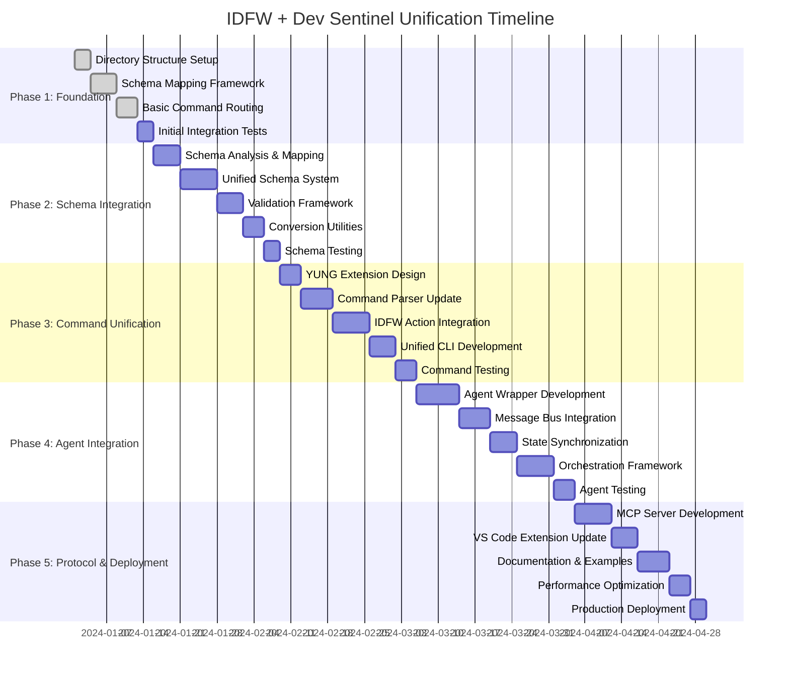
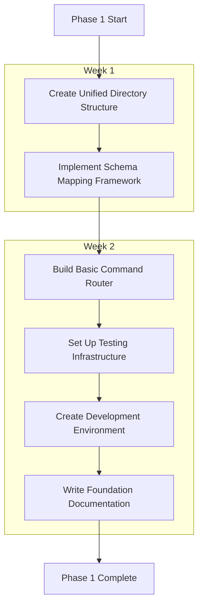
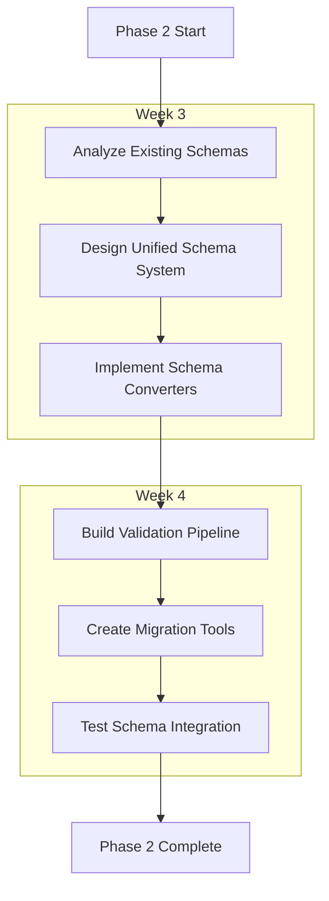
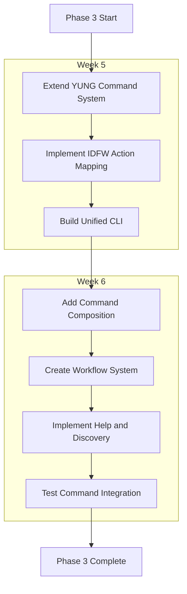
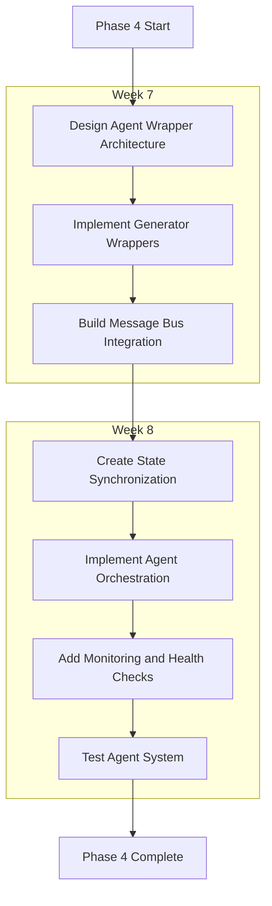
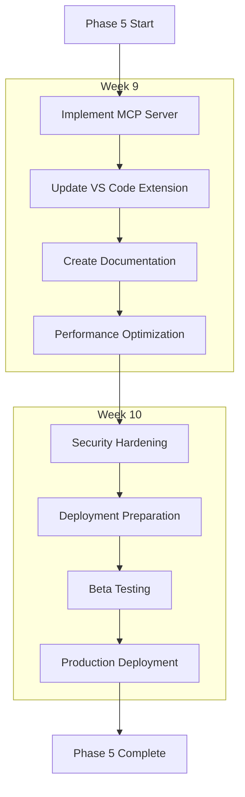
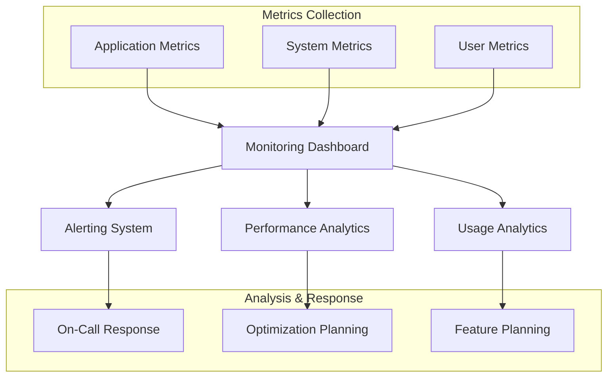

# Implementation Roadmap and Phases

## Overview

This document outlines the comprehensive implementation roadmap for unifying IDFW and Dev Sentinel frameworks. The plan is structured in five phases, each building upon the previous to create a fully integrated, production-ready unified development framework.

## Implementation Timeline



## Phase 1: Foundation (Weeks 1-2)

### Objectives
- Establish unified project structure
- Create basic integration framework
- Set up development and testing infrastructure

### Phase 1 Tasks



#### Task 1.1: Unified Directory Structure
**Duration**: 3 days
**Owner**: Infrastructure Team

**Deliverables**:
- `/unified-framework/` root directory
- Consolidated package.json with dependencies
- Shared configuration files
- Build and development scripts

**Directory Structure**:
```
unified-framework/
├── packages/
│   ├── core/                    # Shared core functionality
│   ├── idfw-integration/        # IDFW wrapper and adapters
│   ├── dev-sentinel-integration/ # Dev Sentinel wrapper
│   ├── unified-cli/             # Unified command interface
│   ├── mcp-server/              # MCP protocol implementation
│   └── schemas/                 # Unified schema definitions
├── apps/
│   ├── cli/                     # Main CLI application
│   ├── vs-code-extension/       # VS Code extension
│   └── web-dashboard/           # Web-based dashboard (future)
├── tools/
│   ├── build-tools/             # Custom build utilities
│   ├── testing/                 # Testing utilities
│   └── dev-tools/               # Development helpers
├── docs/
│   ├── api/                     # API documentation
│   ├── guides/                  # User guides
│   └── examples/                # Example projects
└── tests/
    ├── integration/             # Integration tests
    ├── e2e/                     # End-to-end tests
    └── fixtures/                # Test fixtures
```

#### Task 1.2: Schema Mapping Framework
**Duration**: 5 days
**Owner**: Schema Team

**Deliverables**:
- Schema mapping interfaces and types
- Basic conversion utilities
- Schema validation framework
- Initial IDFW-to-Force mappings

**Key Components**:
```typescript
interface SchemaMapper {
  mapIDFWToForce(idfwSchema: IDFWSchema): ForceSchema;
  mapForceToIDFW(forceSchema: ForceSchema): IDFWSchema;
  validateMapping(mapping: SchemaMapping): ValidationResult;
  resolveConflicts(conflicts: SchemaConflict[]): Resolution[];
}
```

#### Task 1.3: Basic Command Routing
**Duration**: 4 days
**Owner**: Command Team

**Deliverables**:
- Command parser and router foundation
- Namespace resolution system
- Basic YUNG command integration
- Command validation framework

#### Task 1.4: Testing Infrastructure
**Duration**: 3 days
**Owner**: QA Team

**Deliverables**:
- Jest test configuration
- Integration test framework
- Mock services for external dependencies
- CI/CD pipeline setup

### Phase 1 Success Criteria
- [ ] Unified project builds successfully
- [ ] Basic command routing works for YUNG commands
- [ ] Schema mapping framework can convert simple schemas
- [ ] All existing IDFW and Dev Sentinel tests pass
- [ ] Integration tests cover basic workflows

## Phase 2: Schema Integration (Weeks 3-4)

### Objectives
- Complete schema system unification
- Implement bidirectional schema conversion
- Establish validation pipeline

### Phase 2 Tasks



#### Task 2.1: Schema Analysis and Mapping
**Duration**: 5 days
**Owner**: Schema Team

**Deliverables**:
- Comprehensive schema inventory
- Conflict identification and resolution strategy
- Mapping specifications for all schema types
- Compatibility matrix

#### Task 2.2: Unified Schema System
**Duration**: 7 days
**Owner**: Schema Team + Core Team

**Deliverables**:
- Unified schema format specification
- Schema registry and management system
- Version control and migration system
- Runtime schema validation

#### Task 2.3: Validation Framework
**Duration**: 5 days
**Owner**: Validation Team

**Deliverables**:
- Multi-format schema validator
- Performance-optimized validation pipeline
- Error reporting and suggestion system
- Auto-fix capabilities for common issues

### Phase 2 Success Criteria
- [ ] All IDFW schemas convert to unified format
- [ ] All Force schemas convert to unified format
- [ ] Bidirectional conversion maintains schema integrity
- [ ] Validation performance meets benchmarks (< 100ms for typical schemas)
- [ ] Migration tools successfully upgrade existing projects

## Phase 3: Command Unification (Weeks 5-6)

### Objectives
- Extend YUNG with IDFW operations
- Create unified command interface
- Implement command composition and workflows

### Phase 3 Tasks



#### Task 3.1: YUNG Extension Design
**Duration**: 4 days
**Owner**: Command Team

**Deliverables**:
- Extended YUNG architecture
- New namespace definitions
- Command registration system
- Plugin architecture for extensibility

#### Task 3.2: Command Parser Enhancement
**Duration**: 6 days
**Owner**: CLI Team

**Deliverables**:
- Enhanced command parser
- Parameter validation system
- Auto-completion support
- Context-aware command suggestions

#### Task 3.3: IDFW Action Integration
**Duration**: 7 days
**Owner**: Integration Team

**Deliverables**:
- IDFW action wrappers
- Parameter mapping system
- Result transformation utilities
- Error handling integration

### Phase 3 Success Criteria
- [ ] All IDFW operations accessible through YUNG commands
- [ ] Command composition works for complex workflows
- [ ] Auto-completion provides accurate suggestions
- [ ] Performance metrics meet targets (< 50ms command parsing)
- [ ] Backward compatibility maintained for existing commands

## Phase 4: Agent Integration (Weeks 7-8)

### Objectives
- Wrap IDFW generators as autonomous agents
- Implement agent message bus
- Create orchestration framework

### Phase 4 Tasks



#### Task 4.1: Agent Wrapper Development
**Duration**: 8 days
**Owner**: Agent Team

**Deliverables**:
- IDFW generator wrapper framework
- Agent lifecycle management
- Parameter mapping and validation
- Error handling and recovery

#### Task 4.2: Message Bus Integration
**Duration**: 6 days
**Owner**: Infrastructure Team

**Deliverables**:
- Message bus implementation
- Topic management system
- Message routing and delivery
- Event sourcing capabilities

#### Task 4.3: State Synchronization
**Duration**: 5 days
**Owner**: State Team

**Deliverables**:
- Distributed state management
- Conflict resolution strategies
- State persistence and recovery
- Real-time synchronization

### Phase 4 Success Criteria
- [ ] IDFW generators run as autonomous agents
- [ ] Message bus handles high throughput (1000+ msgs/sec)
- [ ] State synchronization maintains consistency
- [ ] Agent orchestration supports complex workflows
- [ ] System remains stable under concurrent load

## Phase 5: Protocol & Deployment (Weeks 9-10)

### Objectives
- Complete MCP integration
- Deploy production-ready system
- Provide comprehensive documentation

### Phase 5 Tasks



#### Task 5.1: MCP Server Development
**Duration**: 7 days
**Owner**: Protocol Team

**Deliverables**:
- Full MCP server implementation
- Tool and resource exposure
- Transport layer optimization
- Protocol compliance testing

#### Task 5.2: VS Code Extension Update
**Duration**: 5 days
**Owner**: Extension Team

**Deliverables**:
- Updated VS Code extension
- New command palette entries
- Improved user interface
- Extension marketplace preparation

#### Task 5.3: Documentation and Examples
**Duration**: 6 days
**Owner**: Documentation Team

**Deliverables**:
- Complete API documentation
- User guides and tutorials
- Example projects and templates
- Migration guides

### Phase 5 Success Criteria
- [ ] MCP server passes all protocol compliance tests
- [ ] VS Code extension works seamlessly with unified framework
- [ ] Documentation covers all major use cases
- [ ] Performance meets production requirements
- [ ] Security audit passes all checks

## Risk Mitigation Strategies

### Technical Risks

#### Risk: Schema Conversion Complexity
**Probability**: High
**Impact**: Medium

**Mitigation**:
- Incremental schema conversion approach
- Extensive testing with real-world schemas
- Fallback mechanisms for unsupported conversions
- Community feedback integration

#### Risk: Performance Degradation
**Probability**: Medium
**Impact**: High

**Mitigation**:
- Continuous performance monitoring
- Benchmarking against baseline performance
- Optimization sprints built into timeline
- Caching and lazy loading strategies

#### Risk: State Synchronization Issues
**Probability**: Medium
**Impact**: High

**Mitigation**:
- Event sourcing for audit trail
- Conflict resolution strategies
- Rollback capabilities
- Distributed testing scenarios

### Project Risks

#### Risk: Resource Allocation
**Probability**: Medium
**Impact**: Medium

**Mitigation**:
- Cross-training team members
- Buffer time built into estimates
- External contractor availability
- Scope adjustment procedures

#### Risk: Integration Complexity
**Probability**: High
**Impact**: Medium

**Mitigation**:
- Prototype early and often
- Incremental integration approach
- Regular stakeholder reviews
- Rollback plans for each phase

## Quality Assurance Strategy

### Testing Approach

#### Unit Testing
- **Target Coverage**: 90%+
- **Framework**: Jest with TypeScript support
- **Focus**: Individual component functionality
- **Automation**: Pre-commit hooks and CI/CD

#### Integration Testing
- **Coverage**: All inter-component interfaces
- **Framework**: Custom integration test framework
- **Focus**: Data flow and API contracts
- **Automation**: Nightly builds and PR validation

#### End-to-End Testing
- **Coverage**: Critical user workflows
- **Framework**: Playwright for UI testing
- **Focus**: Complete user journeys
- **Automation**: Weekly regression testing

#### Performance Testing
- **Metrics**: Latency, throughput, memory usage
- **Tools**: Artillery.js for load testing
- **Benchmarks**: Current system performance
- **Frequency**: Every major milestone

### Code Quality Standards

#### Code Reviews
- **Requirement**: All code requires review
- **Reviewers**: Minimum 2 reviewers for critical components
- **Criteria**: Functionality, performance, security, maintainability
- **Tools**: GitHub PR reviews with automated checks

#### Documentation Standards
- **API Documentation**: OpenAPI/Swagger specifications
- **Code Documentation**: TSDoc comments for all public APIs
- **User Documentation**: Markdown with examples
- **Architecture Documentation**: Diagrams and decision records

## Post-Implementation Support

### Monitoring and Observability



### Maintenance and Updates

#### Regular Maintenance
- **Security Updates**: Monthly security patches
- **Dependency Updates**: Quarterly dependency reviews
- **Performance Tuning**: Bi-annual performance optimization
- **Documentation Updates**: Continuous documentation maintenance

#### Feature Development
- **Community Requests**: Monthly review of community feedback
- **Bug Fixes**: Weekly bug triage and resolution
- **Enhancement Requests**: Quarterly feature planning
- **Breaking Changes**: Annual major version planning

### Success Metrics

#### Technical Metrics
- **System Uptime**: > 99.9%
- **Response Time**: < 100ms for typical operations
- **Error Rate**: < 0.1% for all operations
- **Test Coverage**: > 90% across all components

#### User Metrics
- **Adoption Rate**: Track unified framework adoption
- **User Satisfaction**: Quarterly user surveys
- **Support Tickets**: Track and reduce support volume
- **Documentation Usage**: Monitor help system usage

#### Business Metrics
- **Development Velocity**: Measure improvement in development speed
- **Code Quality**: Track bug reports and code review feedback
- **Community Growth**: Monitor community contributions
- **Integration Success**: Track successful project integrations

---

*Document Version: 1.0.0*
*Date: 2025-09-29*
*Status: Implementation Ready*
*Total Estimated Duration: 10 weeks*
*Total Estimated Effort: 120 person-weeks*