# Mermaid and PlantUML Architecture Diagram Reference Guide

## Overview

This comprehensive reference covers the latest syntax standards for Mermaid (v10+) and PlantUML (2024) for creating software architecture diagrams, with specific focus on IDFW + Dev Sentinel integration documentation.

## Table of Contents

1. [Mermaid v10+ Syntax](#mermaid-v10-syntax)
2. [PlantUML 2024 Syntax](#plantuml-2024-syntax)
3. [Best Practices](#best-practices)
4. [IDFW + Dev Sentinel Use Cases](#idfw--dev-sentinel-use-cases)
5. [Tool Selection Guidelines](#tool-selection-guidelines)

---

## Mermaid v10+ Syntax

### 1. C4 Diagrams (Experimental)

**Note**: C4 diagrams in Mermaid are experimental and syntax may change.

#### Supported C4 Diagram Types
- `C4Context` - System Context diagrams
- `C4Container` - Container diagrams
- `C4Component` - Component diagrams
- `C4Dynamic` - Dynamic diagrams
- `C4Deployment` - Deployment diagrams

#### Basic C4 Components
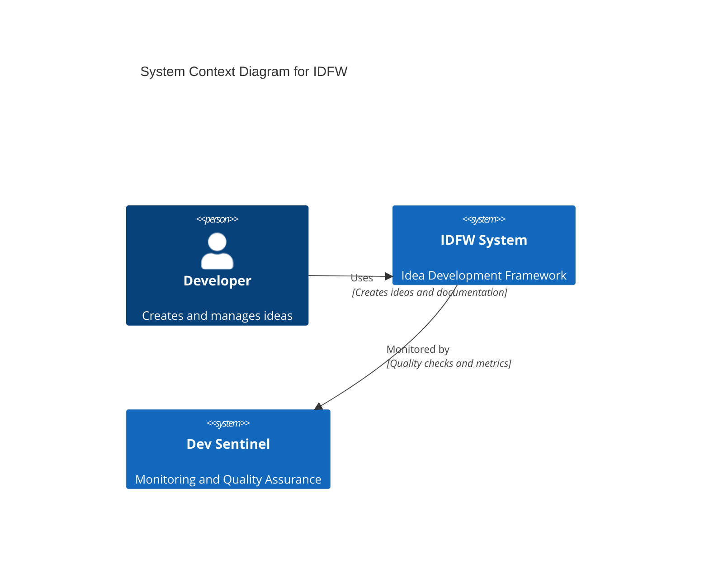

#### C4 Layout Configuration
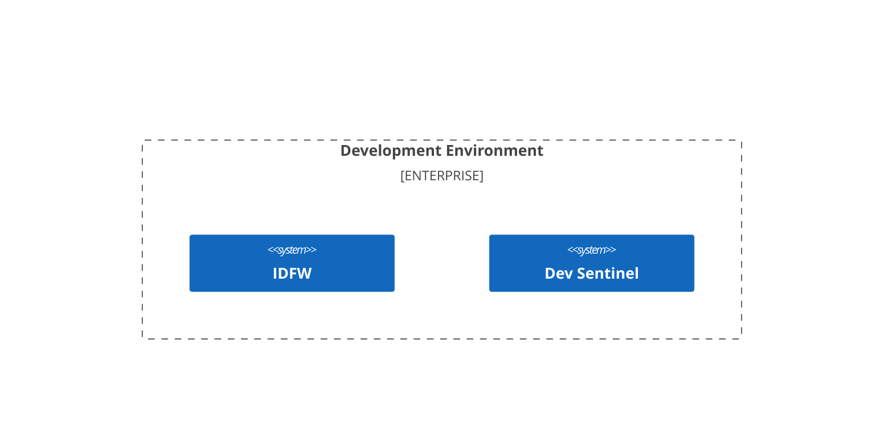

#### Key C4 Elements
- `Person(alias, "Label", "Description")` - External/internal persons
- `System(alias, "Label", "Description")` - Systems
- `SystemDb(alias, "Label", "Description")` - Database systems
- `Container(alias, "Label", "Technology", "Description")` - Containers
- `Component(alias, "Label", "Technology", "Description")` - Components
- `Rel(from, to, "Label", "Description")` - Relationships

### 2. Class Diagrams

#### Class Definition Syntax
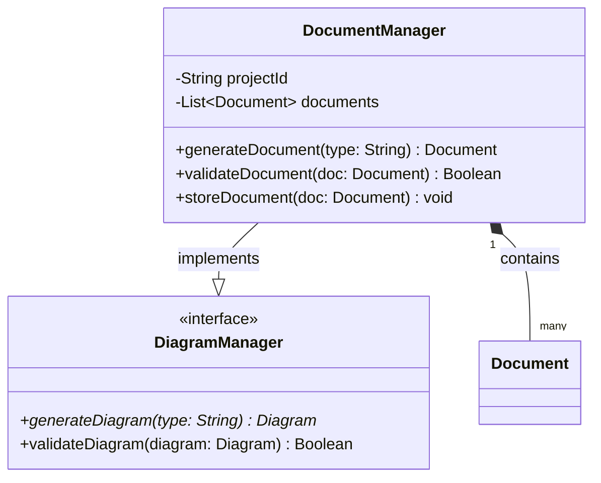

#### Visibility Modifiers
- `+` Public
- `-` Private
- `#` Protected
- `~` Package/Internal

#### Method/Attribute Classifiers
- `*` Abstract
- `$` Static

#### Relationship Types
- `<|--` Inheritance
- `*--` Composition
- `o--` Aggregation
- `-->` Association
- `..>` Dependency
- `..|>` Realization

#### Advanced Features
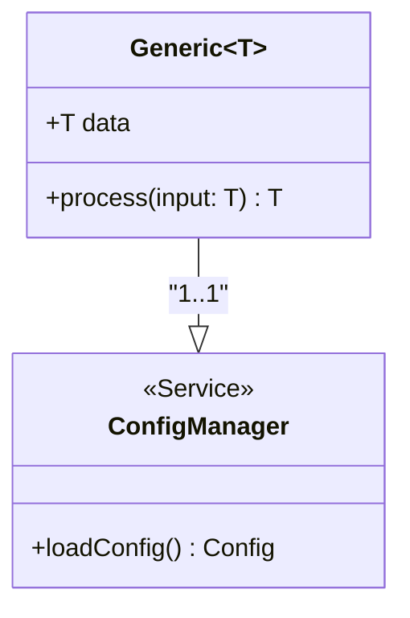

### 3. Sequence Diagrams

#### Basic Sequence Structure
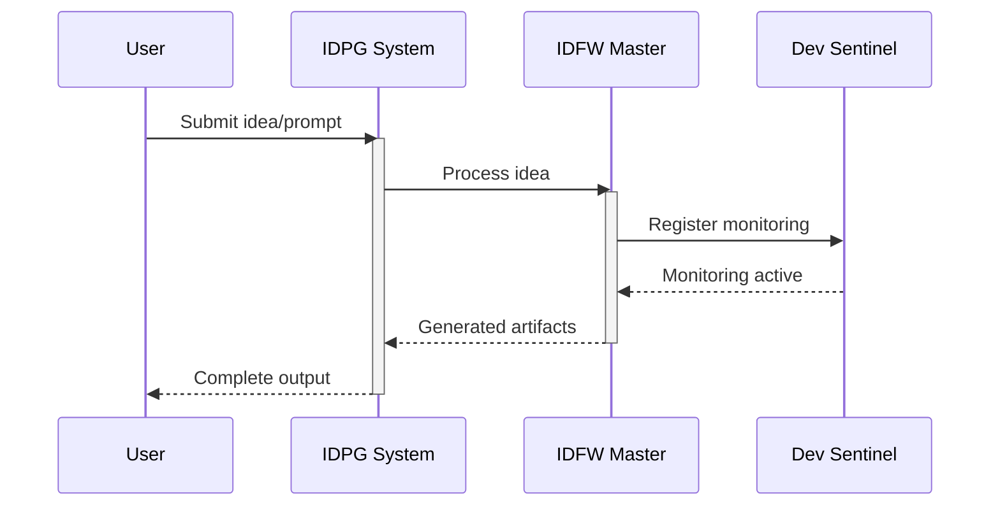

#### Advanced Sequence Features
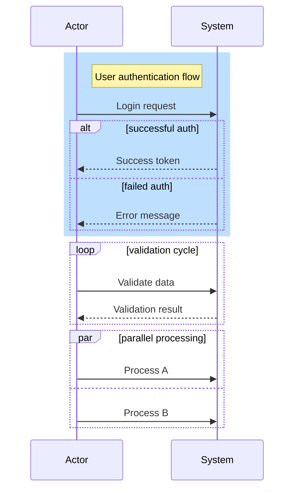

#### Message Types
- `->` Solid line
- `-->` Dotted line
- `->>` Solid arrow
- `-->>` Dotted arrow
- `-x` Cross ending
- `--x` Dotted cross
- `-)` Async ending

### 4. State Diagrams

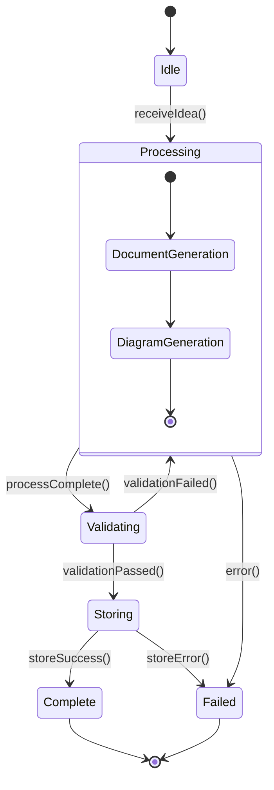

### 5. Entity Relationship Diagrams

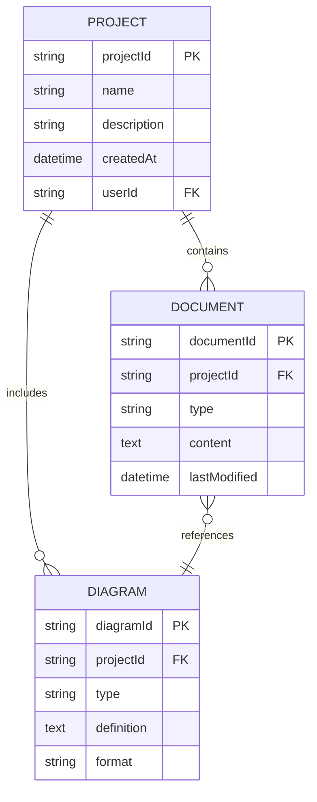

### 6. Flowcharts

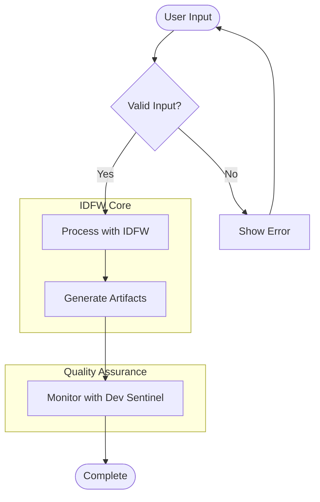

### 7. Git Graphs

```mermaid
gitgraph
    commit id: "Initial IDFW"
    branch feature/dev-sentinel
    checkout feature/dev-sentinel
    commit id: "Add monitoring"
    commit id: "Implement metrics"
    checkout main
    merge feature/dev-sentinel
    commit id: "Release v1.0"
    branch hotfix/monitoring
    checkout hotfix/monitoring
    commit id: "Fix alert logic"
    checkout main
    merge hotfix/monitoring
```

---

## PlantUML 2024 Syntax

### 1. Component Diagrams

#### Basic Component Syntax
```plantuml
@startuml "IDFW Component Architecture"
!theme aws-orange

' Component definitions
[IDFW Core] as Core
[Document Generator] as DocGen
[Diagram Generator] as DiagGen
[Configuration Manager] as Config
[Version Control] as VC

' Interfaces
() "Generation API" as GenAPI
() "Config API" as ConfigAPI
() "Storage API" as StorageAPI

' Connections
Core --> GenAPI
GenAPI --> DocGen
GenAPI --> DiagGen
Core --> ConfigAPI
ConfigAPI --> Config
DocGen --> StorageAPI
DiagGen --> StorageAPI
StorageAPI --> VC

' Grouping
package "Generation Layer" {
    DocGen
    DiagGen
}

package "Infrastructure" {
    Config
    VC
}

note right of Core
    Central orchestrator for
    idea processing workflow
end note

@enduml
```

#### Advanced Component Features
```plantuml
@startuml
' Using different component styles
skinparam componentStyle uml2

component [API Gateway] as Gateway
component [Service A] <<microservice>>
component [Database] <<database>>

' Ports
portin " " as pin
portout " " as pout
Gateway --( pin
Gateway -( pout

' Tagging and styling
Gateway #lightblue
[Service A] #lightgreen
[Database] #yellow

' Hide unlinked components
hide @unlinked

@enduml
```

### 2. Deployment Diagrams

```plantuml
@startuml "IDFW Deployment Architecture"
!theme aws-orange

node "Development Environment" as DevEnv {
    artifact "IDFW CLI" as CLI
    component "Local Config" as LocalConfig
}

node "Cloud Infrastructure" as Cloud {
    artifact "IDFW Service" as Service
    database "Document Store" as DocStore
    component "Dev Sentinel" as Sentinel
}

node "External Services" as External {
    cloud "GitHub" as GitHub
    cloud "Monitoring" as Monitor
}

' Connections
CLI --> Service : "API Calls"
Service --> DocStore : "Store/Retrieve"
Service --> Sentinel : "Quality Metrics"
Sentinel --> Monitor : "Send Alerts"
Service --> GitHub : "Version Control"

' Styling
DevEnv #lightblue
Cloud #lightgreen
External #lightyellow

@enduml
```

### 3. Use Case Diagrams

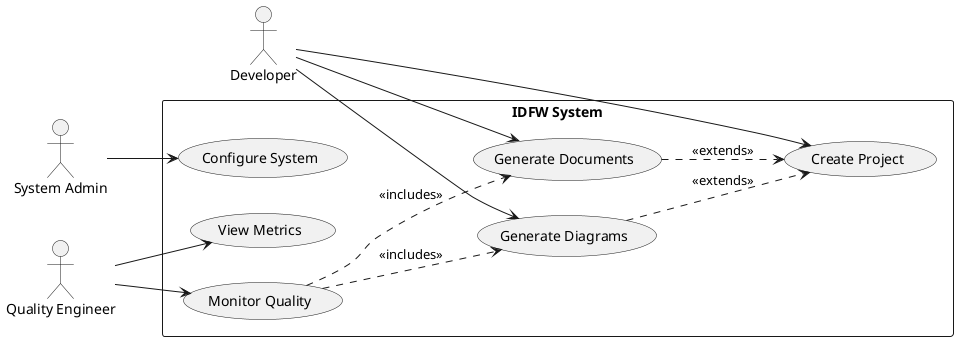

### 4. Activity Diagrams

```plantuml
@startuml "IDFW Processing Flow"
!theme aws-orange

start

:Receive user input;

if (Input valid?) then (yes)
    :Initialize IDFW object;

    fork
        :Generate documents;
    fork again
        :Generate diagrams;
    end fork

    :Validate artifacts;

    if (Validation passes?) then (yes)
        :Store in version control;
        :Update metrics;
        :Notify Dev Sentinel;
    else (no)
        :Initiate feedback loop;
        backward :Return to generation;
    endif

else (no)
    :Show error message;
    stop
endif

:Finalize output;
stop

@enduml
```

### 5. State Machine Diagrams

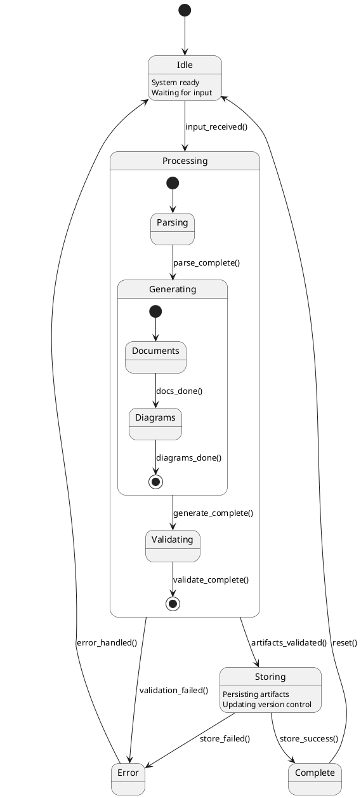

### 6. C4 Model with PlantUML

#### C4 Context Diagram
```plantuml
@startuml "C4 Context - IDFW System"
!include https://raw.githubusercontent.com/plantuml-stdlib/C4-PlantUML/master/C4_Context.puml

LAYOUT_WITH_LEGEND()

title System Context Diagram for IDFW

Person(developer, "Developer", "Creates and manages software ideas")
Person(admin, "System Administrator", "Configures and monitors IDFW")

System(idfw, "IDFW System", "Idea Development Framework for creating documentation and diagrams")
System_Ext(devsentinel, "Dev Sentinel", "Quality monitoring and metrics collection")
System_Ext(github, "GitHub", "Version control and collaboration platform")
System_Ext(cloud, "Cloud Storage", "Document and artifact storage")

Rel(developer, idfw, "Uses", "HTTPS/CLI")
Rel(admin, idfw, "Configures", "Admin API")
Rel(idfw, devsentinel, "Sends metrics to", "API")
Rel(idfw, github, "Stores code/docs in", "Git API")
Rel(idfw, cloud, "Stores artifacts in", "Cloud API")

@enduml
```

#### C4 Container Diagram
```plantuml
@startuml "C4 Container - IDFW System"
!include https://raw.githubusercontent.com/plantuml-stdlib/C4-PlantUML/master/C4_Container.puml

LAYOUT_WITH_LEGEND()

title Container Diagram for IDFW System

Person(developer, "Developer")

System_Boundary(idfw, "IDFW System") {
    Container(cli, "CLI Application", "Node.js", "Command-line interface for IDFW")
    Container(api, "API Gateway", "Express.js", "Handles API requests and routing")
    Container(core, "Core Engine", "Node.js", "Main processing logic for idea development")
    Container(docgen, "Document Generator", "Node.js", "Generates documentation from templates")
    Container(diaggen, "Diagram Generator", "Node.js", "Creates diagrams from specifications")
    ContainerDb(config, "Configuration Store", "JSON/YAML", "System configuration and templates")
    ContainerDb(cache, "Artifact Cache", "Redis", "Temporary storage for generated artifacts")
}

System_Ext(devsentinel, "Dev Sentinel")
System_Ext(github, "GitHub")

Rel(developer, cli, "Uses", "Command line")
Rel(cli, api, "Makes requests to", "HTTPS")
Rel(api, core, "Routes to", "Internal API")
Rel(core, docgen, "Delegates to", "Function calls")
Rel(core, diaggen, "Delegates to", "Function calls")
Rel(core, config, "Reads from", "File I/O")
Rel(core, cache, "Caches in", "Redis protocol")
Rel(core, devsentinel, "Reports to", "HTTPS")
Rel(core, github, "Commits to", "Git API")

@enduml
```

### 7. JSON/YAML Data Visualization

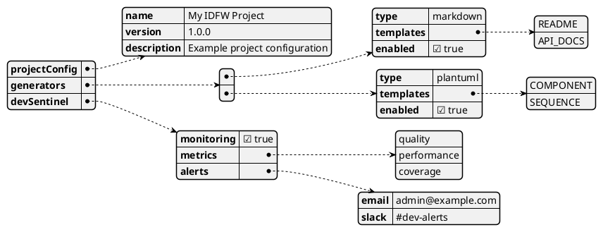

#### Styled JSON Visualization
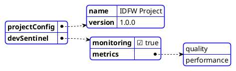

---

## Best Practices

### 1. Tool Selection Guidelines

#### Use Mermaid When:
- **Simple, quick diagrams** needed for documentation
- **GitHub/GitLab integration** required (native support)
- **Markdown embedding** is important
- **Interactive features** are needed (clickable links, etc.)
- **Git-friendly** text format is priority
- **Team collaboration** in web environments

#### Use PlantUML When:
- **Complex, detailed diagrams** with extensive customization
- **Professional documentation** requiring precise layout control
- **C4 model architecture** diagrams are primary need
- **Multiple output formats** required (PNG, SVG, PDF, etc.)
- **Advanced UML features** are necessary
- **Data visualization** (JSON/YAML) is important

### 2. Color Schemes and Styling

#### Mermaid Styling
```mermaid
%%{init: {
  'theme': 'base',
  'themeVariables': {
    'primaryColor': '#ff6b6b',
    'primaryTextColor': '#333',
    'primaryBorderColor': '#ff6b6b',
    'lineColor': '#333',
    'secondaryColor': '#4ecdc4',
    'tertiaryColor': '#ffe66d'
  }
}}%%

flowchart TD
    A[Start] --> B[Process]
    B --> C[End]
```

#### PlantUML Styling
```plantuml
@startuml
!theme aws-orange

skinparam {
    BackgroundColor #f8f9fa
    ComponentBackgroundColor #e3f2fd
    ComponentBorderColor #1976d2
    ArrowColor #333
    ComponentFontColor #333
}

@enduml
```

### 3. Layout Optimization

#### Mermaid Layout Control
```mermaid
flowchart LR
    subgraph "Input Layer"
        A[User Input]
        B[Config]
    end

    subgraph "Processing Layer"
        C[IDFW Core]
        D[Generators]
    end

    subgraph "Output Layer"
        E[Documents]
        F[Diagrams]
    end

    A --> C
    B --> C
    C --> D
    D --> E
    D --> F
```

#### PlantUML Layout Control
```plantuml
@startuml
!define DIRECTION top to bottom direction
DIRECTION

left to right direction
skinparam linetype ortho

@enduml
```

### 4. Accessibility Considerations

#### High Contrast Colors
```plantuml
@startuml
skinparam {
    BackgroundColor #ffffff
    ComponentBackgroundColor #f0f0f0
    ComponentBorderColor #000000
    ArrowColor #000000
    ComponentFontColor #000000
    ComponentFontSize 12
}
@enduml
```

#### Descriptive Labels
```mermaid
flowchart TD
    A["User Input<br/>(Voice or Text)"] --> B["IDFW Processing<br/>(Document Generation)"]
    B --> C["Output Artifacts<br/>(Docs and Diagrams)"]
```

### 5. Version Control Friendly Formatting

#### Consistent Formatting
- Use consistent indentation (2 or 4 spaces)
- Keep lines under 80 characters when possible
- Use meaningful aliases for elements
- Group related elements together
- Add comments for complex logic

#### Example: Well-Formatted Mermaid
```mermaid
sequenceDiagram
    participant U as User
    participant I as IDFW
    participant D as DevSentinel

    Note over U,D: IDFW Processing Flow

    U->>I: Submit idea
    activate I

    I->>D: Register monitoring
    D-->>I: Monitoring active

    I-->>U: Generated output
    deactivate I
```

#### Example: Well-Formatted PlantUML
```plantuml
@startuml "IDFW Architecture"
!theme aws-orange

' Core components
component [IDFW Core] as Core #lightblue
component [Document Generator] as DocGen #lightgreen
component [Diagram Generator] as DiagGen #lightgreen

' External systems
system [Dev Sentinel] as Sentinel #lightyellow
database [Storage] as Storage #lightcoral

' Relationships
Core --> DocGen : generates
Core --> DiagGen : generates
Core --> Sentinel : monitors
DocGen --> Storage : stores
DiagGen --> Storage : stores

@enduml
```

---

## IDFW + Dev Sentinel Use Cases

### 1. System Architecture Overview

```mermaid
C4Context
    title IDFW + Dev Sentinel Integration

    Person(dev, "Developer", "Creates and manages ideas")
    System(idfw, "IDFW System", "Idea Development Framework")
    System(sentinel, "Dev Sentinel", "Quality monitoring and alerts")
    System_Ext(storage, "Cloud Storage", "Artifact persistence")
    System_Ext(vcs, "Version Control", "Git repositories")

    Rel(dev, idfw, "Uses", "CLI/API")
    Rel(idfw, sentinel, "Reports to", "Metrics API")
    Rel(idfw, storage, "Stores in", "Cloud API")
    Rel(idfw, vcs, "Commits to", "Git API")
    Rel(sentinel, dev, "Alerts", "Notifications")
```

### 2. Processing Flow Diagram

```plantuml
@startuml "IDFW + Dev Sentinel Processing Flow"
!theme aws-orange

actor Developer as Dev
participant "IDFW Core" as IDFW
participant "Document Generator" as DocGen
participant "Diagram Generator" as DiagGen
participant "Dev Sentinel" as Sentinel
participant "Storage" as Store

Dev -> IDFW : Submit idea/prompt
activate IDFW

IDFW -> Sentinel : Register process start
activate Sentinel

par Document Generation
    IDFW -> DocGen : Generate documents
    activate DocGen
    DocGen -> Store : Save documents
    DocGen -> Sentinel : Report doc metrics
    DocGen --> IDFW : Documents ready
    deactivate DocGen
and Diagram Generation
    IDFW -> DiagGen : Generate diagrams
    activate DiagGen
    DiagGen -> Store : Save diagrams
    DiagGen -> Sentinel : Report diagram metrics
    DiagGen --> IDFW : Diagrams ready
    deactivate DiagGen
end

IDFW -> Sentinel : Report process complete
Sentinel -> Dev : Send quality report
deactivate Sentinel

IDFW --> Dev : Return artifacts
deactivate IDFW

@enduml
```

### 3. Component Integration Diagram

```plantuml
@startuml "IDFW + Dev Sentinel Components"
!include https://raw.githubusercontent.com/plantuml-stdlib/C4-PlantUML/master/C4_Component.puml

LAYOUT_WITH_LEGEND()

Container_Boundary(idfw, "IDFW System") {
    Component(cli, "CLI Interface", "Node.js", "Command line entry point")
    Component(core, "Core Engine", "Node.js", "Main orchestration logic")
    Component(docgen, "Document Generator", "Node.js", "Template-based document creation")
    Component(diaggen, "Diagram Generator", "Node.js", "Diagram creation and validation")
    Component(config, "Configuration Manager", "Node.js", "System configuration handling")
}

Container_Boundary(sentinel, "Dev Sentinel System") {
    Component(monitor, "Quality Monitor", "Node.js", "Real-time quality tracking")
    Component(metrics, "Metrics Collector", "Node.js", "Performance and usage metrics")
    Component(alerts, "Alert Manager", "Node.js", "Notification and alerting system")
    ComponentDb(data, "Metrics Database", "TimeSeries DB", "Historical metrics storage")
}

Rel(cli, core, "Invokes")
Rel(core, docgen, "Delegates to")
Rel(core, diaggen, "Delegates to")
Rel(core, config, "Reads from")
Rel(core, monitor, "Reports to", "Quality events")
Rel(docgen, metrics, "Sends metrics", "Document stats")
Rel(diaggen, metrics, "Sends metrics", "Diagram stats")
Rel(monitor, alerts, "Triggers")
Rel(metrics, data, "Stores in")

@enduml
```

### 4. State Machine for Quality Monitoring

```mermaid
stateDiagram-v2
    [*] --> Monitoring

    state Monitoring {
        [*] --> Idle
        Idle --> Collecting : metrics_received
        Collecting --> Analyzing : analysis_triggered
        Analyzing --> Idle : analysis_complete

        state Analyzing {
            [*] --> QualityCheck
            QualityCheck --> ThresholdCheck
            ThresholdCheck --> [*]
        }
    }

    Monitoring --> Alerting : threshold_exceeded
    Alerting --> Monitoring : alert_sent

    state Alerting {
        [*] --> PrepareAlert
        PrepareAlert --> SendNotification
        SendNotification --> LogAlert
        LogAlert --> [*]
    }

    Monitoring --> Reporting : report_scheduled
    Reporting --> Monitoring : report_generated
```

### 5. Data Flow Visualization

```plantuml
@startjson "IDFW + Dev Sentinel Data Flow"
{
    "input": {
        "userIdea": "Create a REST API for user management",
        "configuration": {
            "templates": ["openapi", "sequence"],
            "quality_thresholds": {
                "documentation_coverage": 0.8,
                "diagram_completeness": 0.9
            }
        }
    },
    "processing": {
        "idfw_stages": [
            "parse_input",
            "generate_documents",
            "generate_diagrams",
            "validate_artifacts"
        ],
        "sentinel_monitoring": [
            "track_processing_time",
            "measure_quality_metrics",
            "validate_thresholds"
        ]
    },
    "output": {
        "artifacts": {
            "documents": ["api_spec.md", "user_guide.md"],
            "diagrams": ["api_sequence.puml", "component_diagram.puml"]
        },
        "metrics": {
            "processing_time": "45s",
            "quality_score": 0.92,
            "coverage": 0.85
        },
        "alerts": []
    }
}
@endjson
```

---

## Tool Selection Guidelines

### Decision Matrix

| Requirement | Mermaid | PlantUML | Recommendation |
|-------------|---------|----------|----------------|
| GitHub Integration | ✅ Native | ⚠️ Plugin | Mermaid |
| Complex UML | ⚠️ Limited | ✅ Full | PlantUML |
| C4 Model | ⚠️ Experimental | ✅ Mature | PlantUML |
| JSON Visualization | ❌ No | ✅ Yes | PlantUML |
| Live Editing | ✅ Yes | ⚠️ Limited | Mermaid |
| Output Formats | ⚠️ SVG/PNG | ✅ Multiple | PlantUML |
| Learning Curve | ✅ Easy | ⚠️ Moderate | Mermaid |
| Version Control | ✅ Excellent | ✅ Good | Either |

### Recommended Usage Strategy

1. **Documentation in Git repositories**: Use Mermaid for embedded diagrams
2. **Architecture documentation**: Use PlantUML C4 model for comprehensive views
3. **Data structure visualization**: Use PlantUML JSON features
4. **Quick prototyping**: Use Mermaid for rapid iteration
5. **Professional presentations**: Use PlantUML for detailed, styled diagrams

### Best Practices Summary

1. **Consistency**: Choose one primary tool per project type
2. **Maintainability**: Use meaningful names and consistent formatting
3. **Accessibility**: Ensure high contrast and descriptive labels
4. **Version Control**: Keep diagrams in text format alongside code
5. **Documentation**: Include diagram legends and explanatory notes
6. **Automation**: Integrate diagram generation into CI/CD pipelines
7. **Quality**: Regular reviews and updates of architectural diagrams

This reference guide provides the foundation for creating comprehensive, maintainable, and professional architecture diagrams for the IDFW + Dev Sentinel integration project.